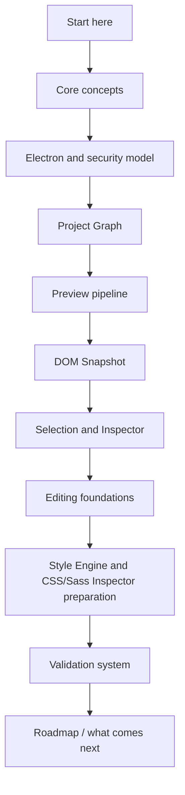

# Crystal Documentation

Crystal is a desktop Electron/Node application for opening, previewing, inspecting, and eventually modifying real HTML projects and their dependencies. It is built around one shared project model: Project Graph, Preview, DOM Snapshot, Selection, Inspector, command previews, editing preflight, Style Engine inventory, and validators all describe different safe views of the same project state.

Crystal solves a specific problem: visual and code-oriented work on real HTML projects needs a trusted bridge between what Chromium renders and what Crystal can safely reason about. The current product is intentionally conservative. It can scan a project, render a real Preview, build source-derived snapshots, map read-only selections, show Inspector surfaces, preview possible source patches, plan future transactions, display disabled editing affordances, and inventory style sources. It does not yet write source files.

> **Navigation:** Start here → [Guided reading](./guided-reading.md) → [Architecture overview](./architecture/README.md) → [Preview pipeline](./architecture/preview/README.md) → [Editing foundations](./architecture/commands/README.md) → [Validation system](./architecture/validation-system.md)

## Start here

Read this page first. It is the entrypoint for the documentation set, not a replacement for the architecture pages. It gives the recommended route, alternate routes by reader profile, and a complete map of the existing docs.

| First question | Start with | Why |
| --- | --- | --- |
| What is Crystal today? | [Roadmap implementation status](./roadmap-implementation.md) | Shows implemented, blocked, and future behavior without implying writes. |
| How do the major pieces connect? | [Architecture overview](./architecture/README.md) | Introduces runtime boundaries, Preview, commands, and validation as one system. |
| Why is Preview read-only? | [Preview safety](./architecture/preview/preview-safety.md) | Explains why the iframe is rendered but not trusted as an editing surface. |
| How does a click become Inspector state? | [DOM Snapshot](./architecture/preview/dom-snapshot.md) | Defines the source-derived tree that selection and Inspector depend on. |
| Why is Apply unavailable? | [Future write flow](./architecture/flows/future-write-flow.md) | Shows the missing write runtime, patch apply, dirty state, refresh, and history pieces. |
| How do validators protect the architecture? | [Validation system](./architecture/validation-system.md) | Describes the gates that keep preview-only and future-only phases honest. |

## What Crystal is

Crystal is a modular Electron desktop application for real web project work. The source architecture is intentionally split across Electron main, preload, renderer, `packages/core`, shared contracts, adapters, scripts, and docs. The Preview uses Chromium to render the user's HTML. Crystal's own reasoning uses scanned project state and source-derived models, not privileged access to the live iframe DOM.

## What Crystal is not yet

| Not implemented today | Current replacement | Read |
| --- | --- | --- |
| Source mutation | Source Patch Preview and write-blocked readiness models. | [Source Patch Preview](./architecture/commands/source-patch-preview.md) |
| Patch application | Patch text and anchors only. | [Source Patch Preview flow](./architecture/flows/source-patch-preview-flow.md) |
| Write IPC | Future-only write boundary. | [Future write flow](./architecture/flows/future-write-flow.md) |
| Real undo/redo execution | Transaction descriptors only. | [Future command execution](./architecture/commands/future-command-execution.md) |
| Editable Inspector Apply | Disabled/read-only Inspector surface. | [Roadmap implementation status](./roadmap-implementation.md) |
| CSS/Sass visual editing | Phase 8A read-only Style Engine source inventory. | [Glossary](./glossary.md) |
| Real cascade/computed styles | Textual selector/declaration/rule previews only. | [Validation system](./architecture/validation-system.md) |

## How to read the documentation

Use the docs as a progressive story. Start with the product status, then read the architecture map, then follow the pipeline that matches the code you want to touch. Do not start from a validator failure alone; validators encode boundaries, but the architecture pages explain why those boundaries exist.

| Step | Read | What you should understand before moving on |
| --- | --- | --- |
| 1 | [Roadmap implementation status](./roadmap-implementation.md) | Which phases are current, preview-only, blocked, or future. |
| 2 | [Architecture overview](./architecture/README.md) | How runtime, Preview, core models, commands, and validators relate. |
| 3 | [Runtime boundaries](./architecture/runtime-boundaries.md) | Which context owns each authority. |
| 4 | [Security model](./architecture/security-model.md) | Why Electron and Preview boundaries are strict. |
| 5 | [Project Preview](./architecture/preview/project-preview.md) | How Crystal serves and displays project HTML. |
| 6 | [DOM Snapshot](./architecture/preview/dom-snapshot.md) | Why source-derived structure is the trusted bridge. |
| 7 | [Preview Selection](./architecture/preview/preview-selection.md) | How bounded iframe messages become defensive selection state. |
| 8 | [Preview Inspector](./architecture/preview/preview-inspector.md) | How selection becomes a read-only surface. |
| 9 | [Commands overview](./architecture/commands/README.md) | Why current command paths are dry-run only. |
| 10 | [Future write flow](./architecture/flows/future-write-flow.md) | What must exist before Apply or source writes can be real. |
| 11 | [Validation system](./architecture/validation-system.md) | Which scripts guard each boundary. |
| 12 | [Full product roadmap](./full-product-roadmap.md) | Where the current foundations lead. |

## Read by goal

| Goal | Start with | Then read | Validator |
| --- | --- | --- | --- |
| Understand the app boundary | [Runtime boundaries](./architecture/runtime-boundaries.md) | [Security model](./architecture/security-model.md), [Security boundaries diagram](./architecture/diagrams/security-boundaries.md) | `validate:architecture-docs` |
| Understand Project Graph and opening flow | [Project open flow](./architecture/flows/project-open-flow.md) | [Repository map](./architecture/repository-map.md), [System overview](./architecture/system-overview.md) | `validate:project-graph` |
| Understand Preview rendering | [Preview architecture](./architecture/preview/README.md) | [Project Preview](./architecture/preview/project-preview.md), [Preview safety](./architecture/preview/preview-safety.md) | `validate:preview` |
| Understand DOM Snapshot | [DOM Snapshot](./architecture/preview/dom-snapshot.md) | [DOM Snapshot flow](./architecture/flows/dom-snapshot-flow.md) | `validate:dom-snapshot` |
| Understand selection mapping | [Preview Selection](./architecture/preview/preview-selection.md) | [Preview selection flow](./architecture/flows/preview-selection-flow.md), [Preview selection sequence](./architecture/diagrams/preview-selection-sequence.md) | `validate:preview-selection` |
| Understand Inspector surfaces | [Preview Inspector](./architecture/preview/preview-inspector.md) | [Visual Selection Overlay](./architecture/preview/visual-selection-overlay.md), [Glossary](./glossary.md) | `validate:preview-inspector` |
| Understand editing foundations | [Commands overview](./architecture/commands/README.md) | [Source Patch Preview](./architecture/commands/source-patch-preview.md), [Future write flow](./architecture/flows/future-write-flow.md) | `validate:source-patch-preview` |
| Understand Element Library previews | [HTML Element Library](./architecture/commands/html-element-library.md) | [HTML insertion preview planner](./architecture/commands/html-insertion-preview-planner.md), [Element Library preview flow](./architecture/flows/element-library-preview-flow.md) | `validate:html-element-library` |
| Understand future command execution | [Future command execution](./architecture/commands/future-command-execution.md) | [Command Preview Bus](./architecture/commands/command-preview-bus.md), [ADR 0003](./decisions/0003-command-preview-before-write.md) | `validate:history-foundation` |
| Understand Style Engine and CSS/Sass Inspector preparation | [Roadmap implementation status](./roadmap-implementation.md) | [Validation system](./architecture/validation-system.md), [Glossary](./glossary.md) | `validate:style-engine-foundation` |
| Validate docs | [Validation system](./architecture/validation-system.md) | [Validation flow](./architecture/flows/validation-flow.md), [Validation gates](./architecture/diagrams/validation-gates.md) | `validate:guided-docs` |

## Read by subsystem

| Subsystem | Primary docs | Useful companion |
| --- | --- | --- |
| Root architecture | [Architecture overview](./architecture/README.md), [System overview](./architecture/system-overview.md), [Module boundaries](./architecture/module-boundaries.md) | [Event and state flow](./architecture/event-and-state-flow.md) |
| Runtime and security | [Runtime boundaries](./architecture/runtime-boundaries.md), [Security model](./architecture/security-model.md) | [ADR 0001](./decisions/0001-electron-security-boundaries.md) |
| Renderer shell | [Renderer shell](./architecture/renderer-shell/README.md) | [Shell UI primitives](./architecture/renderer-shell/shell-ui-primitives.md), [Sidebar composition](./architecture/renderer-shell/sidebar-composition.md) |
| Preview pipeline | [Preview architecture](./architecture/preview/README.md) | [Project Preview](./architecture/preview/project-preview.md), [Preview safety](./architecture/preview/preview-safety.md) |
| Snapshot and inspection | [DOM Snapshot](./architecture/preview/dom-snapshot.md) | [Preview Inspector](./architecture/preview/preview-inspector.md), [DOM Snapshot flow](./architecture/flows/dom-snapshot-flow.md) |
| Selection overlay | [Visual Selection Overlay](./architecture/preview/visual-selection-overlay.md) | [Preview selection flow](./architecture/flows/preview-selection-flow.md) |
| Command preview | [Commands overview](./architecture/commands/README.md) | [Command Preview Bus](./architecture/commands/command-preview-bus.md), [Source Patch Preview](./architecture/commands/source-patch-preview.md) |
| Future writes | [Future write flow](./architecture/flows/future-write-flow.md) | [Future command execution](./architecture/commands/future-command-execution.md), [ADR 0003](./decisions/0003-command-preview-before-write.md) |
| Validation | [Validation system](./architecture/validation-system.md) | [Validation gates](./architecture/diagrams/validation-gates.md) |
| Roadmap | [Current implementation status](./roadmap-implementation.md) | [Full product roadmap](./full-product-roadmap.md) |

## Read by safety concern

| Concern | Read | Boundary to preserve |
| --- | --- | --- |
| Renderer privilege | [Runtime boundaries](./architecture/runtime-boundaries.md) | Renderer must not get direct filesystem or raw IPC authority. |
| Preview iframe access | [Preview safety](./architecture/preview/preview-safety.md) | Renderer must not use `iframe.contentDocument` or `iframe.contentWindow.document`. |
| Preview DOM mutation | [Preview architecture](./architecture/preview/README.md) | Crystal overlays stay outside the user's DOM. |
| Patch preview vs write | [Source Patch Preview](./architecture/commands/source-patch-preview.md) | Preview text must not apply or save. |
| Command bus confusion | [Command Preview Bus](./architecture/commands/command-preview-bus.md) | Dry-run preview bus must not replace legacy `command-bus.ts`. |
| Editable Inspector confusion | [Future write flow](./architecture/flows/future-write-flow.md) | Disabled controls are not edit execution. |
| Style Engine confusion | [Validation system](./architecture/validation-system.md) | Style inventory is not cascade, computed style inspection, or CSS editing. |
| Future write claims | [Future write flow](./architecture/flows/future-write-flow.md) | No real file write, patch apply, write IPC, DOM mutation, or real undo/redo. |

## Read by implementation phase

| Phase area | Current state | Read |
| --- | --- | --- |
| Phase -1 / 0 | Physical architecture and tooling foundation. | [Repository map](./architecture/repository-map.md), [Runtime boundaries](./architecture/runtime-boundaries.md) |
| Phase 1 | Project Graph foundation. | [Project open flow](./architecture/flows/project-open-flow.md) |
| Phase 2 | Real Preview, DOM Snapshot, Preview Selection. | [Preview architecture](./architecture/preview/README.md) |
| Phase 3 | Preview Inspector read-only. | [Preview Inspector](./architecture/preview/preview-inspector.md) |
| Phase 4 | Design Canvas navigation foundation. | [Design view](./architecture/renderer-shell/design-view.md) |
| Phase 5 | Visual Selection Overlay MVP. | [Visual Selection Overlay](./architecture/preview/visual-selection-overlay.md) |
| Phase 6A | HTML Element Library command foundation. | [HTML Element Library](./architecture/commands/html-element-library.md) |
| Phase 6B | Source Patch Preview and Command Bus foundation. | [Source Patch Preview flow](./architecture/flows/source-patch-preview-flow.md) |
| Phase 6C | History/undo transaction skeleton and refresh boundary planning. | [Future write flow](./architecture/flows/future-write-flow.md) |
| Phase 6D | Design Editing MVP preflight. | [Future command execution](./architecture/commands/future-command-execution.md) |
| Phase 7A | Editable Inspector draft/intent foundation. | [Glossary](./glossary.md) |
| Phase 7B | Editable Inspector read-only draft surface. | [Roadmap implementation status](./roadmap-implementation.md) |
| Phase 8A | Style Engine read-only source inventory foundation. | [Validation system](./architecture/validation-system.md) |
| Next | CSS/Sass Inspector read-only visual surface. | [Full product roadmap](./full-product-roadmap.md) |

## Reader profiles

| Reader profile | Recommended path |
| --- | --- |
| New contributor | [Guided reading](./guided-reading.md) → [Architecture overview](./architecture/README.md) → [Glossary](./glossary.md) → [Validation system](./architecture/validation-system.md) |
| Electron/security contributor | [Runtime boundaries](./architecture/runtime-boundaries.md) → [Security model](./architecture/security-model.md) → [Preview safety](./architecture/preview/preview-safety.md) → [ADR 0001](./decisions/0001-electron-security-boundaries.md) |
| Preview/rendering contributor | [Preview architecture](./architecture/preview/README.md) → [Project Preview](./architecture/preview/project-preview.md) → [DOM Snapshot](./architecture/preview/dom-snapshot.md) → [Preview Selection](./architecture/preview/preview-selection.md) |
| Editing pipeline contributor | [Commands overview](./architecture/commands/README.md) → [Source Patch Preview](./architecture/commands/source-patch-preview.md) → [Future command execution](./architecture/commands/future-command-execution.md) → [Future write flow](./architecture/flows/future-write-flow.md) |
| Style Engine / CSS Inspector contributor | [Roadmap implementation status](./roadmap-implementation.md) → [Glossary](./glossary.md) → [Validation system](./architecture/validation-system.md) → [Future write flow](./architecture/flows/future-write-flow.md) |
| Validation/local checks contributor | [Validation system](./architecture/validation-system.md) → [Validation flow](./architecture/flows/validation-flow.md) → [Validation gates](./architecture/diagrams/validation-gates.md) → [`scripts/validate-architecture-docs.mjs`](../scripts/validate-architecture-docs.mjs) |

## Full navigation

| Area | Links |
| --- | --- |
| Guided entrypoints | [Guided reading](./guided-reading.md), [Architecture overview](./architecture/README.md), [Current implementation status](./roadmap-implementation.md), [Glossary](./glossary.md) |
| Primary maps | [Architecture overview](./architecture/README.md), [System overview](./architecture/system-overview.md), [Repository map](./architecture/repository-map.md), [Runtime boundaries](./architecture/runtime-boundaries.md), [Security model](./architecture/security-model.md), [Event and state flow](./architecture/event-and-state-flow.md), [Validation system](./architecture/validation-system.md), [Module boundaries](./architecture/module-boundaries.md) |
| Runtime and UI | [Renderer shell](./architecture/renderer-shell/README.md), [Shell UI primitives](./architecture/renderer-shell/shell-ui-primitives.md), [Design view](./architecture/renderer-shell/design-view.md), [Diagnostics](./architecture/renderer-shell/diagnostics.md), [Status bar](./architecture/renderer-shell/status-bar.md), [Sidebar composition](./architecture/renderer-shell/sidebar-composition.md) |
| Preview | [Preview architecture](./architecture/preview/README.md), [Project Preview](./architecture/preview/project-preview.md), [DOM Snapshot](./architecture/preview/dom-snapshot.md), [Preview Selection](./architecture/preview/preview-selection.md), [Visual Selection Overlay](./architecture/preview/visual-selection-overlay.md), [Preview Inspector](./architecture/preview/preview-inspector.md), [Preview safety](./architecture/preview/preview-safety.md) |
| Commands | [Commands overview](./architecture/commands/README.md), [HTML Element Library](./architecture/commands/html-element-library.md), [Source Patch Preview](./architecture/commands/source-patch-preview.md), [Command Preview Bus](./architecture/commands/command-preview-bus.md), [HTML insertion preview planner](./architecture/commands/html-insertion-preview-planner.md), [Future command execution](./architecture/commands/future-command-execution.md) |
| Flows | [Flows overview](./architecture/flows/README.md), [Project open flow](./architecture/flows/project-open-flow.md), [Preview selection flow](./architecture/flows/preview-selection-flow.md), [DOM Snapshot flow](./architecture/flows/dom-snapshot-flow.md), [Element Library preview flow](./architecture/flows/element-library-preview-flow.md), [Source Patch Preview flow](./architecture/flows/source-patch-preview-flow.md), [Validation flow](./architecture/flows/validation-flow.md), [Future write flow](./architecture/flows/future-write-flow.md) |
| Diagrams | [Diagrams overview](./architecture/diagrams/README.md), [System context](./architecture/diagrams/system-context.md), [Runtime boundaries diagram](./architecture/diagrams/runtime-boundaries.md), [Preview selection sequence](./architecture/diagrams/preview-selection-sequence.md), [Source Patch Preview sequence](./architecture/diagrams/source-patch-preview-sequence.md), [Command Preview Bus sequence](./architecture/diagrams/command-preview-bus-sequence.md), [Security boundaries](./architecture/diagrams/security-boundaries.md), [Validation gates](./architecture/diagrams/validation-gates.md) |
| Decisions and reference | [Architecture decisions](./decisions/README.md), [ADR 0001](./decisions/0001-electron-security-boundaries.md), [ADR 0002](./decisions/0002-read-only-preview-first.md), [ADR 0003](./decisions/0003-command-preview-before-write.md), [ADR 0004](./decisions/0004-modular-shell-ui-primitives.md), [Glossary](./glossary.md) |
| Roadmap | [Current implementation status](./roadmap-implementation.md), [Full product roadmap](./full-product-roadmap.md), [Existing architecture note](./architecture.md), [Development setup](./development.md) |

## Documentation rules

> **Safety boundary:** Treat implemented, blocked, and future behavior as separate states. If a feature only previews a possible edit, call it a preview. If a path is intentionally blocked, explain the technical reason.

Do not claim real insertion, source mutation, patch application, undo/redo execution, write IPC, live iframe DOM reads, relaxed Electron security, computed style inspection, real cascade analysis, or style editing unless the code and validators support that claim.

## Read next

You are here: Documentation start.

Before this:
- No prior doc. This is the entrypoint.

Next:
- [Guided reading](./guided-reading.md)

Related:
- [Architecture overview](./architecture/README.md)
- [Roadmap implementation status](./roadmap-implementation.md)
- [Glossary](./glossary.md)

Why this matters:
This page prevents the docs from being a flat file list. It sets the intended reading order so contributors see Crystal's safety boundaries before touching Preview, editing, Style Engine, or validation code.
