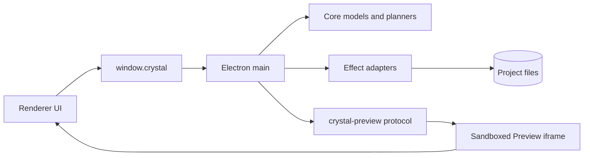

# Crystal architecture

[Docs index](./README.md)

Crystal is easier to understand as a chain of authority than as a directory tree. Renderer expresses intent. Preload narrows the available API. Main owns privileged coordination. Core calculates portable models and dry-run plans. Adapters perform effects. The Preview iframe renders project HTML without joining the trusted shell.

## The current product loop

A user opens a project, main resolves the root, and core builds the Project Graph through filesystem abstractions. Main serves a selected page through the root-contained Preview protocol while separately reading static HTML to build a DOM Snapshot. A bounded iframe message can become Preview Selection state only after renderer, main, and core validation. Inspector and overlay state are derived from that trusted mapping.

The Element Library continues from a matched target into command intent and Source Patch Preview. The loop stops there. Planning models for history, refresh, editing readiness, Inspector drafts, style inventory, and authored matching remain read-only or dry-run.

## Authority boundaries

- Renderer cannot access Node or the filesystem directly.
- Preload exposes named operations rather than raw IPC.
- Main owns dialogs, filesystem-backed services, protocol serving, and authoritative application state.
- Core should remain portable and side-effect free where its contract is modeling, validation, selection, or planning.
- Adapters isolate effects and external tools from application policy.
- Preview content remains sandboxed and cannot inherit Crystal privileges.

## Current capability versus product direction

Implemented systems include Project Graph, watcher/cache, Preview, DOM Snapshot, selection mapping, read-only Inspector, Design Canvas navigation, external selection overlay, dry-run HTML insertion previews, transaction/readiness descriptors, disabled editable-Inspector surfaces, style-source inventory, read-only CSS/Sass presentation, and conservative authored selector candidates.

Not implemented: source writes, patch application, write IPC, real undo/redo execution, dirty-state persistence, refresh execution after writes, enabled editing, real cascade, computed styles, CSSOM, live-DOM style matching, WebGPU overlays, Rust/WASM analyzers, or packaged distribution.

Read the maintained [Architecture overview](./architecture/README.md) for subsystem entry points and [Implementation status](./roadmap-implementation.md) for evidence-backed phase status.
