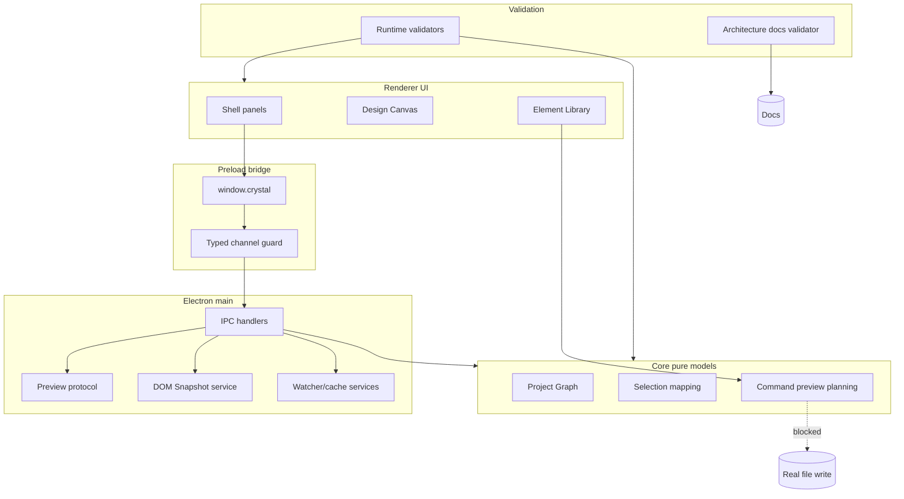

# Architecture Documentation

[Docs index](../README.md)

## At a glance

| Question | Answer |
| --- | --- |
| Is this implemented? | Yes, as the documentation map for the current architecture. |
| Can it write source files? | No. These docs describe current read-only/dry-run systems and future write constraints. |
| Runtime owner | Documentation only; it describes renderer, preload, main, core, adapters, and validators. |
| Safety risk controlled | Prevents contributors from treating Preview or command preview as source mutation. |
| Related next phase | Phase 6C transaction planning and refresh-boundary design. |

> **Read this first:** Start here when you need the shortest route from product behavior to module boundaries.

## Purpose

Crystal's architecture documentation is the map a new contributor should read before changing code. It explains why the project is split across Electron main, preload, renderer, core packages, adapters, and validators, and it calls out the safety boundaries that are easy to break when adding visual editing features.

## Why this exists

The codebase is deliberately modular. Without an architecture map, a feature can accidentally cross runtime boundaries, duplicate state ownership, or turn dry-run planning into mutation. This page keeps the whole system visible before drilling into Preview, command previews, or validation.

## How to read this page

| Need | Read next |
| --- | --- |
| Runtime authority | [Runtime boundaries](./runtime-boundaries.md) |
| Security risk | [Security model](./security-model.md) |
| Preview pipeline | [Preview architecture](./preview/README.md) |
| Command dry-run pipeline | [Commands overview](./commands/README.md) |
| Future writes | [Future write flow](./flows/future-write-flow.md) |

## Current implementation

The product is still in a read-only and dry-run stage for project content. Users can open a project, scan a Project Graph, load a sandboxed Preview, build a static DOM Snapshot, select rendered nodes in read-only mode, inspect mapped structure, view an external selection overlay, and ask the Element Library to describe a possible insertion.

## Key files

See the responsibilities table for the first files to open when tracing a feature.

## Key files and responsibilities

| File | Responsibility | Reads | Must not do |
| --- | --- | --- | --- |
| `apps/desktop/electron/main/main.ts` | Boots main process and registers privileged services. | Electron app lifecycle. | Expose renderer shortcuts. |
| `apps/desktop/electron/preload/preload.ts` | Loads the constrained preload surface. | Bridge modules. | Expose raw IPC. |
| `apps/desktop/electron/renderer/app/bootstrap/bootstrap.ts` | Starts renderer shell composition. | Browser-safe UI modules. | Import main/adapters. |
| `packages/core/state/app-state.ts` | Defines shared app state shape. | Core state contracts. | Perform Electron effects. |
| `packages/shared/constants/ipc.constants.ts` | Defines typed IPC channel names. | Shared contracts. | Create write channels without policy. |
| `scripts/validate-local.mjs` | Runs aggregate validation. | npm scripts. | Mutate source. |

## Data flow

| Input | Decision | Output |
| --- | --- | --- |
| Renderer user intent | Is this privileged, pure, or display-only work? | Preload call, core selector, or UI state update. |
| Main project request | Is the target inside the active root and supported? | Sanitized project/preview/snapshot state. |
| Core planning request | Can the system reason safely without side effects? | Derived state, blocked state, or dry-run preview. |
| Future write intent | Are transaction, patch, history, and refresh contracts available? | Currently blocked. |

## Main diagram

The diagram separates presentation, bridge, privileged services, pure models, and validation. The dotted edge marks the blocked write boundary.

## Boundaries

Renderer UI may present intent, but it must not own project mutation. Preview can render and report bounded selection data, but it is not a trusted editing surface. Source Patch Preview can describe a possible edit, but it is not patch application.

> **Safety boundary:** Main owns privileged effects, preload narrows access, and core planning stays pure until a future write runtime exists.

## What this does not do

| Not provided | Why |
| --- | --- |
| Real file write | No transaction, apply, dirty-state, refresh, and undo stack exists. |
| Patch apply | Source Patch Preview is descriptive only. |
| DOM mutation | Preview isolation and source truth must remain separate. |
| Write IPC | No write contract has been designed. |

## Common misunderstanding

> **Common misunderstanding:** A diagram edge from Element Library to Source Patch Preview does not mean insertion exists. It means the system can produce an inspectable dry-run result.

## Validation

`npm run validate:local:quick` runs the installed quick gate. `npm run validate:architecture-docs` checks this documentation set for required pages, root links, required section headings, tables, callouts, Mermaid coverage, roadmap links, and explicit blocked-write language.

## Related docs

- [System overview](./system-overview.md)
- [Runtime boundaries](./runtime-boundaries.md)
- [Security model](./security-model.md)
- [Validation system](./validation-system.md)
- [Commands overview](./commands/README.md)
- [Preview overview](./preview/README.md)

## Future work

Phase 6C is the next architectural step because it can define transaction and refresh-boundary contracts without enabling writes. Actual source mutation should wait until command execution, patch application, undo/redo records, dirty-state handling, and validators are designed together.
