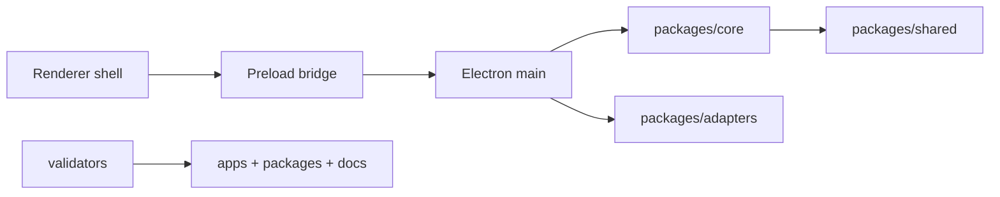

# Architecture Documentation

[Docs index](../README.md)

## Purpose

Crystal's architecture documentation is the map a new contributor should read before changing code. It explains why the project is split across Electron main, preload, renderer, core packages, adapters, and validators, and it calls out the safety boundaries that are easy to break when adding visual editing features.

## Current implementation

The product is still in a read-only and dry-run stage for project content. Users can open a project, scan a Project Graph, load a sandboxed Preview, build a static DOM Snapshot, select rendered nodes in read-only mode, inspect mapped structure, navigate the Design Canvas, see an external Visual Selection Overlay, and preview an Element Library insertion as a Source Patch Preview through the Command Preview Bus.

The diagram shows the main dependency direction: renderer UI asks for data, preload narrows the API surface, main owns privileged effects, and core packages hold portable models and planning logic.

## Key files

Read this list as entry points, not as the complete source inventory. Start with the runtime entrypoints, then follow the package paths for the subsystem being changed.

- `apps/desktop/electron/main/main.ts`
- `apps/desktop/electron/preload/preload.ts`
- `apps/desktop/electron/renderer/app/bootstrap/bootstrap.ts`
- `packages/core/state/app-state.ts`
- `packages/shared/constants/ipc.constants.ts`
- `scripts/validate-local.mjs`
- `docs/roadmap-implementation.md`

## Data flow

Renderer modules request work through `window.crystal`. Preload exposes only the allowed methods and subscriptions. Main resolves filesystem, protocol, watcher, and IPC work, then returns sanitized state. Core packages provide selectors, validators, state models, and dry-run planners that can be reasoned about without Electron runtime access.

## Boundaries

A renderer component may present intent, but it must not become the owner of project mutation. Preview can render and report bounded selection data, but it is not a trusted editing surface. Source Patch Preview can describe a possible edit, but it is not patch application. These limits prevent the UI from writing stale or ambiguous source while the project still lacks transaction history, dirty-state tracking, and refresh invalidation.

## Validation

`npm run validate:local:quick` runs the installed quick gate. `npm run validate:architecture-docs` checks this documentation set for required pages, root links, required section headings, Mermaid coverage, roadmap links, and explicit blocked-write language.

## Related docs

- [System overview](./system-overview.md)
- [Runtime boundaries](./runtime-boundaries.md)
- [Security model](./security-model.md)
- [Validation system](./validation-system.md)
- [Commands overview](./commands/README.md)
- [Preview overview](./preview/README.md)

## Future work

Phase 6C is the next architectural step because it can define transaction and refresh-boundary contracts without enabling writes. Actual source mutation should wait until command execution, patch application, undo/redo records, dirty-state handling, and validators are designed together.
