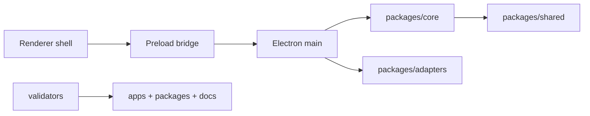

# Architecture Documentation

[Docs index](../README.md)

## Purpose

This hub explains the current Crystal architecture as implemented on `main` after PR #21. It is the entry point for runtime boundaries, module ownership, security limits, validation gates, and the next planned Phase 6C work.

## Current implementation

Crystal currently has an Electron main process, preload bridge, renderer shell, core packages, adapters, and scripts. The implemented product surface is read-only for project content. The user can open projects, scan Project Graph data, load a safe Preview URL, build a static DOM Snapshot, select Preview nodes in read-only mode, inspect mapped structure, navigate a Design Canvas frame, view a Visual Selection Overlay, and dry-run Element Library insertion previews through Source Patch Preview and the Command Preview Bus.

## Key files

- `apps/desktop/electron/main/main.ts`
- `apps/desktop/electron/preload/preload.ts`
- `apps/desktop/electron/renderer/app/bootstrap/bootstrap.ts`
- `packages/core/state/app-state.ts`
- `packages/shared/constants/ipc.constants.ts`
- `scripts/validate-local.mjs`
- `docs/roadmap-implementation.md`

## Data flow

Renderer modules call the exposed preload API. Preload validates channel names and invokes explicit IPC channels. Main owns Electron dialogs, filesystem access, Preview protocol handling, DOM Snapshot source reading, watcher lifecycle, and sanitized state updates. Core modules define pure state, selectors, validators, planners, and model contracts. Renderer code consumes sanitized state and renders panels.

## Boundaries

- Renderer does not receive free Node access.
- Renderer does not write files.
- Preview iframe isolation is preserved.
- Source Patch Preview is a dry-run model, not an apply path.
- Command Preview Bus produces `preview-ready`, `blocked`, or `unsupported`; it does not execute writes.

## Validation

Use `npm run validate:local:quick` for installed local iteration. The architecture docs are additionally guarded by `npm run validate:architecture-docs` once the docs validator is present on this branch.

## Related docs

- [System overview](./system-overview.md)
- [Runtime boundaries](./runtime-boundaries.md)
- [Security model](./security-model.md)
- [Validation system](./validation-system.md)
- [Commands overview](./commands/README.md)
- [Preview overview](./preview/README.md)

## Future work

Phase 6C should add history/undo transaction skeletons and refresh-boundary planning without enabling real source writes, write IPC, DOM mutation, or real undo/redo behavior.
