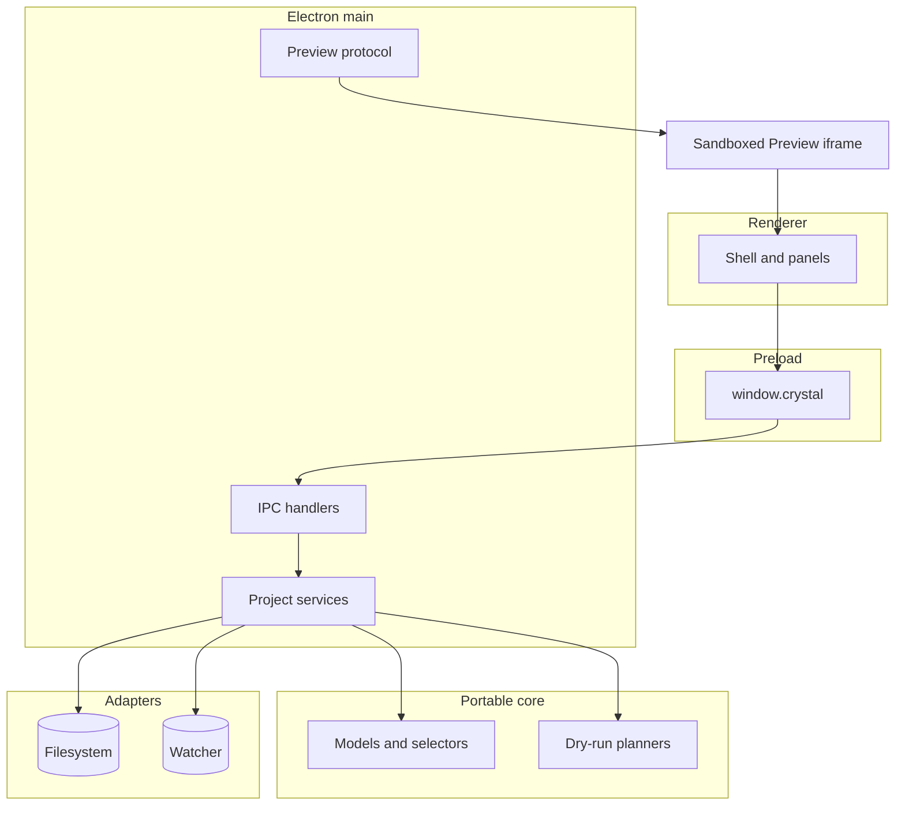

# Architecture overview

[Docs index](../README.md)

## At a glance

| Question | Answer |
| --- | --- |
| What is implemented? | A read-only project-analysis and Preview pipeline, plus dry-run and planning foundations for future editing. |
| Who owns privileged effects? | Electron main, using adapters for filesystem and watcher work. |
| What does renderer own? | Composition, interaction state, and presentation of sanitized models. |
| Can Crystal write project source? | No. No patch application or write IPC exists. |
| Where should a contributor start? | Choose the runtime boundary first, then follow the subsystem flow. |

## Purpose

Crystal places a real browser-rendered project beside desktop authority. The architecture exists to keep those concerns useful without letting project HTML, renderer UI, or dry-run planners inherit filesystem power.

## Current implementation

The active runtime chain is renderer → preload → main, with core modules providing portable models, selectors, validators, and planners. Adapters isolate effects. Preview content is served through a root-contained custom protocol and remains an untrusted iframe. Current editing-related modules stop at intent, preview, planning, readiness, disabled UI, style inventory, or authored-style candidates.

## Key files

The following paths are the shortest reliable entry points. They are not a substitute for following the data flow through the subsystem.

## Key files and responsibilities

| File or path | Responsibility | Reads | Must not do |
| --- | --- | --- | --- |
| `apps/desktop/electron/main/main.ts` | Composes the privileged runtime. | main services and Electron lifecycle | grant renderer direct effects |
| `apps/desktop/electron/preload/bridges/crystal-api.bridge.ts` | Exposes the constrained API. | shared IPC constants and types | expose raw ipcRenderer |
| `apps/desktop/electron/renderer/app/bootstrap/bootstrap.ts` | Starts browser UI composition. | renderer modules and window.crystal | import main services |
| `packages/core` | Owns portable models and dry-run logic. | validated inputs | perform filesystem IO |
| `packages/adapters` | Isolates external and Node effects. | main-owned requests | decide UI or command policy |

## Data flow

| Input | Decision | Output |
| --- | --- | --- |
| User action | Does it require a privileged effect? | Local renderer state or a preload request |
| Preload request | Is the channel part of the typed API? | Main IPC call or no access |
| Main request | Is the work semantic or effectful? | Core result or adapter effect |
| Preview content | Can a bounded message be validated? | Sanitized application state or ignored input |
| Command intent | Can it be previewed safely? | Dry-run result; never execution |

## Boundaries

Runtime ownership is an authority model, not only a directory convention. Renderer cannot import privileged services for convenience. Preview data cannot be treated as trusted source identity. Planning objects cannot acquire side effects simply because their output resembles a patch or transaction.

> **Safety boundary:** State that crosses a boundary is evidence to validate, not authority to perform a privileged effect.

## What this does not do

| Not provided | Why |
| --- | --- |
| Source mutation | The write runtime and patch application path do not exist. |
| Direct live-DOM inspection | Preview isolation is preserved through bounded messages and source-derived models. |
| Browser-grade style truth | Cascade, computed styles, CSSOM, and live-DOM matching are not implemented. |
| Future runtime proof | WebGPU, workers, Rust, and WASM remain roadmap work. |

## Common misunderstanding

> **Common misunderstanding:** A module being present in the architecture does not mean it owns effects. Core planners, renderer panels, and Preview models remain unprivileged even when they describe future operations.

## Validation

Use focused feature validators while working, then run `npm run validate:local:quick`. Documentation changes also require project metadata, Markdown integrity, guided-docs, architecture-docs, and change-policy validation.

## Related docs

- [System overview](./system-overview.md)
- [Runtime boundaries](./runtime-boundaries.md)
- [Security model](./security-model.md)
- [Repository map](./repository-map.md)
- [Architecture flows](./flows/README.md)

## Future work

Add new runtime boxes only when their authority, message contract, fallback, and validation exist. Future writes must extend the current boundary model rather than bypass it.

## Read next

You are here: architecture entrypoint.

Next:
- [System overview](./system-overview.md) follows the current product loop from project open to dry-run planning.
- [Runtime boundaries](./runtime-boundaries.md) explains which process may own each effect.

Why this matters:
The architecture is organized around authority and data provenance. Starting here makes later subsystem detail easier to interpret without overstating capability.
