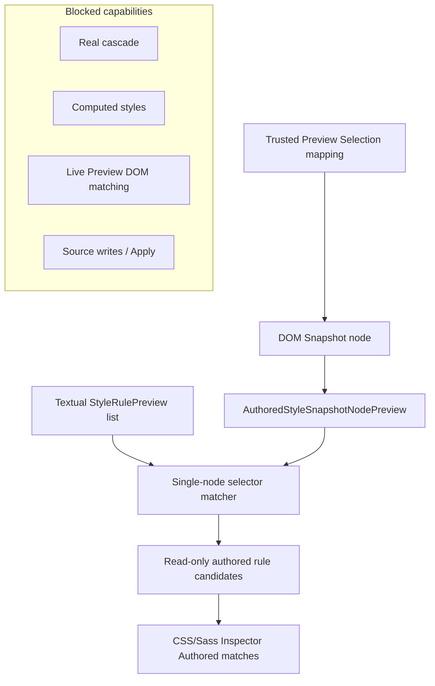

# Authored Style Matching over DOM Snapshot

[Docs index](../README.md)

> **Navigation:** [Start here](../README.md) → [Architecture overview](./README.md) → Authored Style Matching over DOM Snapshot → [Validation System](./validation-system.md)

## At a glance

| Question | Answer |
| --- | --- |
| Phase | Phase 8C. |
| Goal | Produce conservative read-only authored-style candidates for a selected DOM Snapshot node. |
| Input | Phase 8A style inventory, textual selector/rule previews, DOM Snapshot data, and trusted Preview Selection mapping. |
| Output | `SelectedNodeAuthoredStyleMatchesPreview` and compact CSS/Sass Inspector candidate rows. |
| Runtime authority | None for writes. |
| Cascade | Not calculated. |
| Computed styles | Not read. |
| Preview DOM | Not matched live. |
| Apply | Unavailable. |

## Purpose

Phase 8C moves the CSS/Sass Inspector from inventory-only presentation toward authored-style candidate matching. The result is intentionally conservative: this selected DOM Snapshot node could match these authored rules.

It does not claim browser truth, cascade truth, inherited style truth, specificity resolution, or computed-style truth.

## Current implementation

Phase 8C adds small Style Engine modules for authored matching, DOM Snapshot node normalization, selector matching, rule-candidate matching, selected-node authored-match summaries, CSS/Sass Inspector candidate rendering, and a strict validator.

Phase 8C boundary: Authored Style Matching over DOM Snapshot only. No real cascade is calculated. No computed styles are read. No document.styleSheets or CSSOM is used. No iframe internals are read. No live Preview DOM matching is performed. No source files are written. No patch apply is available. No write IPC exists. Apply remains unavailable. No contenteditable is used. No undo/redo execution runs. Dirty-state is not persisted. No refresh execution runs. No Preview DOM mutation occurs.

## Key files

| File | Responsibility |
| --- | --- |
| `packages/core/style-engine/style-authored-matching.types.ts` | Read-only authored matching contracts. |
| `packages/core/style-engine/style-authored-snapshot-node.ts` | Normalizes plain `ProjectDomNode` data into matching input. |
| `packages/core/style-engine/style-authored-selector-match.ts` | Matches supported single-node selectors against DOM Snapshot data. |
| `packages/core/style-engine/style-authored-rule-match.ts` | Builds read-only authored rule candidates. |
| `packages/core/style-engine/style-authored-matching-readiness.ts` | Summarizes selected-node authored matches. |
| `apps/desktop/electron/renderer/views/inspector/css-sass-inspector/` | Renders compact candidate rows. |
| `scripts/validate-authored-style-matching.mjs` | Guards the Phase 8C boundary. |

## Key files and responsibilities

| Component | Reads | Must not do |
| --- | --- | --- |
| Snapshot node preview | Plain `ProjectDomNode` fields. | Accept `HTMLElement`, `Document`, iframe internals, or live DOM objects. |
| Selector matcher | `StyleSelectorPreview.selectorText` and normalized snapshot attributes. | Use `Element.matches`, selector engines, DOMParser, query APIs, CSSOM, or computed styles. |
| Rule matcher | Textual `StyleRulePreview` contracts. | Resolve cascade or winning declarations. |
| CSS/Sass Inspector | Authored match preview contracts. | Enable Apply, edit styles, write sources, mutate DOM, or hide unsupported selectors. |

## Data flow

| Step | Input | Output |
| --- | --- | --- |
| Normalize selected node | `ProjectDomNode` | `AuthoredStyleSnapshotNodePreview` |
| Parse supported selector | selector text | single-node selector parts or unsupported-selector |
| Match selector | selector parts + snapshot node | `AuthoredSelectorMatchPreview` |
| Match rule | rule preview + snapshot node | `AuthoredStyleRuleMatchCandidatePreview` |
| Summarize selected node | candidate list | `SelectedNodeAuthoredStyleMatchesPreview` |
| Render surface | selected-node preview | compact CSS/Sass Inspector Authored matches section |



## Supported selectors

| Selector form | Example |
| --- | --- |
| Element | `button`, `div`, `main`, `section` |
| Class | `.card`, `.is-active` |
| ID | `#hero`, `#mainNav` |
| Attribute presence | `[data-state]`, `[aria-expanded]` |
| Attribute equals | `[type="button"]`, `[type='button']`, `[type=button]` |
| Single-node compound | `button.card`, `.card.is-active`, `button#submit.primary`, `button[data-state="open"]`, `#hero.card`, `.card[data-active]` |

## Unsupported selectors

Descendant selectors, child combinators, adjacent/general siblings, pseudo classes, pseudo elements, universal selectors, namespace selectors, complex escaped selectors, Sass nesting, media/supports/container evaluation, inherited styles, browser default styles, and any real cascade behavior return explicit unsupported or future-only states.

## Boundaries

> **Safety boundary:** Phase 8C is read-only authored candidate matching over DOM Snapshot data. A matched candidate means possible authored selector correlation, not applied browser style truth.

Still out of scope:

- real cascade calculation
- specificity resolution beyond textual preview
- computed style inspection
- CSSOM
- live Preview DOM matching
- selector engine for complex selectors
- Sass nesting resolution
- media/supports/container evaluation
- style editing
- class management
- source writes
- patch apply
- write IPC
- save/apply workflow
- undo/redo execution
- dirty-state persistence
- refresh execution
- DOM mutation
- Apply enablement

## Validation

Run:

```bash
npm run validate:authored-style-matching
npm run validate:style-engine-foundation
npm run validate:css-sass-inspector-surface
npm run validate:validation-system
npm run validate:local:quick
npm --silent run validate:local:quick:json
```

## What this does not do

| Not provided | Reason |
| --- | --- |
| Real cascade | Requires browser/app cascade model not implemented in Phase 8C. |
| Computed styles | Browser computed style reads are forbidden here. |
| CSSOM access | `document.styleSheets` and CSSOM are outside the boundary. |
| Live DOM matching | Matching uses DOM Snapshot only. |
| Source editing | No write runtime, patch apply, write IPC, or Apply flow exists. |
| DOM mutation | Preview DOM mutation remains blocked. |
| Undo/redo execution | No execution path exists. |
| Dirty-state persistence | No dirty-state write flow exists. |

## Common misunderstanding

> **Common misunderstanding:** `matched-from-snapshot` does not mean the style is applied in the browser. It only means a supported authored selector matched the selected node's normalized DOM Snapshot data.

## Related docs

- [CSS/Sass Inspector read-only visual surface](./css-sass-inspector-readonly-surface.md)
- [Validation System](./validation-system.md)
- [DOM Snapshot](./preview/dom-snapshot.md)
- [Preview Selection](./preview/preview-selection.md)
- [Roadmap implementation status](../roadmap-implementation.md)

## Future work

Future phases may add complex selector support, Sass nesting resolution, media/supports/container awareness, cascade maps, specificity resolution, computed style correlation, class management, style editing, write runtime, patch apply, write IPC, dirty-state persistence, refresh execution, and undo/redo execution.

## Read next

You are here: Authored Style Matching over DOM Snapshot.

Before this:
- [CSS/Sass Inspector read-only visual surface](./css-sass-inspector-readonly-surface.md) documents Phase 8B inventory-only UI.

Next:
- [Validation System](./validation-system.md) documents the new validator gate.

Why this matters:
Phase 8C creates the first conservative authored-style correlation layer without breaking Crystal's read-only safety boundary.
