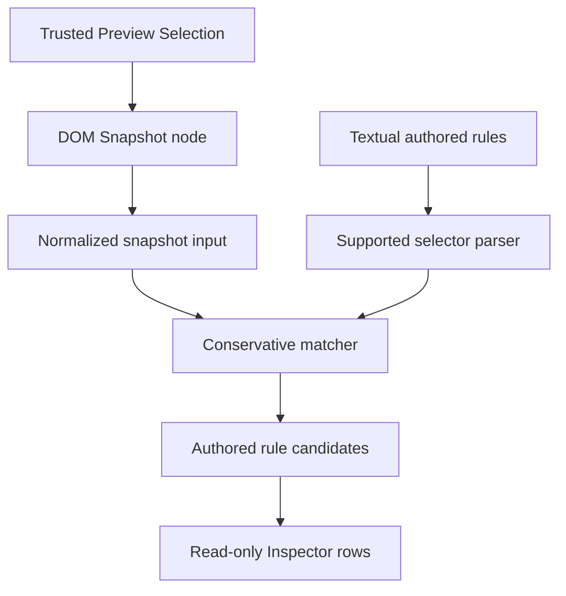

# Authored Style Matching over DOM Snapshot

[Docs index](../README.md)

## Purpose

Phase 8C answers a deliberately limited question: which authored textual rules could correlate with the selected source-derived node? It does not answer which styles the browser applies.

## Current implementation

Core normalizes a plain `ProjectDomNode`, parses a supported single-node selector subset, evaluates textual selector parts against snapshot attributes, and returns authored rule candidates. The CSS/Sass Inspector renders those candidates with explicit unsupported states. Matching uses no live elements, DOM query APIs, CSSOM, or computed styles.

## Key files

- `packages/core/style-engine/style-authored-snapshot-node.ts`
- `packages/core/style-engine/style-authored-selector-match.ts`
- `packages/core/style-engine/style-authored-rule-match.ts`
- `packages/core/style-engine/style-authored-matching-readiness.ts`
- `scripts/validate-authored-style-matching.mjs`

## Data flow

A trusted selection identifies a snapshot node. The node is normalized into tag, ID, classes, and attributes. Supported selector text becomes single-node parts. Each rule returns matched-from-snapshot, not matched, or unsupported evidence, which is summarized for presentation.

## Boundaries

Supported forms are element, class, ID, attribute presence/equality, and single-node compounds. Combinators, pseudo classes/elements, universal and namespace selectors, complex escapes, Sass nesting, conditional-rule evaluation, inheritance, specificity resolution, browser defaults, and real cascade remain outside the model.

## Validation

Run `npm run validate:authored-style-matching`, `validate:style-engine-foundation`, and `validate:css-sass-inspector-surface`. The validator rejects live DOM, CSSOM, selector-engine shortcuts, writes, Apply, and Preview mutation.

## Related docs

- [CSS/Sass Inspector surface](./css-sass-inspector-readonly-surface.md)
- [DOM Snapshot](./preview/dom-snapshot.md)
- [Preview Selection](./preview/preview-selection.md)
- [Implementation status](../roadmap-implementation.md)

## Future work

Complex selector support should expand only with explicit semantics and tests. Cascade, computed values, and editing require separate sources of truth and must not be inferred from candidate matches.

## Read next

You are here: Authored Style Matching over DOM Snapshot.

Before this:
- [CSS/Sass Inspector read-only visual surface](./css-sass-inspector-readonly-surface.md) explains where candidates are presented.

Next:
- [Validation System](./validation-system.md) documents the gate that keeps matching source-derived and read-only.

Why this matters:
`matched-from-snapshot` is useful evidence, but it is not applied browser style truth. Naming that distinction prevents the first selector matcher from becoming an accidental cascade engine.
