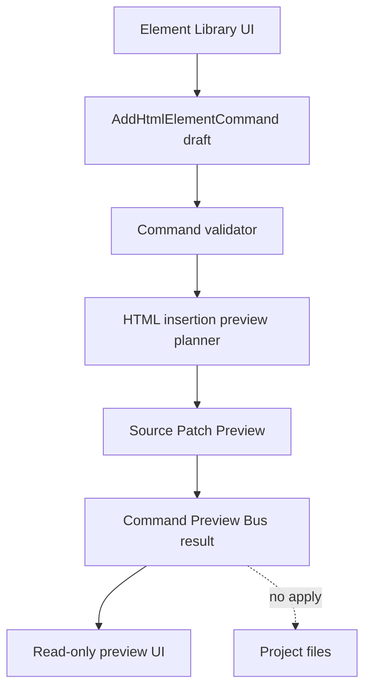

# Commands Architecture

[Docs index](../../README.md)

## Purpose

Commands are the future path from user intent to source change. The current architecture deliberately stops before execution: it defines command intent, validates whether a target is previewable, and renders a source patch preview. That gives the project a place to reason about edits without writing files prematurely.

## Current implementation

Phase 6A and 6B added command contracts, Element Library target eligibility, Source Patch Preview, HTML insertion preview planning, and a Command Preview Bus for dry-run results. No command applies patches or writes files yet.

The diagram shows the current end of the line. `Source Patch Preview` is output for the UI, not input to a writer.

## Key files

These paths are split by intent source, command shape, dry-run planning, and UI rendering.

- `packages/core/commands/html-insertion/**`
- `packages/core/commands/command-preview-bus/**`
- `packages/core/source-patch/**`
- `packages/core/project/html-element-library/**`
- `apps/desktop/electron/renderer/components/html-element-library-panel/**`
- `scripts/validate-html-element-library.mjs`
- `scripts/validate-source-patch-preview.mjs`

## Data flow

Renderer turns a selected catalog item and insertion mode into an `AddHtmlElementCommand` preview object. Core validates the command, checks context, resolves a source anchor if possible, and returns a `CommandPreviewResult`. Renderer displays the result and keeps Apply unavailable.

## Boundaries

Command preview is not command execution. A `preview-ready` result means the system can describe a possible patch; it does not mean a patch is safe to apply. The existing legacy `packages/core/commands/command-bus.ts` is not replaced by the dry-run Command Preview Bus. The preview bus is a separate Phase 6B foundation under `packages/core/commands/command-preview-bus/`.

## Validation

`validate:html-element-library` and `validate:source-patch-preview` guard command preview boundaries, disabled apply behavior, and forbidden write paths.

## Related docs

- [HTML Element Library](./html-element-library.md)
- [Source Patch Preview](./source-patch-preview.md)
- [Command Preview Bus](./command-preview-bus.md)
- [Future command execution](./future-command-execution.md)

## Future work

Phase 6C should introduce transaction and refresh-boundary contracts. Actual execution should remain future until writes are reversible, refreshes are planned, and validators can prove that mutation is explicit rather than accidental.
