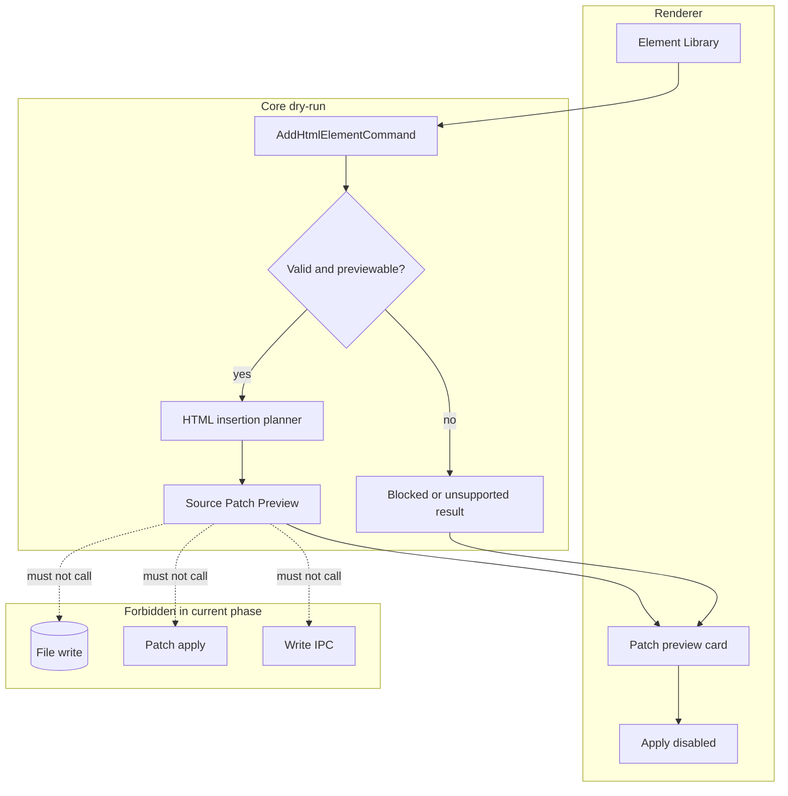

# Commands Architecture

[Docs index](../../README.md)

## At a glance

| Question | Answer |
| --- | --- |
| Is this implemented? | Yes, as dry-run command preview infrastructure. |
| Can it write source files? | No. |
| Runtime owner | Core owns command preview planning; renderer displays intent and results. |
| Safety risk controlled | Prevents UI command intent from becoming implicit source mutation. |
| Related next phase | Phase 6C transaction and refresh-boundary planning. |

> **Safety boundary:** A command preview is not command execution.

## Purpose

Commands are the future path from user intent to source change. The current architecture deliberately stops before execution: it defines command intent, validates whether a target is previewable, and renders a Source Patch Preview.

## Why this exists

Crystal needs a way to reason about edits before it can apply them. Command preview gives validators and UI a concrete dry-run result while keeping writes blocked.

## How to read this page

| Need | Read next |
| --- | --- |
| Element catalog intent | [HTML Element Library](./html-element-library.md) |
| Patch-like preview | [Source Patch Preview](./source-patch-preview.md) |
| Dry-run routing | [Command Preview Bus](./command-preview-bus.md) |
| Future execution | [Future command execution](./future-command-execution.md) |

## Current implementation

Phase 6A and 6B added command contracts, Element Library target eligibility, Source Patch Preview, HTML insertion preview planning, and a Command Preview Bus for dry-run results. No command applies patches or writes files yet.

| Implemented | Blocked | Future |
| --- | --- | --- |
| Element Library command intent. | Real insertion. | Command execution runtime. |
| Source Patch Preview. | Patch apply. | Transaction records. |
| Command Preview Bus dry-run. | Write IPC. | Dirty-state/save workflow. |

## Key files

These paths are split by intent source, command shape, dry-run planning, and UI rendering.

## Key files and responsibilities

| File or path | Responsibility | Reads | Must not do |
| --- | --- | --- | --- |
| `packages/core/project/html-element-library/**` | Element catalog and target eligibility. | Graph, Preview, snapshot, selection state. | Edit source. |
| `packages/core/commands/html-insertion/**` | Command contracts and dry-run planning. | Command + source anchor. | Apply patch. |
| `packages/core/commands/command-preview-bus/**` | Dry-run preview routing. | Supported preview commands. | Replace execution bus. |
| `packages/core/source-patch/**` | Source anchor and preview models. | Snapshot source locations. | Write files. |
| `html-element-library-panel/**` | Renderer panel for intent and preview. | Catalog and preview result. | Enable Apply as working. |

## Data flow

| Input | Decision | Output |
| --- | --- | --- |
| Catalog item + insertion mode | Is command shape valid? | Command preview input. |
| Current selection context | Is target previewable? | Eligible target or blocked state. |
| Source anchor | Can safe preview text be created? | Source Patch Preview. |
| Apply/write action | Does execution runtime exist? | Blocked. |

## Main diagram

## Boundaries

Command preview is not command execution. A `preview-ready` result means the system can describe a possible patch; it does not mean a patch is safe to apply. The existing legacy `packages/core/commands/command-bus.ts` is not replaced by the dry-run Command Preview Bus.

## What this does not do

| Not provided | Reason |
| --- | --- |
| Apply source changes | No execution runtime. |
| Register undo/redo | No transaction history. |
| Refresh Project Graph after writes | No write path exists. |
| Persist dirty state | Save/apply workflow is future. |

## Common misunderstanding

> **Common misunderstanding:** `preview-ready` means display-ready, not write-ready.

## Validation

`validate:html-element-library` and `validate:source-patch-preview` guard command preview boundaries, disabled apply behavior, and forbidden write paths.

## Related docs

- [HTML Element Library](./html-element-library.md)
- [Source Patch Preview](./source-patch-preview.md)
- [Command Preview Bus](./command-preview-bus.md)
- [Future command execution](./future-command-execution.md)

## Future work

Phase 6C should introduce transaction and refresh-boundary contracts. Actual execution should remain future until writes are reversible, refreshes are planned, and validators can prove that mutation is explicit rather than accidental.
