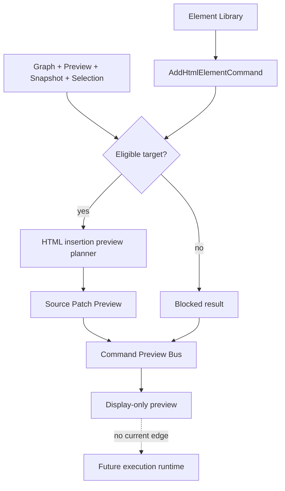

# Commands architecture

[Docs index](../../README.md)

## At a glance

| Question | Answer |
| --- | --- |
| Status | Implemented as dry-run command preview infrastructure. |
| Current command path | HTML Element Library to `AddHtmlElementCommand` preview. |
| Result states | Preview-ready, blocked, or unsupported. |
| Execution | Not implemented. |
| Apply | Unavailable. |

## Purpose

Commands are the seam between user intent and future source mutation. Crystal currently implements only the part that can be made trustworthy without a writer: typed intent, eligibility, validation, and dry-run source previews.

## Current implementation

The Element Library turns a catalog choice and insertion mode into command intent. Target selectors combine Project Graph, Preview, DOM Snapshot, and trusted selection state. The HTML insertion planner resolves a source anchor and creates Source Patch Preview when it can do so without guessing. The Command Preview Bus normalizes the result for renderer display. Phase 6C and later models can describe transaction, refresh, editing, Inspector, and style readiness, but none execute effects.

## Key files

The following paths are the shortest reliable entry points. They are not a substitute for following the data flow through the subsystem.

## Key files and responsibilities

| File or path | Responsibility | Reads | Must not do |
| --- | --- | --- | --- |
| `packages/core/project/html-element-library` | Catalog and target eligibility. | graph, Preview, Snapshot, selection | insert HTML |
| `packages/core/commands/html-insertion` | Command shape, validation, and dry-run planner. | eligible target and source anchor | apply patches |
| `packages/core/commands/command-preview-bus` | Routes supported preview requests. | command and context | execute commands |
| `packages/core/source-patch` | Models source anchors and preview payloads. | Snapshot source locations | persist files |
| `components/html-element-library-panel` | Presents intent and result. | catalog and preview state | enable working Apply |

## Data flow

| Input | Decision | Output |
| --- | --- | --- |
| Catalog item | Is it known and supported? | Command intent or unsupported state |
| Current project context | Is target identity trustworthy? | Eligible target or blocked reason |
| Insertion mode | Can a source anchor be resolved? | Source Patch Preview or blocked state |
| Preview-ready result | Should execution run? | No; renderer displays it |
| Readiness models | Do future requirements appear satisfied? | Planning summary with Apply still unavailable |

## Boundaries

Command preview is not command execution. A preview-ready result means Crystal can describe a possible source change from current evidence. It does not prove freshness at apply time, persistence safety, reversibility, or refresh behavior.

> **Safety boundary:** State that crosses a boundary is evidence to validate, not authority to perform a privileged effect.

## What this does not do

| Not provided | Why |
| --- | --- |
| Patch application | No apply service consumes preview results. |
| File persistence | No write IPC or writer exists. |
| Real undo/redo | History contracts are planning descriptors only. |
| Dirty state and refresh execution | Readiness models describe requirements but perform no effects. |

## Common misunderstanding

> **Common misunderstanding:** A realistic patch preview can still be pure display data. Similarity to source code does not grant it mutation authority.

## Validation

Use `validate:html-element-library`, `validate:source-patch-preview`, `validate:history-foundation`, `validate:design-editing-preflight`, and Inspector/style validators for the relevant boundary.

## Related docs

- [HTML Element Library](./html-element-library.md)
- [Source Patch Preview](./source-patch-preview.md)
- [Command Preview Bus](./command-preview-bus.md)
- [Future command execution](./future-command-execution.md)
- [Future write flow](../flows/future-write-flow.md)

## Future work

Execution must be a separate explicit path with source freshness, conflict detection, safe file IO, transaction history, dirty state, refresh orchestration, and user-controlled Apply. Do not overload the dry-run bus.

## Read next

You are here: Editing Foundations / Commands Architecture.

Before this:
- [Preview Inspector](../preview/preview-inspector.md) explains how Crystal obtains a trusted source-mapped target.

Next:
- [HTML Element Library](./html-element-library.md) shows where insertion intent begins.
- [Source Patch Preview](./source-patch-preview.md) explains the current dry-run endpoint.

Why this matters:
Commands define the future mutation seam. Keeping intent, preview, planning, and execution separate is what makes later persistence reviewable and reversible.
