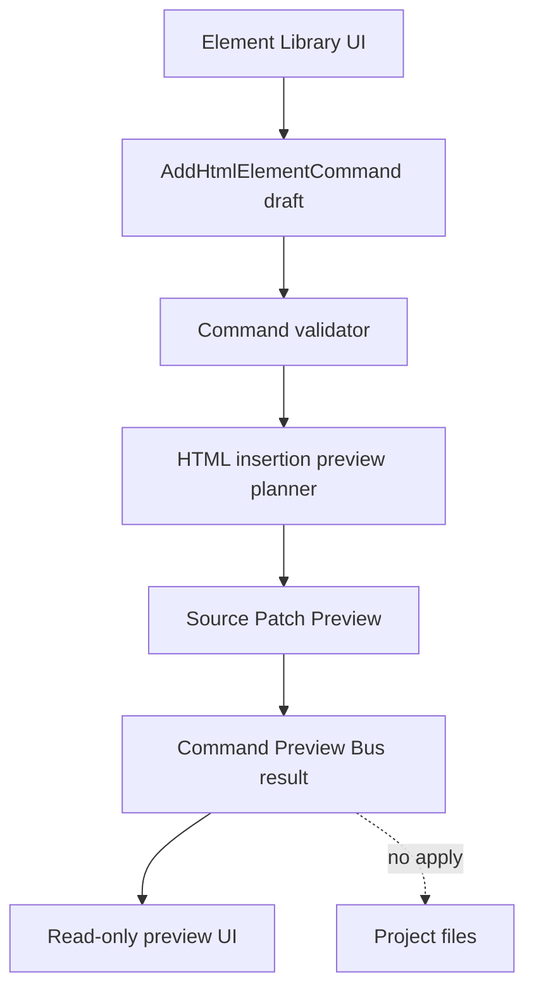

# Commands Architecture

[Docs index](../../README.md)

## Purpose

This document explains Crystal's current command foundations and the deliberate gap between command preview and command execution.

## Current implementation

Phase 6A and 6B introduced command contracts, Element Library target eligibility, Source Patch Preview, HTML insertion preview planning, and Command Preview Bus dry-run results. No command applies patches or writes files yet.

## Key files

- `packages/core/commands/html-insertion/**`
- `packages/core/commands/command-preview-bus/**`
- `packages/core/source-patch/**`
- `packages/core/project/html-element-library/**`
- `apps/desktop/electron/renderer/components/html-element-library-panel/**`
- `scripts/validate-html-element-library.mjs`
- `scripts/validate-source-patch-preview.mjs`

## Data flow

Renderer creates a preview command from selected library item, target eligibility, and insertion mode. Core validators and planners create a dry-run preview. The UI renders the human summary and inserted-text preview if available. The Apply action remains disabled/unavailable.

## Boundaries

Command preview is not command execution. A `preview-ready` result means the planner can describe a patch, not that the patch was applied. Source patch application, write IPC, save/apply workflow, and undo/redo history are blocked.

## Validation

`validate:html-element-library` and `validate:source-patch-preview` guard command boundaries and forbidden write paths.

## Related docs

- [HTML Element Library](./html-element-library.md)
- [Source Patch Preview](./source-patch-preview.md)
- [Command Preview Bus](./command-preview-bus.md)
- [Future command execution](./future-command-execution.md)

## Future work

Phase 6C should define transaction skeletons and refresh-boundary planning without enabling real command execution.
