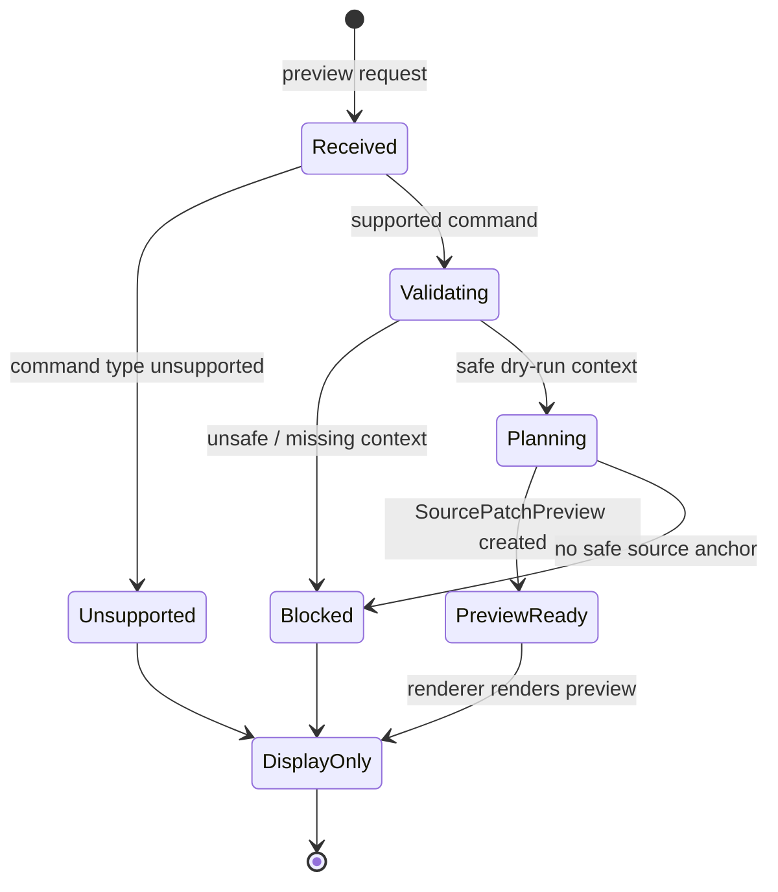

# Command Preview Bus

[Docs index](../../README.md)

## At a glance

| Question | Answer |
| --- | --- |
| Is this implemented? | Yes, as a dry-run bus. |
| Is it an execution bus? | No. |
| Runtime owner | Core pure command preview modules. |
| Safety risk controlled | Prevents previewable command intent from gaining side effects. |
| Related next phase | Future execution bus must be separate and transaction-aware. |

> **Implementation note:** The Command Preview Bus is not a replacement for `packages/core/commands/command-bus.ts` and not an execution bus.

## Purpose

The Command Preview Bus gives command-like user intent a safe dry-run path. It normalizes preview outcomes so the UI can explain what would happen, what is blocked, or what is unsupported.

## Why this exists

The UI needs one place to ask for a command preview without knowing every planner. That should not imply that a central writer exists.

## How to read this page

| Need | Focus |
| --- | --- |
| Status model | State diagram. |
| Legacy bus distinction | Boundaries and common misunderstanding. |
| Current supported path | Key files and data flow. |

## Current implementation

The bus accepts supported command preview inputs and returns a `CommandPreviewResult` with statuses such as preview-ready, blocked, or unsupported. The current user-facing path is Element Library preview for `AddHtmlElementCommand`.

| Implemented | Blocked | Future |
| --- | --- | --- |
| Dry-run preview routing. | Command execution. | Separate execution bus. |
| Blocked/unsupported statuses. | File write. | Transaction-aware command runtime. |
| HTML insertion preview path. | Undo/redo registration. | Refresh invalidation. |

## Key files

The `command-preview-bus` folder is the dry-run bus. It should not be confused with the existing `packages/core/commands/command-bus.ts`, which is a different legacy module boundary.

## Key files and responsibilities

| File | Responsibility | Reads | Must not do |
| --- | --- | --- | --- |
| `command-preview-bus.types.ts` | Defines preview result status model. | Preview command contracts. | Define execution effects. |
| `command-preview-bus.preview.ts` | Routes supported dry-run previews. | Command + context. | Write files or call Electron. |
| `html-insertion-command.validators.ts` | Validates command/context. | Catalog and target state. | Treat unsafe target as previewable. |
| `html-insertion-command.planner.ts` | Builds dry-run preview. | Anchor and command data. | Apply patch. |
| `validate-source-patch-preview.mjs` | Guards preview/write boundary. | Source files. | Weaken write restrictions. |

## Data flow

| Input | Decision | Output |
| --- | --- | --- |
| Command preview request | Is command type supported? | Unsupported or next validation. |
| Supported command | Is context safe? | Blocked or planning. |
| Planning result | Can preview text be created? | Preview-ready or blocked. |
| Preview-ready result | Should execution run? | No; renderer displays only. |

## Main diagram

## Boundaries

The Command Preview Bus is not a replacement for `packages/core/commands/command-bus.ts` and not an execution bus. It must not write files, mutate DOM, call Electron IPC, refresh Preview, or register undo/redo.

> **Safety boundary:** A bus that returns preview statuses must stay side-effect free.

## What this does not do

| Not provided | Reason |
| --- | --- |
| Command execution | Requires separate policy and transaction layer. |
| Patch application | Source Patch Preview is descriptive. |
| Undo/redo registration | No history model exists. |
| Legacy bus replacement | Existing `command-bus.ts` remains a different module boundary. |

## Common misunderstanding

> **Common misunderstanding:** Centralizing dry-run preview is not the same as centralizing writes.

## Validation

`validate:source-patch-preview` checks bus exports, statuses, blocked reasons, renderer preview rendering, and absence of write behavior.

## Related docs

- [Source Patch Preview](./source-patch-preview.md)
- [HTML insertion preview planner](./html-insertion-preview-planner.md)
- [Command Preview Bus sequence](../diagrams/command-preview-bus-sequence.md)
- [ADR 0003](../../decisions/0003-command-preview-before-write.md)

## Future work

A write-capable command runtime should add transaction creation, patch application, persistence, refresh invalidation, and undo/redo descriptors without overloading this dry-run bus.
