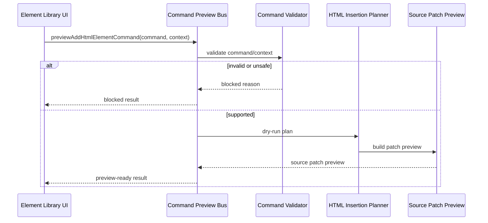

# Command Preview Bus

[Docs index](../../README.md)

## Purpose

The Command Preview Bus gives command-like user intent a safe dry-run path. It is deliberately narrower than an execution bus: it normalizes preview outcomes so the UI can explain what would happen, what is blocked, or what is unsupported.

## Current implementation

The bus accepts supported command preview inputs and returns a `CommandPreviewResult` with statuses such as preview-ready, blocked, or unsupported. The current user-facing path is Element Library preview for `AddHtmlElementCommand`.

The sequence shows validation before planning. A blocked result is a valid outcome, not an error to bypass.

## Key files

The `command-preview-bus` folder is the dry-run bus. It should not be confused with the existing `packages/core/commands/command-bus.ts`, which is a different legacy module boundary.

- `packages/core/commands/command-preview-bus/command-preview-bus.types.ts`
- `packages/core/commands/command-preview-bus/command-preview-bus.preview.ts`
- `packages/core/commands/html-insertion/html-insertion-command.types.ts`
- `packages/core/commands/html-insertion/html-insertion-command.validators.ts`
- `packages/core/commands/html-insertion/html-insertion-command.planner.ts`
- `packages/core/commands/html-insertion/html-insertion-command.preview.ts`
- `scripts/validate-source-patch-preview.mjs`

## Data flow

Renderer provides command intent and context. Core validates target, graph, snapshot, selection mapping, selected catalog item, insertion mode, and source-anchor availability. The bus returns displayable state only; it does not update Project Graph, DOM Snapshot, Preview, or source files.

## Boundaries

The Command Preview Bus is not a replacement for `packages/core/commands/command-bus.ts` and not an execution bus. It must not write files, mutate DOM, call Electron IPC, refresh Preview, or register undo/redo. A future execution bus should be a separate layer with explicit side-effect contracts.

## Validation

`validate:source-patch-preview` checks bus exports, statuses, blocked reasons, renderer preview rendering, and absence of write behavior.

## Related docs

- [Source Patch Preview](./source-patch-preview.md)
- [HTML insertion preview planner](./html-insertion-preview-planner.md)
- [Command Preview Bus sequence](../diagrams/command-preview-bus-sequence.md)
- [ADR 0003](../../decisions/0003-command-preview-before-write.md)

## Future work

A write-capable command runtime should add transaction creation, patch application, persistence, refresh invalidation, and undo/redo descriptors without overloading this dry-run bus.
