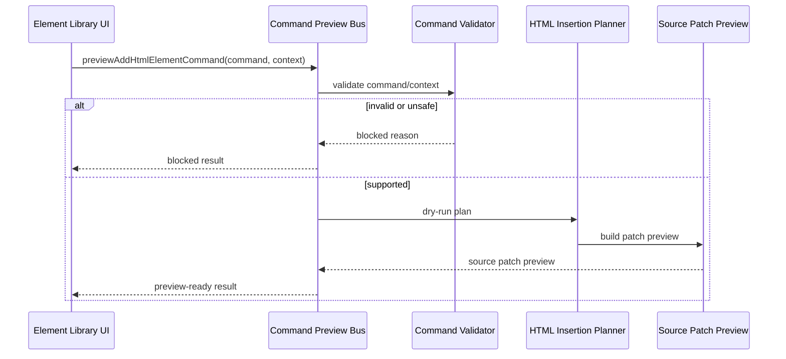

# Command Preview Bus

[Docs index](../../README.md)

## Purpose

This document explains the Command Preview Bus dry-run boundary introduced before any command execution runtime.

## Current implementation

The Command Preview Bus accepts supported command preview inputs and returns a `CommandPreviewResult`. Current statuses distinguish preview-ready, blocked, and unsupported states. The bus is used by the Element Library to preview `AddHtmlElementCommand` output.

## Key files

- `packages/core/commands/command-preview-bus/command-preview-bus.types.ts`
- `packages/core/commands/command-preview-bus/command-preview-bus.preview.ts`
- `packages/core/commands/html-insertion/html-insertion-command.types.ts`
- `packages/core/commands/html-insertion/html-insertion-command.validators.ts`
- `packages/core/commands/html-insertion/html-insertion-command.planner.ts`
- `packages/core/commands/html-insertion/html-insertion-command.preview.ts`
- `scripts/validate-source-patch-preview.mjs`

## Data flow

Renderer creates a preview command and context. Core validates command shape, selected target, graph state, snapshot state, selection mapping, insertion mode, and anchor support. The bus returns a result object for display only.

## Boundaries

The Command Preview Bus is not a command execution bus. It must not write files, mutate DOM, call Electron IPC, refresh Preview, or register undo/redo. It is safe to show `preview-ready` only as a planning result.

## Validation

`validate:source-patch-preview` checks bus exports, statuses, blocked reasons, renderer preview rendering, and no write implementation.

## Related docs

- [Source Patch Preview](./source-patch-preview.md)
- [HTML insertion preview planner](./html-insertion-preview-planner.md)
- [Command Preview Bus sequence](../diagrams/command-preview-bus-sequence.md)
- [ADR 0003](../../decisions/0003-command-preview-before-write.md)

## Future work

A future execution bus must be a separate layer with stronger contracts, transactional history, patch application, persistence, and refresh invalidation. It should not reuse dry-run naming for write behavior.
