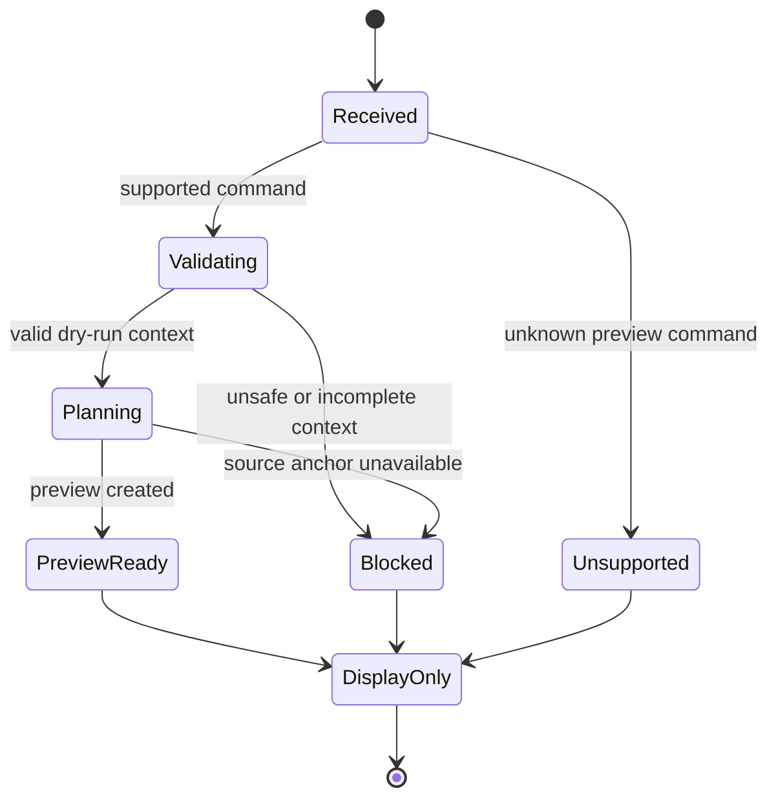

# Command Preview Bus

[Docs index](../../README.md)

## At a glance

| Question | Answer |
| --- | --- |
| Status | Implemented, dry-run. |
| Input | Supported command preview request and current context. |
| Output | Preview-ready, blocked, or unsupported result. |
| Current user path | HTML insertion preview from Element Library. |
| Execution | Not available. |

## Purpose

The UI needs one place to ask what a supported command would look like without learning every planner. That coordination point remains pure and side-effect free.

## Current implementation

The bus identifies supported command intent, validates context through the relevant command module, and routes to a pure preview planner. It normalizes the result for renderer presentation. It is not a replacement for `packages/core/commands/command-bus.ts` and not an execution bus.

## Key files

The following paths are the shortest reliable entry points. They are not a substitute for following the data flow through the subsystem.

## Key files and responsibilities

| File or path | Responsibility | Reads | Must not do |
| --- | --- | --- | --- |
| `command-preview-bus.types.ts` | Defines preview result statuses. | preview command contracts | define effects |
| `command-preview-bus.preview.ts` | Routes supported dry-runs. | command and current context | execute or persist |
| `html-insertion-command.validators.ts` | Validates the supported insertion context. | target and command data | mark unsafe input ready |
| `html-insertion-command.planner.ts` | Builds the current Source Patch Preview. | safe source anchor | apply patches |
| `validate-source-patch-preview.mjs` | Guards bus and write boundary. | source and fixtures | weaken policy |

## Data flow

| Input | Decision | Output |
| --- | --- | --- |
| Preview request | Is the command type supported? | Unsupported or validation |
| Supported request | Is context complete and trustworthy? | Blocked or planning |
| Planning | Can a safe preview be built? | Preview-ready or blocked |
| Preview-ready | What should renderer do? | Display the result only |
| Any status | Should an execution side effect run? | No |

## Boundaries

The preview bus cannot call Electron, filesystem adapters, patch application, refresh execution, dirty-state storage, or history execution. Centralizing dry-run classification does not centralize mutation.

> **Safety boundary:** State that crosses a boundary is evidence to validate, not authority to perform a privileged effect.

## What this does not do

| Not provided | Why |
| --- | --- |
| Command execution | A future execution bus needs stronger policy and transaction contracts. |
| Legacy bus replacement | The existing `command-bus.ts` remains a different boundary. |
| Patch application | Source Patch Preview is descriptive. |
| Undo/redo registration | No executable transaction is created. |

## Common misunderstanding

> **Common misunderstanding:** A bus can unify result states without becoming an effectful service. The word “bus” does not imply execution authority.

## Validation

`npm run validate:source-patch-preview` checks exports, statuses, blocked reasons, current routing, renderer behavior, and the absence of side effects.

## Related docs

- [Source Patch Preview](./source-patch-preview.md)
- [HTML insertion preview planner](./html-insertion-preview-planner.md)
- [Command Preview Bus sequence](../diagrams/command-preview-bus-sequence.md)
- [ADR 0003](../../decisions/0003-command-preview-before-write.md)

## Future work

Create a separately named execution path only after command policy, transactions, conflict detection, persistence, dirty state, refresh, and history execution are designed as one lifecycle.
