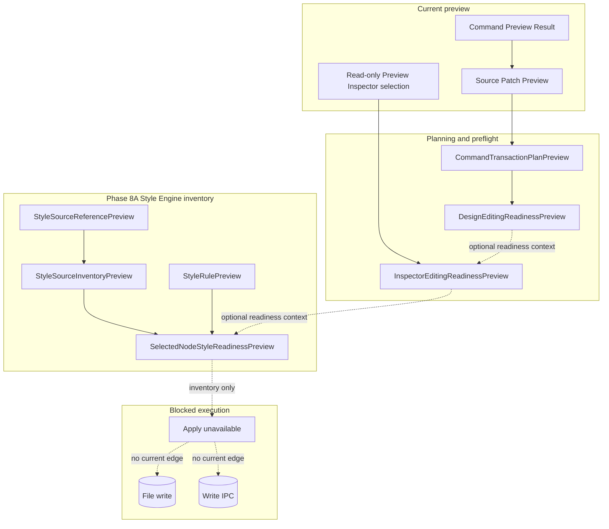

# Future Command Execution

[Docs index](../../README.md)

## At a glance

| Question | Answer |
| --- | --- |
| Is this implemented? | No. |
| Can current commands write source files? | No. |
| Runtime owner | Future main/core execution services. |
| Phase 6C addition | Command transaction plan preview only. |
| Phase 6D addition | Design editing readiness preflight only. |
| Phase 7A addition | Editable Inspector draft/intent foundation only. |
| Phase 7B addition | Editable Inspector read-only draft surface only. |
| Phase 8A addition | Style Engine read-only source inventory foundation only. |
| Safety risk controlled | Keeps dry-run previews, planning, readiness summaries, Inspector edit intents, disabled Inspector UI, and Style Engine inventory separate from side effects. |

> **Future-only:** This page describes the shape a future runtime needs. It must not be cited as current write support.

## Purpose

This page keeps future command execution separate from current preview behavior. Phase 6C adds transaction planning descriptors. Phase 6D adds Apply-blocked design readiness. Phase 7A adds Inspector draft/intent contracts. Phase 7B renders those Inspector contracts as disabled UI. Phase 8A adds Style Engine source inventory contracts for a future CSS/Sass Inspector without command execution.

## Current implementation

No real command execution runtime exists. No source patch apply path exists. No write IPC exists. No save/apply workflow exists. No renderer behavior writes project files. Phase 8A only introduces read-only style source inventory and textual preview models under `packages/core/style-engine/`.

Phase 8A boundary: Style Engine read-only source inventory foundation only. No CSS/Sass Inspector visual surface is added. No real cascade is calculated. No computed styles are read. No style editing is implemented. No source files are written. No patch apply is available. No write IPC exists. Apply remains unavailable. No contenteditable is used. No undo/redo execution runs. Dirty-state is not persisted. No refresh execution runs. No Preview DOM mutation occurs.

| Implemented | Blocked | Future |
| --- | --- | --- |
| Dry-run command previews. | Command execution. | Explicit execution runtime. |
| Source Patch Preview. | File writes. | Patch apply service. |
| History transaction preview. | Undo/redo execution. | Durable transaction log. |
| Refresh boundary plan. | Refresh execution. | Post-write orchestration. |
| Design editing readiness preview. | Apply enablement. | Dirty-state workflow. |
| Inspector edit draft/intent previews. | Applied Inspector edits. | Gated Inspector Apply flow. |
| Disabled Editable Inspector surface. | Editable input state. | Gated Inspector Apply flow. |
| Style Engine source inventory. | CSS/Sass editing. | CSS/Sass Inspector. |
| Selector/declaration/rule previews. | Real cascade. | Cascade Map. |
| Selected-node style readiness. | Computed style reads. | Authored/computed style correlation. |

## Key files

The following files are preview, planning, preflight, draft/intent, read-only surface, or inventory files only. Do not cite them as an implemented execution runtime.

## Key files and responsibilities

| File or path | Responsibility | Reads | Must not do |
| --- | --- | --- | --- |
| `packages/core/commands/command-preview-bus/**` | Dry-run preview routing. | Command preview input. | Execute commands. |
| `packages/core/source-patch/**` | Preview anchors and payloads. | DOM Snapshot source location. | Persist files. |
| `packages/core/history/**` | Future transaction descriptor. | Patch metadata. | Execute undo/redo. |
| `packages/core/refresh-boundary/**` | Future invalidation descriptor. | Affected files. | Mutate derived state. |
| `packages/core/commands/transaction-planning/**` | Preview-only bridge across the above models. | Preview results. | Execute or apply. |
| `packages/core/design-editing/**` | Preview-only readiness summary. | Preflight models. | Enable Apply. |
| `packages/core/inspector-editing/**` | Draft/intent and read-only surface models. | Selection paths and readiness previews. | Mutate DOM or write source. |
| `packages/core/style-engine/**` | Read-only style inventory, selector, declaration, rule, and selected-node style readiness previews. | Caller-supplied source text and Project Graph-style paths. | Read iframe styles, calculate real cascade, edit styles, write files, or enable Apply. |
| `apps/desktop/electron/renderer/views/inspector/editable-inspector/**` | Disabled surface for Editable Inspector preview. | Inspector editing view model. | Attach editing or Apply handlers. |

Future execution files do not exist yet.

## Data flow

| Current input | Current decision | Current output |
| --- | --- | --- |
| Command Preview Result | Is it preview-ready? | Plan may continue or block. |
| Source Patch Preview | Is it ready and does it include affected files? | History/refresh planning or blocked plan. |
| CommandTransactionPlanPreview | What dirty/conflict/write capability checks are needed? | Design editing readiness preview. |
| Preview Inspector selection | Can Inspector fields be represented as drafts? | Inspector editable field preview. |
| InspectorEditingReadinessPreview | Can Apply be enabled? | No, Apply remains unavailable. |
| Caller-supplied HTML/source text | Can style sources be inventoried textually? | StyleSourceInventoryPreview. |
| StyleSourceInventoryPreview | Can authored styles be inspected as inventory? | SelectedNodeStyleReadinessPreview. |
| Style readiness | Can styles be edited or applied? | No, Apply remains unavailable. |

## Boundaries

Do not add hidden apply behavior under preview functions. Do not add renderer filesystem writes. Do not add write IPC before command execution policy, transaction state, dirty state, conflict detection, and refresh execution are designed. Phase 8A Style Engine models must remain pure inventory contracts: no CSS/Sass Inspector visual surface, no real cascade, no computed styles, no style editing, no source write, no patch apply, no write IPC, no contenteditable, no refresh execution, no dirty-state persistence, no undo/redo execution, and no Preview DOM mutation.

> **Safety boundary:** Execution must be a separate, explicit runtime path; it cannot be smuggled into preview helpers, planning helpers, readiness helpers, Inspector draft/intent helpers, the Phase 7B read-only surface, or the Phase 8A Style Engine inventory.

## What this does not do

| Not provided | Reason |
| --- | --- |
| File write | Future only. |
| Patch apply | Future only. |
| Undo/redo execution | Future only. |
| Save/apply workflow | Future only. |
| Preview reload after write | No write occurs. |
| Dirty-state persistence | Future only. |
| CSS/Sass Inspector visual surface | Phase 8A is core inventory only. |
| Real cascade | Phase 8A only stores textual previews. |
| Computed styles | Phase 8A forbids computed style reads. |
| Applied style editing | Style declarations remain `canEdit: false` and `canApply: false`. |

## Common misunderstanding

> **Common misunderstanding:** A style source inventory is not a Cascade Map. A selector preview is not a DOM match. A declaration preview is not an editable style control. A selected-node style readiness preview is not Apply permission.

## Validation

`validate:style-engine-foundation` checks that Phase 8A modules exist, exports remain barrel-only, style sources cannot write, style inventory cannot edit/apply, selected-node style readiness cannot inspect computed styles, forbidden stylesheet/browser/iframe/write APIs are absent, package scripts are wired, and docs keep the Phase 8A boundary explicit.

## Related docs

- [Future write flow](../flows/future-write-flow.md)
- [Command Preview Bus](./command-preview-bus.md)
- [Source Patch Preview](./source-patch-preview.md)
- [Validation system](../validation-system.md)
- [ADR 0003](../../decisions/0003-command-preview-before-write.md)
- [Roadmap implementation](../../roadmap-implementation.md)

## Future work

A later phase can add CSS/Sass Inspector visual UI, authored-style matching against DOM Snapshot, real cascade analysis, computed style inspection, and controlled style editing only after write ownership, patch application, dirty state, conflict detection, refresh execution, Inspector Apply UX, and history execution are explicit and validated.
