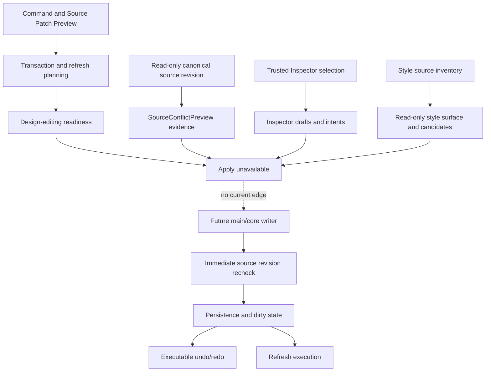

# Future command execution

[Docs index](../../README.md)

## At a glance

| Question | Answer |
| --- | --- |
| Write runtime | Not implemented. |
| Planning foundations | Implemented through transaction, refresh, and readiness descriptors. |
| Source freshness foundation | Implemented, read-only; canonical byte revisions and root-contained observation exist, but no execution-time writer gate uses them. |
| Inspector foundations | Draft/intent models and disabled read-only surface implemented. |
| Style foundations | 8A inventory, 8B read-only surface, and 8C snapshot candidates implemented. |
| Apply | Unavailable throughout. |

## Purpose

This page marks the exact boundary between the models Crystal has and the effectful runtime it does not. It should be read as an execution contract under design, not as current write support.

## Current implementation

No command execution runtime, patch apply service, write IPC, save workflow, executable history, dirty-state store, or post-write refresh executor exists. Current modules can produce Source Patch Preview, history/refresh transaction plans, design-editing readiness, Inspector field drafts and intents, a disabled Editable Inspector, style-source inventory, a passive CSS/Sass Inspector, authored rule candidates over DOM Snapshot, and canonical source revision evidence from a bounded read-only file observation. Every output remains read-only, preview-only, or planning-only.

The Source Revision and Freshness Foundation uses exact file bytes and a versioned token with the external form `sha256:<byteLengthDecimal>:<64LowercaseHexCharacters>`. It can map a canonical match to `clean-preview`, a canonical mismatch to `conflict-risk`, insufficient evidence to `not-checked`, and invalid path/read/token evidence to `blocked`. It never changes `canApplyWithoutRecheck: false`.

## Key files

The following paths are the shortest reliable entry points. They are not a substitute for following the data flow through the subsystem.

## Key files and responsibilities

| File or path | Responsibility | Reads | Must not do |
| --- | --- | --- | --- |
| `packages/core/commands/command-preview-bus` | Dry-run command routing. | preview request | execute |
| `packages/core/source-conflict` | Portable canonical revision format, comparison, and conflict-preview mapping. | revision tokens and typed read evidence | import Node, write, or authorize Apply |
| `packages/adapters/file-system/source-revision.adapter.ts` | Bounded root-contained observation of a real file revision. | project root, relative path, exact bytes | accept unbound absolute targets, escape root, or write |
| `packages/core/history` | HistoryTransactionPreview descriptors. | patch metadata | undo or redo |
| `packages/core/refresh-boundary` | RefreshBoundaryPlan descriptors. | affected paths | reload state |
| `packages/core/design-editing` | Apply-blocked readiness. | transaction and capability inputs | enable Apply |
| `packages/core/inspector-editing` | Field drafts and edit-intent previews. | trusted source-mapped context | mutate source |
| `packages/core/style-engine` | Inventory and snapshot candidate previews. | plain source text and snapshot data | calculate real cascade or edit |

## Data flow

| Input | Decision | Output |
| --- | --- | --- |
| Command Preview Result | Is it preview-ready? | Planning can continue or block |
| Source Patch Preview | Which files and reversibility questions matter? | Transaction/refresh descriptors |
| Expected revision plus read-only file observation | Are both canonical and identical? | `clean-preview`, `conflict-risk`, `not-checked`, or `blocked` evidence |
| Readiness inputs | Are all future requirements represented? | Apply remains false |
| Inspector draft | Can intent be modeled safely? | Read-only field and intent preview |
| Style evidence | Can inventory/candidates be represented? | Passive Inspector data |
| Future validated transaction | Does an execution runtime exist? | Currently no |

## Boundaries

No planning, readiness, draft, disabled-surface, inventory, authored-matching, source-conflict, or revision-observation module may hide an apply path. Renderer must not write files. Main must not gain write IPC before source freshness, conflict policy, transaction execution, dirty state, refresh execution, and user approval are explicit.

The read-only foundation is not the writer's completed conflict detector. A future writer must repeat the canonical read and comparison immediately before mutation because any earlier observation may become stale after it is returned.

> **Safety boundary:** State that crosses a boundary is evidence to validate, not authority to perform a privileged effect.

## What this does not do

| Not provided | Why |
| --- | --- |
| File writes or patch apply | Future writer files do not exist. |
| Execution-time conflict gate | No writer invokes a freshness check at the mutation boundary. |
| Undo/redo execution | History previews cannot replay effects. |
| Refresh execution | Plans describe invalidation only. |
| Enabled Inspector or CSS editing | Current surfaces remain passive. |
| Real cascade or computed styles | Style evidence is textual and snapshot-derived. |

## Common misunderstanding

> **Common misunderstanding:** A canonical byte revision proves what was read for that observation. It does not reserve the file, lock it, or authorize a later write without another immediate check.

## Canonical phase boundary statements

The repository validators preserve the following historical phase contracts verbatim. They describe the scope of each increment when it landed; they do not erase later read-only additions.

- Phase 6D remained preflight-only.
- Phase 7A was the Editable Inspector draft/intent foundation.
- Phase 7B added the Editable Inspector read-only draft surface.
- Phase 8A introduced the Style Engine read-only source inventory foundation. No CSS/Sass Inspector visual surface is added within that phase.

Across those boundaries: No real cascade is calculated. No computed styles are read. No style editing is implemented. No source files are written. No patch apply is available. No write IPC exists. Apply remains unavailable. No contenteditable is used. No undo/redo execution runs. Dirty-state is not persisted. No refresh execution runs. No Preview DOM mutation occurs.

## Validation

Current validators must fail if write behavior appears in preview, planning, readiness, Inspector, style, source-conflict, or source-revision modules. Use `npm run validate:source-freshness-foundation` for the focused behavioral gate and the existing history, editing-preflight, Inspector, Style Engine, matching, surface, source-patch, and architecture gates for preserved boundaries.

## Related docs

- [Future write flow](../flows/future-write-flow.md)
- [Source Patch Preview](./source-patch-preview.md)
- [CSS/Sass Inspector surface](../css-sass-inspector-readonly-surface.md)
- [Implementation status](../../roadmap-implementation.md)

## Future work

Implement command execution only as a separate main/core runtime path with an immediate canonical revision recheck, exact patching, safe IO, executable transactions, dirty-state persistence, refresh orchestration, and reviewable Apply/Save/Undo/Redo behavior. Keep `conflict-detector` listed as missing until that writer-time gate exists.
