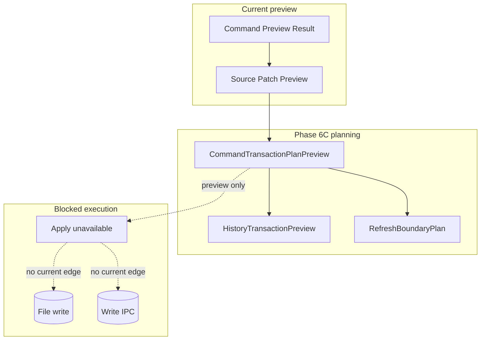

# Future Command Execution

[Docs index](../../README.md)

## At a glance

| Question | Answer |
| --- | --- |
| Is this implemented? | No. |
| Can current commands write source files? | No. |
| Runtime owner | Future main/core execution services. |
| Phase 6C addition | Command transaction plan preview only. |
| Safety risk controlled | Keeps dry-run preview and planning separate from side effects. |

> **Future-only:** This page describes the shape a future runtime needs. It must not be cited as current write support.

## Purpose

This page keeps future command execution separate from current preview behavior. Phase 6C adds a planning layer that can answer what a future command would affect, whether it appears reversible, and which derived states would need invalidation after a later write.

## Why this exists

The project already has command intent and Source Patch Preview. Without a future execution map, a source preview could be mistaken for permission to write files. The command transaction plan makes the missing requirements explicit instead of hiding them inside UI state.

## How to read this page

| Need | Focus |
| --- | --- |
| Current truth | Current implementation and what this does not do. |
| Phase 6C contracts | Transaction planning preview. |
| Future requirements | Data flow and future work. |
| Safety language | Boundaries. |

## Current implementation

No real command execution runtime exists. No source patch apply path exists. No write IPC exists. No save/apply workflow exists. No renderer behavior writes project files. Phase 6C adds only `CommandTransactionPlanPreview`, which combines existing previews with history and refresh planning descriptors.

| Implemented | Blocked | Future |
| --- | --- | --- |
| Dry-run command previews. | Command execution. | Explicit execution runtime. |
| Source Patch Preview. | File writes. | Patch apply service. |
| History transaction preview. | Undo/redo execution. | Durable transaction log. |
| Refresh boundary plan. | Refresh execution. | Post-write orchestration. |
| Disabled Apply affordance. | Save/apply workflow. | Dirty-state workflow. |

## Key files

The following files are dry-run or planning files only. Do not cite them as an implemented execution runtime.

## Key files and responsibilities

| File or path | Responsibility | Reads | Must not do |
| --- | --- | --- | --- |
| `packages/core/commands/command-preview-bus/**` | Dry-run preview routing. | Command preview input. | Execute commands. |
| `packages/core/commands/html-insertion/**` | Preview planning. | Command and anchor. | Apply patches. |
| `packages/core/source-patch/**` | Preview anchors and payloads. | DOM Snapshot source location. | Persist files. |
| `packages/core/history/**` | Future transaction descriptor. | Patch metadata. | Execute undo/redo. |
| `packages/core/refresh-boundary/**` | Future invalidation descriptor. | Affected files. | Mutate derived state. |
| `packages/core/commands/transaction-planning/**` | Preview-only bridge across the above models. | Preview results. | Execute or apply. |
| `html-element-library-panel/**` | UI for intent and preview. | Preview result. | Enable working Apply. |

Future execution files do not exist yet.

## Data flow

| Current input | Current decision | Current output |
| --- | --- | --- |
| Command Preview Result | Is it preview-ready? | Plan may continue or block. |
| Source Patch Preview | Is it ready and does it include affected files? | History/refresh planning or blocked plan. |
| Patch reversibility flag | Can undo strategy be described? | Reverse-patch or unsupported descriptor. |
| Affected files | Which derived state would become stale after a future write? | Refresh-boundary plan. |
| Execution request | Does write runtime exist? | Blocked. |

## Boundaries

Do not add hidden apply behavior under preview functions. Do not add renderer filesystem writes. Do not add write IPC before command execution policy, transaction state, dirty state, and refresh execution are designed.

> **Safety boundary:** Execution must be a separate, explicit runtime path; it cannot be smuggled into preview helpers or Phase 6C planning helpers.

## What this does not do

| Not provided | Reason |
| --- | --- |
| File write | Future only. |
| Patch apply | Future only. |
| Undo/redo execution | Future only. |
| Save/apply workflow | Future only. |
| Preview reload after write | No write occurs. |
| Dirty-state mutation | Future only. |

## Common misunderstanding

> **Common misunderstanding:** A command transaction plan is not an execution plan that can be run. It is a preview object used to keep future requirements visible.

## Validation

`validate:history-foundation` keeps Phase 6C dry-run by checking module presence, statuses, validators, exports, package script wiring, and forbidden filesystem, IPC, patch-apply, renderer, and iframe patterns.

## Related docs

- [Future write flow](../flows/future-write-flow.md)
- [Command Preview Bus](./command-preview-bus.md)
- [Source Patch Preview](./source-patch-preview.md)
- [Validation system](../validation-system.md)
- [ADR 0003](../../decisions/0003-command-preview-before-write.md)
- [Roadmap implementation](../../roadmap-implementation.md)

## Future work

A later phase can add real command execution only after write ownership, patch application, dirty state, refresh execution, and history execution are explicit and validated.
