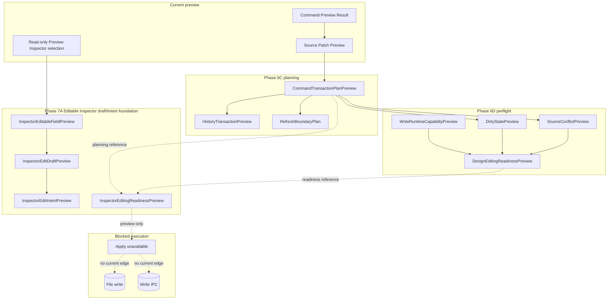

# Future Command Execution

[Docs index](../../README.md)

## At a glance

| Question | Answer |
| --- | --- |
| Is this implemented? | No. |
| Can current commands write source files? | No. |
| Runtime owner | Future main/core execution services. |
| Phase 6C addition | Command transaction plan preview only. |
| Phase 6D addition | Design editing readiness preflight only. |
| Phase 7A addition | Editable Inspector draft/intent foundation only. |
| Safety risk controlled | Keeps dry-run preview, planning, readiness summaries, and Inspector edit intents separate from side effects. |

> **Future-only:** This page describes the shape a future runtime needs. It must not be cited as current write support.

## Purpose

This page keeps future command execution separate from current preview behavior. Phase 6C adds a planning layer that can answer what a future command would affect, whether it appears reversible, and which derived states would need invalidation after a later write. Phase 6D adds a readiness layer that can explain why Apply must remain unavailable before a real write runtime exists. Phase 7A adds Editable Inspector draft/intent foundation contracts that describe text and attribute edit intent without executing or applying anything.

## Why this exists

The project already has command intent and Source Patch Preview. Without a future execution map, a source preview could be mistaken for permission to write files. The command transaction plan, design editing readiness model, and Inspector editing intent model make the missing requirements explicit instead of hiding them inside UI state.

## How to read this page

| Need | Focus |
| --- | --- |
| Current truth | Current implementation and what this does not do. |
| Phase 6C contracts | Transaction planning preview. |
| Phase 6D contracts | Design editing preflight/readiness preview. |
| Phase 7A contracts | Editable Inspector draft/intent preview. |
| Future requirements | Data flow and future work. |
| Safety language | Boundaries. |

## Current implementation

No real command execution runtime exists. No source patch apply path exists. No write IPC exists. No save/apply workflow exists. No renderer behavior writes project files. Phase 6C adds only `CommandTransactionPlanPreview`, which combines existing previews with history and refresh planning descriptors. Phase 6D adds only `DesignEditingReadinessPreview`, which combines the transaction plan with dirty-state, source-conflict, and write-runtime capability previews. Phase 7A adds only `InspectorEditableFieldPreview`, `InspectorEditDraftPreview`, `InspectorEditIntentPreview`, and `InspectorEditingReadinessPreview` under `packages/core/inspector-editing/`.

Phase 6D boundary: No source files are written. No patch apply is available. No write IPC exists. Apply remains unavailable. No undo/redo execution runs. Dirty-state is not persisted. No refresh execution runs. No Preview DOM mutation occurs.

Phase 7A boundary: Editable Inspector draft/intent foundation only. No source files are written. No patch apply is available. No write IPC exists. Apply remains unavailable. No contenteditable is used. No undo/redo execution runs. Dirty-state is not persisted. No refresh execution runs. No Preview DOM mutation occurs.

| Implemented | Blocked | Future |
| --- | --- | --- |
| Dry-run command previews. | Command execution. | Explicit execution runtime. |
| Source Patch Preview. | File writes. | Patch apply service. |
| History transaction preview. | Undo/redo execution. | Durable transaction log. |
| Refresh boundary plan. | Refresh execution. | Post-write orchestration. |
| Design editing readiness preview. | Apply enablement. | Dirty-state workflow. |
| Inspector edit draft/intent previews. | Applied Inspector edits. | Gated Inspector Apply flow. |
| Disabled Apply affordance. | Save/apply workflow. | Dirty-state workflow. |

## Key files

The following files are dry-run, planning, preflight, or draft/intent files only. Do not cite them as an implemented execution runtime.

## Key files and responsibilities

| File or path | Responsibility | Reads | Must not do |
| --- | --- | --- | --- |
| `packages/core/commands/command-preview-bus/**` | Dry-run preview routing. | Command preview input. | Execute commands. |
| `packages/core/commands/html-insertion/**` | Preview planning. | Command and anchor. | Apply patches. |
| `packages/core/source-patch/**` | Preview anchors and payloads. | DOM Snapshot source location. | Persist files. |
| `packages/core/history/**` | Future transaction descriptor. | Patch metadata. | Execute undo/redo. |
| `packages/core/refresh-boundary/**` | Future invalidation descriptor. | Affected files. | Mutate derived state. |
| `packages/core/commands/transaction-planning/**` | Preview-only bridge across the above models. | Preview results. | Execute or apply. |
| `packages/core/dirty-state/**` | Preview-only dirty-state descriptor. | Transaction and patch preview IDs. | Persist dirty state. |
| `packages/core/source-conflict/**` | Preview-only conflict precondition descriptor. | Version metadata only. | Read or hash files. |
| `packages/core/write-runtime/**` | Preview-only capability gate. | Missing capability list. | Create write capability. |
| `packages/core/design-editing/**` | Preview-only readiness summary. | Preflight models. | Enable Apply. |
| `packages/core/inspector-editing/**` | Draft/intent model for future Inspector edits. | Selection paths, field values, and readiness previews. | Mutate DOM or write source. |
| `html-element-library-panel/**` | UI for intent and preview. | Preview result. | Enable working Apply. |

Future execution files do not exist yet.

## Data flow

| Current input | Current decision | Current output |
| --- | --- | --- |
| Command Preview Result | Is it preview-ready? | Plan may continue or block. |
| Source Patch Preview | Is it ready and does it include affected files? | History/refresh planning or blocked plan. |
| Patch reversibility flag | Can undo strategy be described? | Reverse-patch or unsupported descriptor. |
| Affected files | Which derived state would become stale after a future write? | Refresh-boundary plan. |
| CommandTransactionPlanPreview | What dirty/conflict/write capability checks are needed? | Design editing readiness preview. |
| Preview Inspector selection | Can Inspector fields be represented as drafts? | Inspector editable field preview. |
| Inspector draft values | Which text/attribute changes are intended? | Inspector edit intent preview. |
| InspectorEditingReadinessPreview | Can Apply be enabled? | No, Apply remains unavailable. |
| Execution request | Does write runtime exist? | Blocked. |

## Boundaries

Do not add hidden apply behavior under preview functions. Do not add renderer filesystem writes. Do not add write IPC before command execution policy, transaction state, dirty state, conflict detection, and refresh execution are designed. Phase 7A Inspector editing models must remain pure draft/intent contracts and must not introduce contenteditable, iframe internals access, DOM mutation, refresh execution, dirty-state persistence, or real undo/redo.

> **Safety boundary:** Execution must be a separate, explicit runtime path; it cannot be smuggled into preview helpers, Phase 6C planning helpers, Phase 6D readiness helpers, or Phase 7A Inspector draft/intent helpers.

## What this does not do

| Not provided | Reason |
| --- | --- |
| File write | Future only. |
| Patch apply | Future only. |
| Undo/redo execution | Future only. |
| Save/apply workflow | Future only. |
| Preview reload after write | No write occurs. |
| Dirty-state mutation | Future only. |
| Dirty-state persistence | Future only. |
| Source conflict check against real files | Future only. |
| Applied Inspector text or attribute editing | Phase 7A creates draft/intent previews only. |
| contenteditable editing | The Preview DOM remains read-only. |

## Common misunderstanding

> **Common misunderstanding:** A command transaction plan is not an execution plan that can be run. A design editing readiness preview is not an Apply permission. An Inspector edit intent is not a mutation request. All three are preview objects used to keep future requirements visible.

## Validation

`validate:history-foundation` keeps Phase 6C dry-run by checking module presence, statuses, validators, exports, package script wiring, and forbidden filesystem, IPC, patch-apply, renderer, and iframe patterns. `validate:design-editing-preflight` keeps Phase 6D readiness models blocked and validates that Apply, writes, write IPC, dirty-state persistence, refresh execution, and undo/redo execution remain out of scope. `validate:inspector-editing-foundation` keeps Phase 7A Inspector editing as draft/intent-only and checks that Apply remains unavailable, no contenteditable path appears, and no Preview DOM mutation is introduced.

## Related docs

- [Future write flow](../flows/future-write-flow.md)
- [Command Preview Bus](./command-preview-bus.md)
- [Source Patch Preview](./source-patch-preview.md)
- [Validation system](../validation-system.md)
- [ADR 0003](../../decisions/0003-command-preview-before-write.md)
- [Roadmap implementation](../../roadmap-implementation.md)

## Future work

A later phase can add real command execution only after write ownership, patch application, dirty state, conflict detection, refresh execution, Inspector Apply UX, and history execution are explicit and validated.
