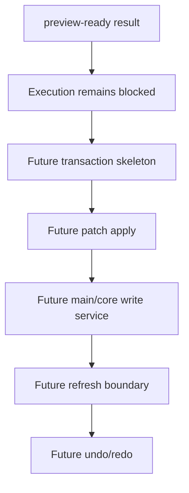

# Future Command Execution

[Docs index](../../README.md)

## Purpose

This page exists to keep future execution separate from current preview. Without that distinction, it would be too easy to treat a good-looking source preview as permission to write files.

## Current implementation

No real command execution runtime exists. No source patch apply path exists. No write IPC exists. No undo/redo transaction log exists. No save/apply workflow exists. No renderer behavior writes project files.

The diagram is intentionally one-way and future-labeled. The current implementation stops before the blocked boundary.

## Key files

The following files are dry-run files only. Do not cite them as an implemented execution runtime.

- `packages/core/commands/command-preview-bus/**`
- `packages/core/commands/html-insertion/**`
- `packages/core/source-patch/**`
- `apps/desktop/electron/renderer/components/html-element-library-panel/**`

Future execution files do not exist yet.

## Data flow

The only current command flow ends at displayable preview state. A future execution flow would need to validate the command again, produce a reversible patch, create a transaction, apply through main/core services, update dirty state, refresh Project Graph, invalidate DOM Snapshot, reload Preview when needed, and register undo/redo descriptors.

## Boundaries

Do not add hidden apply behavior under preview functions. Do not add renderer filesystem writes. Do not add write IPC before command execution policy and transaction state are designed. Do not describe disabled buttons as partially working.

## Validation

Current validation should keep failing if write behavior appears in preview-only modules. Future validation should prove that any write path is explicit, typed, reversible, and gated.

## Related docs

- [Future write flow](../flows/future-write-flow.md)
- [Command Preview Bus](./command-preview-bus.md)
- [ADR 0003](../../decisions/0003-command-preview-before-write.md)
- [Roadmap implementation](../../roadmap-implementation.md)

## Future work

Phase 6C should define transaction skeletons and refresh-boundary planning only. Actual write execution belongs to a later phase after persistence, history, and validation are designed together.
