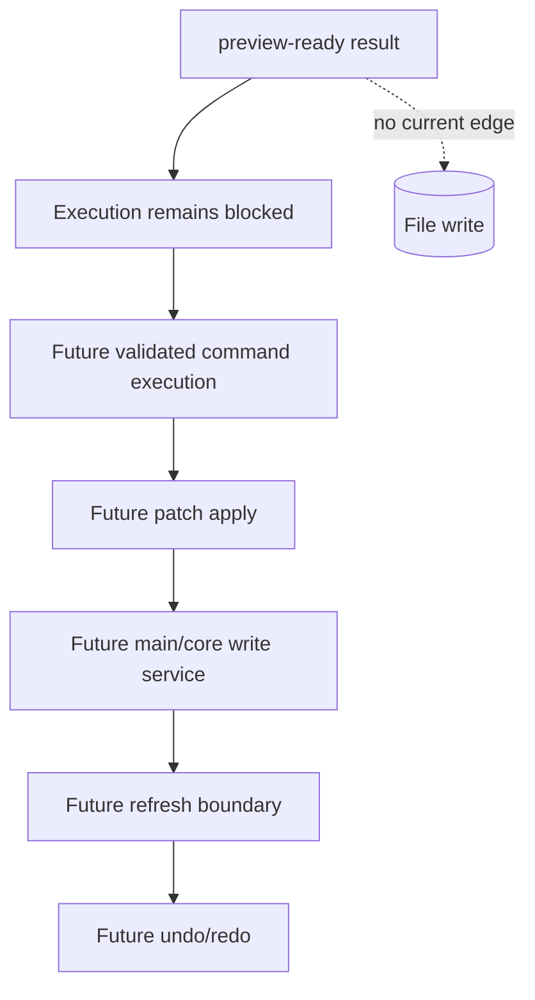

# Future Command Execution

[Docs index](../../README.md)

## At a glance

| Question | Answer |
| --- | --- |
| Is this implemented? | No. |
| Can current commands write source files? | No. |
| Runtime owner | Future main/core execution services. |
| Safety risk controlled | Keeps dry-run preview separate from side effects. |
| Related next phase | Phase 6C transaction skeletons and refresh-boundary planning. |

> **Future-only:** This page describes the shape a future runtime needs. It must not be cited as current write support.

## Purpose

This page keeps future execution separate from current preview. Without that distinction, a good-looking source preview could be mistaken for permission to write files.

## Why this exists

The project already has command intent and Source Patch Preview. Documenting future execution makes the missing pieces explicit instead of letting them be implied.

## How to read this page

| Need | Focus |
| --- | --- |
| Current truth | Current implementation and what this does not do. |
| Future requirements | Data flow and future work. |
| Safety language | Boundaries. |

## Current implementation

No real command execution runtime exists. No source patch apply path exists. No write IPC exists. No undo/redo transaction log exists. No save/apply workflow exists. No renderer behavior writes project files.

| Implemented | Blocked | Future |
| --- | --- | --- |
| Dry-run command previews. | Command execution. | Transaction creation. |
| Source Patch Preview. | File writes. | Patch apply service. |
| Disabled Apply affordance. | Undo/redo execution. | Dirty-state/save workflow. |

## Key files

The following files are dry-run files only. Do not cite them as an implemented execution runtime.

## Key files and responsibilities

| File or path | Responsibility | Reads | Must not do |
| --- | --- | --- | --- |
| `packages/core/commands/command-preview-bus/**` | Dry-run preview routing. | Command preview input. | Execute commands. |
| `packages/core/commands/html-insertion/**` | Preview planning. | Command + anchor. | Apply patches. |
| `packages/core/source-patch/**` | Preview anchors and payloads. | DOM Snapshot source location. | Persist files. |
| `html-element-library-panel/**` | UI for intent and preview. | Preview result. | Enable working Apply. |

Future execution files do not exist yet.

## Data flow

| Future input | Future decision | Future output |
| --- | --- | --- |
| Validated command | Is target still fresh? | Reversible patch or conflict. |
| Patch | Can it be applied atomically? | File update or failure. |
| File update | Which state must refresh? | Graph/snapshot/preview invalidation. |
| Transaction | Can undo/redo reverse it? | History record. |

## Main diagram

## Boundaries

Do not add hidden apply behavior under preview functions. Do not add renderer filesystem writes. Do not add write IPC before command execution policy and transaction state are designed.

> **Safety boundary:** Execution must be a separate, explicit runtime path; it cannot be smuggled into preview helpers.

## What this does not do

| Not provided | Reason |
| --- | --- |
| File write | Future only. |
| Patch apply | Future only. |
| Undo/redo execution | Future only. |
| Save/apply workflow | Future only. |

## Common misunderstanding

> **Common misunderstanding:** The presence of a future execution page does not mean any execution module exists.

## Validation

Current validation should keep failing if write behavior appears in preview-only modules. Future validation should prove that any write path is explicit, typed, reversible, and gated.

## Related docs

- [Future write flow](../flows/future-write-flow.md)
- [Command Preview Bus](./command-preview-bus.md)
- [ADR 0003](../../decisions/0003-command-preview-before-write.md)
- [Roadmap implementation](../../roadmap-implementation.md)

## Future work

Phase 6C should define transaction skeletons and refresh-boundary planning only. Actual write execution belongs to a later phase after persistence, history, and validation are designed together.
