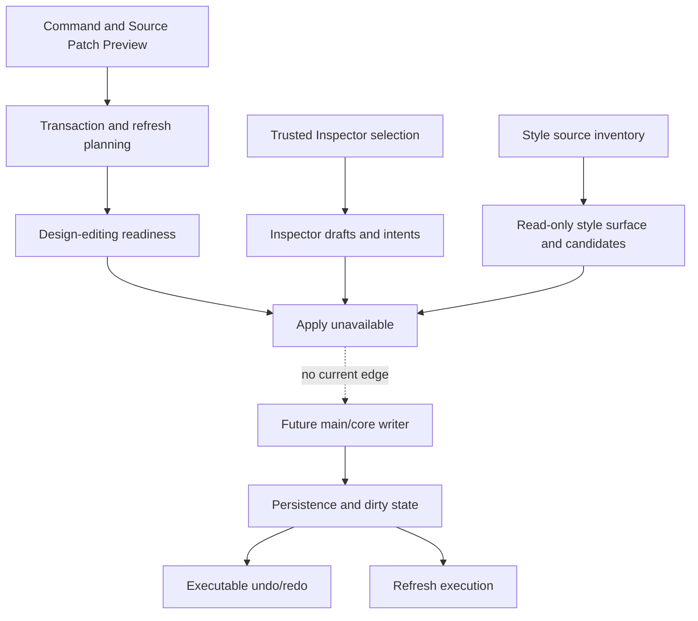

# Future command execution

[Docs index](../../README.md)

## At a glance

| Question | Answer |
| --- | --- |
| Write runtime | Not implemented. |
| Planning foundations | Implemented through transaction, refresh, and readiness descriptors. |
| Inspector foundations | Draft/intent models and disabled read-only surface implemented. |
| Style foundations | 8A inventory, 8B read-only surface, and 8C snapshot candidates implemented. |
| Apply | Unavailable throughout. |

## Purpose

This page marks the exact boundary between the models Crystal has and the effectful runtime it does not. It should be read as an execution contract under design, not as current write support.

## Current implementation

No command execution runtime, patch apply service, write IPC, save workflow, executable history, dirty-state store, or post-write refresh executor exists. Current modules can produce Source Patch Preview, history/refresh transaction plans, design-editing readiness, Inspector field drafts and intents, a disabled Editable Inspector, style-source inventory, a passive CSS/Sass Inspector, and authored rule candidates over DOM Snapshot. Every one of those outputs is read-only, preview-only, or planning-only.

## Key files

The following paths are the shortest reliable entry points. They are not a substitute for following the data flow through the subsystem.

## Key files and responsibilities

| File or path | Responsibility | Reads | Must not do |
| --- | --- | --- | --- |
| `packages/core/commands/command-preview-bus` | Dry-run command routing. | preview request | execute |
| `packages/core/history` | HistoryTransactionPreview descriptors. | patch metadata | undo or redo |
| `packages/core/refresh-boundary` | RefreshBoundaryPlan descriptors. | affected paths | reload state |
| `packages/core/design-editing` | Apply-blocked readiness. | transaction and capability inputs | enable Apply |
| `packages/core/inspector-editing` | Field drafts and edit-intent previews. | trusted source-mapped context | mutate source |
| `packages/core/style-engine` | Inventory and snapshot candidate previews. | plain source text and snapshot data | calculate real cascade or edit |

## Data flow

| Input | Decision | Output |
| --- | --- | --- |
| Command Preview Result | Is it preview-ready? | Planning can continue or block |
| Source Patch Preview | Which files and reversibility questions matter? | Transaction/refresh descriptors |
| Readiness inputs | Are all future requirements represented? | Apply remains false |
| Inspector draft | Can intent be modeled safely? | Read-only field and intent preview |
| Style evidence | Can inventory/candidates be represented? | Passive Inspector data |
| Future validated transaction | Does an execution runtime exist? | Currently no |

## Boundaries

No planning, readiness, draft, disabled-surface, inventory, or authored-matching module may hide an apply path. Renderer must not write files. Main must not gain write IPC before source freshness, conflict policy, transaction execution, dirty state, refresh execution, and user approval are explicit.

> **Safety boundary:** State that crosses a boundary is evidence to validate, not authority to perform a privileged effect.

## What this does not do

| Not provided | Why |
| --- | --- |
| File writes or patch apply | Future writer files do not exist. |
| Undo/redo execution | History previews cannot replay effects. |
| Refresh execution | Plans describe invalidation only. |
| Enabled Inspector or CSS editing | Current surfaces remain passive. |
| Real cascade or computed styles | Style evidence is textual and snapshot-derived. |

## Common misunderstanding

> **Common misunderstanding:** More complete planning does not gradually become execution. The boundary remains binary until an explicit writer owns all required effects.

## Validation

Current validators must fail if write behavior appears in preview, planning, readiness, Inspector, or style modules. Use the focused history, editing-preflight, Inspector, Style Engine, matching, surface, source-patch, and architecture gates.

## Related docs

- [Future write flow](../flows/future-write-flow.md)
- [Source Patch Preview](./source-patch-preview.md)
- [CSS/Sass Inspector surface](../css-sass-inspector-readonly-surface.md)
- [Implementation status](../../roadmap-implementation.md)

## Future work

Implement command execution only as a separate main/core runtime path with exact patching, safe IO, conflict detection, executable transactions, dirty-state persistence, refresh orchestration, and reviewable Apply/Save/Undo/Redo behavior.
