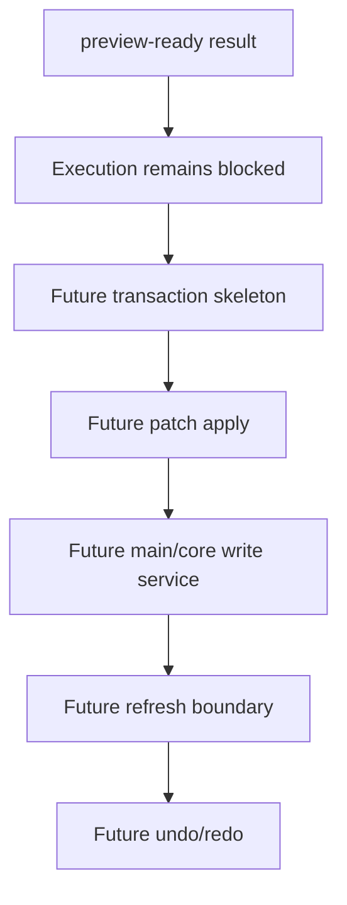

# Future Command Execution

[Docs index](../../README.md)

## Purpose

This document defines what is still Future for command execution. It prevents dry-run documentation from being misread as an implemented write path.

## Current implementation

No real command execution runtime exists. No source patch apply path exists. No write IPC exists. No undo/redo transaction log exists. No save/apply workflow exists. No renderer behavior writes project files.

## Key files

Current dry-run files:

- `packages/core/commands/command-preview-bus/**`
- `packages/core/commands/html-insertion/**`
- `packages/core/source-patch/**`
- `apps/desktop/electron/renderer/components/html-element-library-panel/**`

Future execution files do not exist yet and should not be referenced as implemented.

## Data flow

The only current flow ends at dry-run preview rendering. A future flow would need command execution request, validation, patch generation, patch application, history transaction creation, file persistence, Project Graph refresh, Preview refresh, DOM Snapshot invalidation, and undo/redo support.

## Boundaries

Do not add hidden apply behavior under existing preview functions. Do not add renderer filesystem writes. Do not add write IPC before command execution policy and transaction state are designed. Do not describe disabled buttons as partially working.

## Validation

Current validation must continue proving that write paths are absent. Future validation should prove that any write path is explicit, typed, reversible, and gated.

## Related docs

- [Future write flow](../flows/future-write-flow.md)
- [Command Preview Bus](./command-preview-bus.md)
- [ADR 0003](../../decisions/0003-command-preview-before-write.md)
- [Roadmap implementation](../../roadmap-implementation.md)

## Future work

Phase 6C scope is transaction skeleton and refresh-boundary planning only. Actual write execution belongs to a later phase after validation is expanded.
