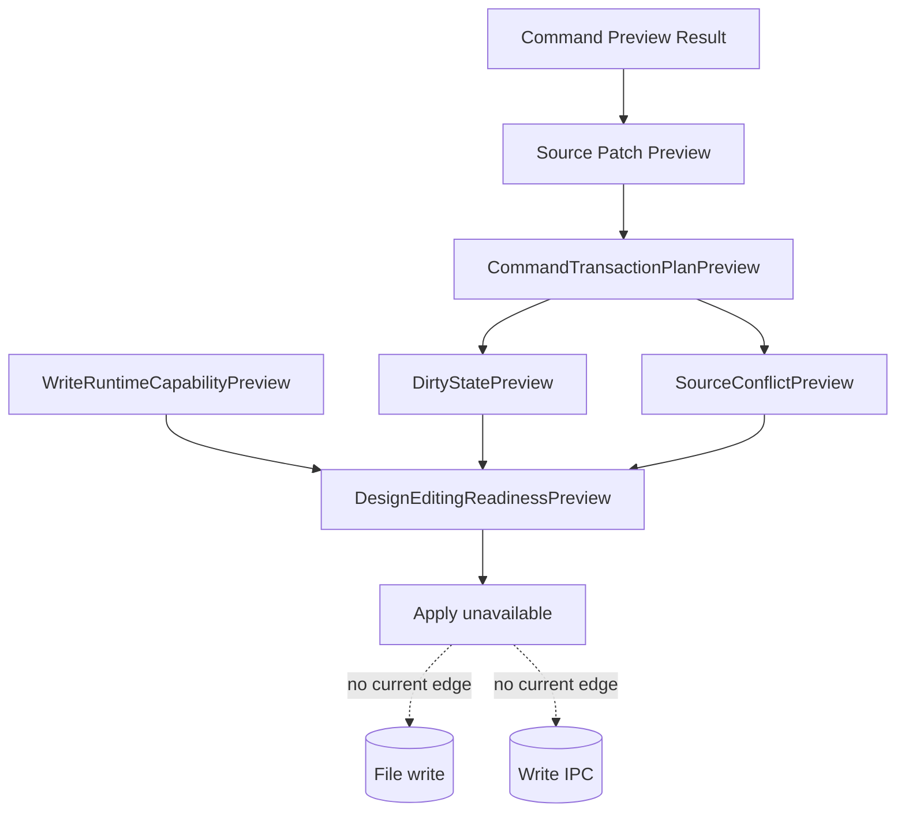

# Future Command Execution

[Docs index](../../README.md)

## At a glance

| Question | Answer |
| --- | --- |
| Is this implemented? | No. |
| Can current commands write source files? | No. |
| Runtime owner | Future main/core execution services. |
| Phase 6D addition | Design editing readiness preflight only. |
| Safety risk controlled | Keeps dry-run preview, transaction planning, and readiness summaries separate from side effects. |

> **Future-only:** This page describes the shape a future runtime needs. It must not be cited as current write support.

## Purpose

This page keeps future command execution separate from current preview behavior. Phase 6D adds a planning layer that can answer whether a future Design Editing MVP has enough preconditions to expose Apply. The answer remains no because write runtime capability is unavailable.

## Current implementation

No real command execution runtime exists. No source patch apply path exists. No write IPC exists. No save/apply workflow exists. No renderer behavior writes project files. Phase 6D adds only readiness models: `DirtyStatePreview`, `SourceConflictPreview`, `WriteRuntimeCapabilityPreview`, and `DesignEditingReadinessPreview`.

Phase 6D boundary: No source files are written. No patch apply is available. No write IPC exists. Apply remains unavailable. No undo/redo execution runs. Dirty-state is not persisted. No refresh execution runs. No Preview DOM mutation occurs.

| Implemented | Blocked | Future |
| --- | --- | --- |
| Dry-run command previews. | Command execution. | Explicit execution runtime. |
| Source Patch Preview. | File writes. | Patch apply service. |
| History transaction preview. | Undo/redo execution. | Durable transaction log. |
| Refresh boundary plan. | Refresh execution. | Post-write orchestration. |
| Design editing readiness preview. | Apply enablement. | Dirty-state workflow. |

## Key files and responsibilities

| File or path | Responsibility | Reads | Must not do |
| --- | --- | --- | --- |
| `packages/core/commands/command-preview-bus/**` | Dry-run preview routing. | Command preview input. | Execute commands. |
| `packages/core/commands/html-insertion/**` | Preview planning. | Command and anchor. | Apply patches. |
| `packages/core/source-patch/**` | Preview anchors and payloads. | DOM Snapshot source location. | Persist files. |
| `packages/core/history/**` | Future transaction descriptor. | Patch metadata. | Execute undo/redo. |
| `packages/core/refresh-boundary/**` | Future invalidation descriptor. | Affected files. | Mutate derived state. |
| `packages/core/commands/transaction-planning/**` | Preview-only bridge across command, source patch, history, and refresh models. | Preview results. | Execute or apply. |
| `packages/core/design-editing/**` | Preview-only bridge across transaction plan, dirty-state, source-conflict, and write-runtime models. | Preflight contracts. | Enable Apply. |
| `html-element-library-panel/**` | UI for intent and preview. | Preview result. | Enable working Apply. |

## Data flow

| Current input | Current decision | Current output |
| --- | --- | --- |
| Command Preview Result | Is it preview-ready? | Plan may continue or block. |
| Source Patch Preview | Is it ready and does it include affected files? | History/refresh planning or blocked plan. |
| CommandTransactionPlanPreview | What files and transaction descriptors would be involved? | Readiness preflight input. |
| DirtyStatePreview | Would unsaved changes be present in a future write? | Preview-only dirty marker. |
| SourceConflictPreview | Would future writes require source freshness checks? | Recheck requirement. |
| WriteRuntimeCapabilityPreview | Does write runtime exist? | Blocked. |

## Boundaries

Do not add hidden apply behavior under preview functions. Do not add renderer filesystem writes. Do not add write IPC before command execution policy, transaction state, dirty state, conflict detection, and refresh execution are designed.

> **Safety boundary:** Execution must be a separate, explicit runtime path; it cannot be smuggled into preview helpers, Phase 6C planning helpers, or Phase 6D readiness helpers.

## What this does not do

| Not provided | Reason |
| --- | --- |
| File write | Future only. |
| Patch apply | Future only. |
| Undo/redo execution | Future only. |
| Save/apply workflow | Future only. |
| Preview reload after write | No write occurs. |
| Dirty-state persistence | Future only. |
| Conflict detection against real source | Future only. |

## Validation

`validate:design-editing-preflight` keeps Phase 6D dry-run by checking module presence, statuses, validators, exports, package script wiring, docs boundary language, and forbidden filesystem, IPC, patch-apply, renderer, and iframe patterns.

## Related docs

- [Future write flow](../flows/future-write-flow.md)
- [Command Preview Bus](./command-preview-bus.md)
- [Source Patch Preview](./source-patch-preview.md)
- [Validation system](../validation-system.md)
- [ADR 0003](../../decisions/0003-command-preview-before-write.md)
- [Roadmap implementation](../../roadmap-implementation.md)

## Future work

A later phase can add real command execution only after write ownership, patch application, dirty state, conflict detection, refresh execution, and history execution are explicit and validated.
