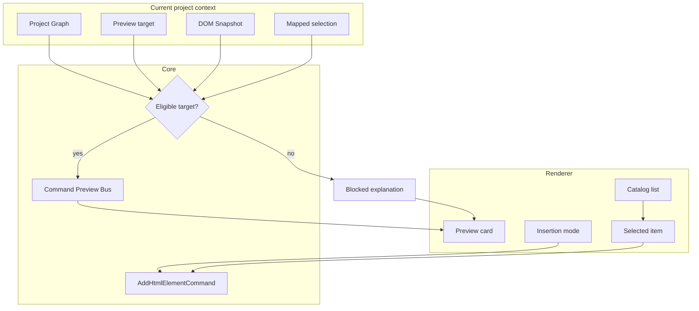

# HTML Element Library

[Docs index](../../README.md)

## At a glance

| Question | Answer |
| --- | --- |
| Is this implemented? | Yes, as an intent and preview producer. |
| Can it edit HTML? | No. |
| Runtime owner | Renderer presents catalog; core validates target eligibility and preview planning. |
| Safety risk controlled | Prevents a catalog click from bypassing mapping, patch, and history requirements. |
| Related next phase | Phase 6C transaction planning before execution. |

## Purpose

The Element Library is where user intent for future HTML insertion begins. Today it lets a user choose an element, see whether the current selection is a plausible target, choose an insertion mode, and preview the source text a later write runtime might produce.

## Why this exists

A visual editor needs an element catalog, but the catalog should not become an editing shortcut. This module keeps selection, eligibility, and preview explicit.

## How to read this page

| Need | Focus |
| --- | --- |
| Catalog shape | Key files and responsibilities. |
| Target availability | Data flow. |
| Why Apply is disabled | Boundaries and common misunderstanding. |

## Current implementation

The panel groups HTML elements by intent: structure, text, media, forms, lists/tables, interaction, semantic/accessibility, and presets. It shows item details, target eligibility, insertion modes, and a read-only command preview.

| Implemented | Blocked | Future |
| --- | --- | --- |
| Catalog browsing. | Active insertion. | Apply through transaction runtime. |
| Target eligibility. | DOM mutation. | More presets and templates. |
| Insertion mode preview. | Patch apply. | Command execution after validators. |

## Key files

The catalog files define what can be offered. The insertion-target files decide whether the current selection can receive a preview. The renderer files display intent and result.

## Key files and responsibilities

| File | Responsibility | Reads | Must not do |
| --- | --- | --- | --- |
| `html-element-library.catalog.ts` | Defines available items. | Static catalog data. | Encode runtime editing. |
| `html-element-library.selectors.ts` | Derives catalog presentation. | Catalog state. | Read filesystem. |
| `insertion-target.selectors.ts` | Computes target eligibility. | Graph, Preview, snapshot, selection. | Treat ambiguous target as safe. |
| `html-element-library-panel.ts` | Hosts renderer panel. | Catalog and preview state. | Insert HTML. |
| `command-preview.renderer.ts` | Displays dry-run preview. | CommandPreviewResult. | Apply patch. |

## Data flow

| Input | Decision | Output |
| --- | --- | --- |
| Selected catalog item | Is item known and supported? | Command intent. |
| Current Preview/selection/snapshot | Is target eligible? | Mode availability or blocked reason. |
| Chosen mode | Can preview planner use it safely? | CommandPreviewResult. |
| Apply click | Is execution available? | Not available. |

## Main diagram

## Boundaries

The library does not insert HTML. It does not mutate DOM Snapshot, Project Graph, Preview iframe, or source files. The disabled future action is not a hidden apply path.

> **Safety boundary:** The library produces intent and preview, not source mutation.

## What this does not do

| Not provided | Reason |
| --- | --- |
| Active HTML insertion | Write runtime is future. |
| Source patch application | Preview only. |
| DOM manipulation | Preview iframe is isolated. |

## Common misunderstanding

> **Common misunderstanding:** The Element Library is not the editor yet. It is the user-facing start of a future command path.

## Validation

`validate:html-element-library` checks catalog shape, defensive target states, shell integration, and blocked future action behavior.

## Related docs

- [HTML insertion preview planner](./html-insertion-preview-planner.md)
- [Command Preview Bus](./command-preview-bus.md)
- [Element Library preview flow](../flows/element-library-preview-flow.md)

## Future work

More elements and presets can be added safely while the panel remains an intent producer. Active editing still requires a later execution runtime with history and write validation.
