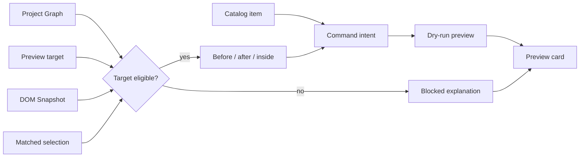

# HTML Element Library

[Docs index](../../README.md)

## At a glance

| Question | Answer |
| --- | --- |
| Status | Implemented as intent and preview UI. |
| Catalog | Grouped HTML elements and presets. |
| Targeting | Eligibility derived from current source-mapped context. |
| Insertion | Not performed. |
| Apply | Visible only as unavailable future action. |

## Purpose

The Element Library is the user-facing start of a future insertion workflow. Today it helps a user choose an element, understand whether the current target is trustworthy, and inspect a dry-run result.

## Current implementation

Renderer presents catalog groups for structure, text, media, forms, lists/tables, interaction, semantics/accessibility, and presets. Core selectors combine active Project Graph, Preview target, DOM Snapshot, and Preview Selection mapping to decide whether before, after, or inside preview modes are available. A valid choice enters Command Preview Bus and returns display state.

## Key files

The following paths are the shortest reliable entry points. They are not a substitute for following the data flow through the subsystem.

## Key files and responsibilities

| File or path | Responsibility | Reads | Must not do |
| --- | --- | --- | --- |
| `html-element-library.catalog.ts` | Defines catalog items and groups. | static metadata | encode persistence behavior |
| `html-element-library.selectors.ts` | Derives catalog presentation. | catalog state | read filesystem |
| `insertion-target.selectors.ts` | Calculates target eligibility. | graph, Preview, Snapshot, selection | trust ambiguous mapping |
| `html-element-library-panel.ts` | Owns renderer interaction state. | catalog and context | insert DOM or source |
| `command-preview.renderer.ts` | Displays command result. | CommandPreviewResult | apply it |

## Data flow

| Input | Decision | Output |
| --- | --- | --- |
| Catalog selection | Is the item supported? | Selected intent or unsupported state |
| Current context | Is the target mapped and source-located? | Available modes or blocked reason |
| Insertion mode | Is the mode valid for this target? | Preview request or disabled mode |
| Command result | What status and source text can be shown? | Preview card |
| Apply affordance | Does write execution exist? | Unavailable |

## Boundaries

The library does not mutate the Preview iframe, DOM Snapshot, Project Graph, or source. A catalog click is not a command execution request. An unavailable mode must remain unavailable rather than being guessed locally.

> **Safety boundary:** State that crosses a boundary is evidence to validate, not authority to perform a privileged effect.

## What this does not do

| Not provided | Why |
| --- | --- |
| Active insertion | No writer or patch apply exists. |
| Drag-and-drop editing | No visual command path or history exists. |
| DOM manipulation | Project content remains isolated. |
| Implicit target recovery | Ambiguous or stale context blocks preview. |

## Common misunderstanding

> **Common misunderstanding:** The Element Library is useful before it is an editor: it makes future intent and blocked reasons concrete without crossing the write boundary.

## Validation

`npm run validate:html-element-library` checks catalog shape, target selectors, mode normalization, shell integration, and the disabled future action. Source preview behavior is covered separately.

## Related docs

- [HTML insertion preview planner](./html-insertion-preview-planner.md)
- [Command Preview Bus](./command-preview-bus.md)
- [Element Library preview flow](../flows/element-library-preview-flow.md)
- [Sidebar composition](../renderer-shell/sidebar-composition.md)

## Future work

Catalog breadth may grow independently of execution. Active insertion still requires the shared write runtime; adding per-item shortcuts would fragment policy and history.
