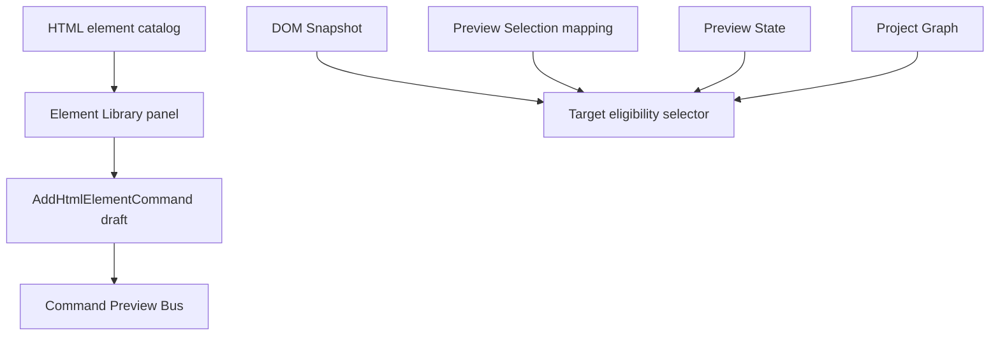

# HTML Element Library

[Docs index](../../README.md)

## Purpose

The Element Library is where user intent for future HTML insertion begins. Today it is not an editor. It lets a user choose an element, see whether the current selection is a plausible target, choose an insertion mode, and preview the source text that a later write runtime might produce.

## Current implementation

The panel groups HTML elements by intent: structure, text, media, forms, lists/tables, interaction, semantic/accessibility, and presets. It shows item details, target eligibility, insertion modes, and a read-only command preview.

The diagram shows that the library depends on several state domains before it can preview anything. A selected element alone is not enough; Crystal also needs a safe target.

## Key files

The catalog files define what can be offered. The insertion-target files decide whether the current selection can receive a preview. The renderer files display intent and result.

- `packages/core/project/html-element-library/html-element-library.catalog.ts`
- `packages/core/project/html-element-library/html-element-library.constants.ts`
- `packages/core/project/html-element-library/html-element-library.selectors.ts`
- `packages/core/project/html-element-library/html-element-library.validators.ts`
- `packages/core/project/html-element-library/insertion-target.selectors.ts`
- `packages/core/project/html-element-library/insertion-target.types.ts`
- `apps/desktop/electron/renderer/components/html-element-library-panel/html-element-library-panel.ts`
- `apps/desktop/electron/renderer/components/html-element-library-panel/renderers/**`

## Data flow

The user selects a catalog item and insertion mode. Eligibility combines Project Graph, Preview target, DOM Snapshot, and Preview Selection mapping. If the target is safe enough for dry-run planning, the panel creates an `AddHtmlElementCommand` preview object and passes it to the command preview path.

## Boundaries

The library does not insert HTML. It does not mutate DOM Snapshot, Project Graph, Preview iframe, or source files. The disabled future action is not a hidden apply path. This prevents a UI catalog click from bypassing mapping, patch, history, and refresh requirements.

## Validation

`validate:html-element-library` checks catalog shape, defensive target states, shell integration, and blocked future action behavior.

## Related docs

- [HTML insertion preview planner](./html-insertion-preview-planner.md)
- [Command Preview Bus](./command-preview-bus.md)
- [Element Library preview flow](../flows/element-library-preview-flow.md)

## Future work

More elements and presets can be added safely while the panel remains an intent producer. Active editing still requires a later execution runtime with history and write validation.
