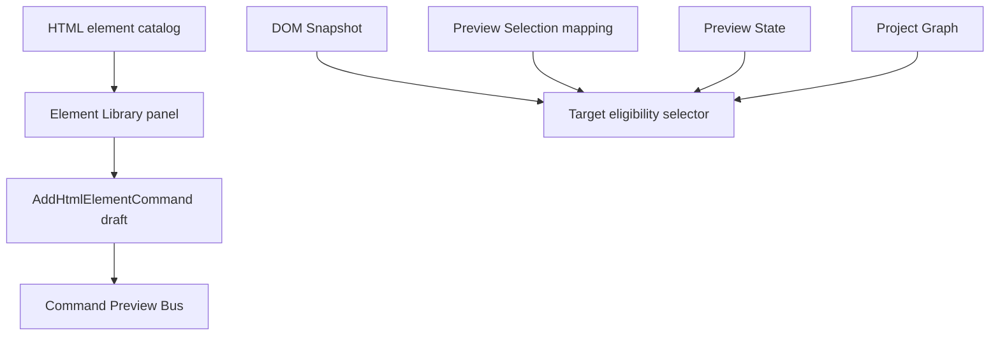

# HTML Element Library

[Docs index](../../README.md)

## Purpose

This document explains the Element Library as the current UI entry point for future HTML insertion commands.

## Current implementation

The Element Library is a compact renderer panel grouped by intent: structure, text, media, forms, lists/tables, interaction, semantic/accessibility, and presets. It shows item details, target eligibility, insertion mode choices, and a read-only command preview.

## Key files

- `packages/core/project/html-element-library/html-element-library.catalog.ts`
- `packages/core/project/html-element-library/html-element-library.constants.ts`
- `packages/core/project/html-element-library/html-element-library.selectors.ts`
- `packages/core/project/html-element-library/html-element-library.validators.ts`
- `packages/core/project/html-element-library/insertion-target.selectors.ts`
- `packages/core/project/html-element-library/insertion-target.types.ts`
- `apps/desktop/electron/renderer/components/html-element-library-panel/html-element-library-panel.ts`
- `apps/desktop/electron/renderer/components/html-element-library-panel/renderers/**`

## Data flow

The panel selects a catalog item and insertion mode. Target eligibility combines Project Graph, Preview, DOM Snapshot, and Preview Selection mapping. When eligible enough for dry-run, the panel creates an `AddHtmlElementCommand` preview object and passes it to core preview planning.

## Boundaries

The library does not insert HTML. It does not mutate DOM Snapshot, Project Graph, Preview iframe, or source files. It does not enable the disabled future Apply action. It is a command preview UI only.

## Validation

`validate:html-element-library` checks catalog shape, defensive target states, shell integration, and blocked future action behavior.

## Related docs

- [HTML insertion preview planner](./html-insertion-preview-planner.md)
- [Command Preview Bus](./command-preview-bus.md)
- [Element Library preview flow](../flows/element-library-preview-flow.md)

## Future work

Future work may add more elements, presets, and semantic hints. Execution still requires Phase 6C+ history and write boundaries before any insertion is real.
