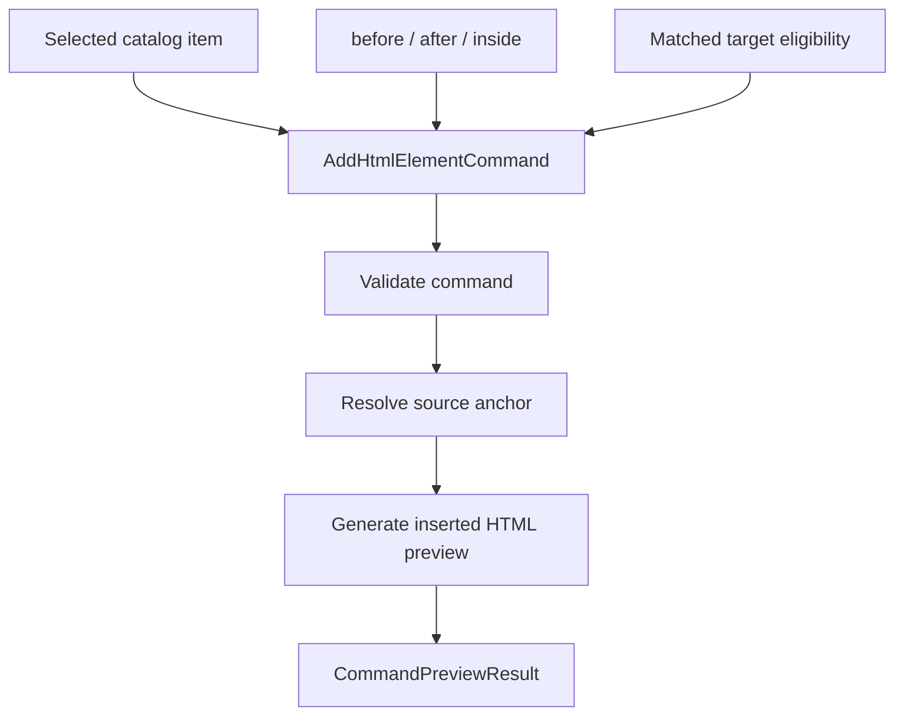

# HTML Insertion Preview Planner

[Docs index](../../README.md)

## Purpose

This document explains how the current planner prepares a read-only preview for future HTML insertion.

## Current implementation

The planner supports `AddHtmlElementCommand` dry-runs. It uses selected Element Library metadata, insertion mode, target file path, matched DOM Snapshot path, and source anchor information to produce a Source Patch Preview.

## Key files

- `packages/core/commands/html-insertion/html-insertion-command.types.ts`
- `packages/core/commands/html-insertion/html-insertion-command.validators.ts`
- `packages/core/commands/html-insertion/html-insertion-command.planner.ts`
- `packages/core/commands/html-insertion/html-insertion-command.preview.ts`
- `packages/core/project/html-element-library/insertion-target.selectors.ts`
- `packages/core/source-patch/html-source-anchor.selectors.ts`

## Data flow

Target eligibility determines whether the selected Preview node maps to a static DOM Snapshot node and whether the requested insertion mode is allowed. The planner then attempts to resolve an insertion anchor. If anchor data is insufficient, the result is blocked rather than guessed.

## Boundaries

The planner must not parse and rewrite whole files as an execution path. It must not apply patches. It must not infer source locations when the snapshot has none. It must not claim success if the target is stale, ambiguous, mismatched, unsupported, or missing.

## Validation

`validate:html-element-library` covers eligibility states. `validate:source-patch-preview` covers planner dry-run states and blocked write behavior.

## Related docs

- [HTML Element Library](./html-element-library.md)
- [Source Patch Preview](./source-patch-preview.md)
- [Element Library preview flow](../flows/element-library-preview-flow.md)

## Future work

Future execution planning should add conflict detection, formatting policy, source freshness checks, dirty-state integration, and undo transaction descriptors.
