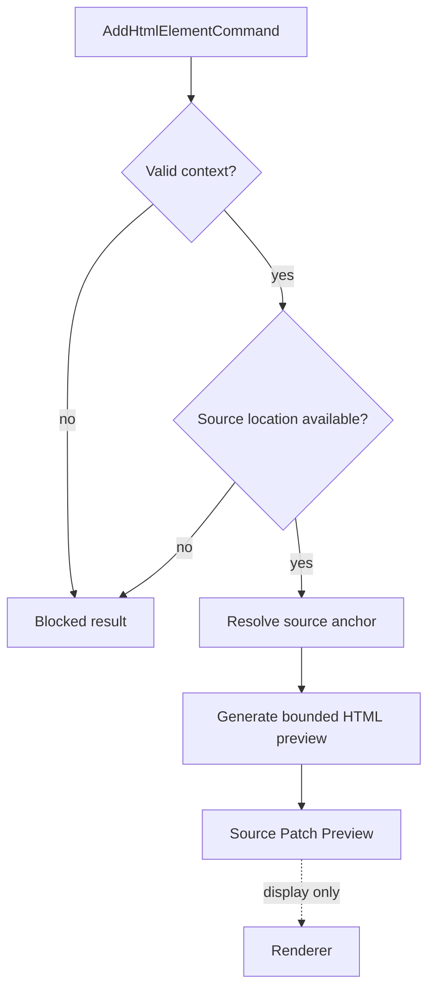

# HTML insertion preview planner

[Docs index](../../README.md)

## At a glance

| Question | Answer |
| --- | --- |
| Status | Implemented, dry-run. |
| Supported intent | `AddHtmlElementCommand` preview. |
| Modes | Before, after, and inside when eligible. |
| Source dependency | DOM Snapshot source locations. |
| Persistence | None. |

## Purpose

The insertion planner converts validated intent into a concrete source description. Its most important behavior is refusing to guess when target identity or source location is incomplete.

## Current implementation

The planner receives a supported catalog item, insertion mode, project-relative target, trusted DOM Snapshot path, and source anchor. Validators reject malformed commands and incompatible context. The planner then formats a bounded HTML snippet and Source Patch Preview or returns a blocked result with a reason.

## Key files

The following paths are the shortest reliable entry points. They are not a substitute for following the data flow through the subsystem.

## Key files and responsibilities

| File or path | Responsibility | Reads | Must not do |
| --- | --- | --- | --- |
| `html-insertion-command.types.ts` | Defines intent and context. | catalog and mode types | include side effects |
| `html-insertion-command.validators.ts` | Checks shape and target coherence. | command and current context | accept unsafe state |
| `html-insertion-command.planner.ts` | Builds the dry-run result. | valid command and source anchor | rewrite files |
| `html-insertion-command.preview.ts` | Formats preview payload. | planner output | persist source |
| `html-source-anchor.selectors.ts` | Resolves before/after/inside positions. | Snapshot source location | invent missing locations |

## Data flow

| Input | Decision | Output |
| --- | --- | --- |
| Command shape | Is item, mode, target, and context valid? | Continue or blocked result |
| Snapshot node | Does it have usable source location? | Source anchor or blocked result |
| Insertion mode | Can the anchor represent it? | Preview position or blocked result |
| HTML item | Can bounded source text be generated? | Source Patch Preview |
| Preview result | Should a file be changed? | No |

## Boundaries

The planner must not parse and rewrite the whole document as an execution strategy, infer missing positions, call filesystem APIs, or trigger refresh. It operates on plain validated inputs and returns plain data.

> **Safety boundary:** State that crosses a boundary is evidence to validate, not authority to perform a privileged effect.

## What this does not do

| Not provided | Why |
| --- | --- |
| Formatting preservation policy | Execution-time formatting remains future. |
| Conflict detection | No source freshness check at apply time exists. |
| Patch apply | The result is descriptive. |
| Transaction creation | Later planning models consume metadata but do not execute. |

## Common misunderstanding

> **Common misunderstanding:** A planner can be exact about what it would insert and still be unable to perform the insertion. That separation is intentional.

## Validation

`validate:html-element-library` covers eligibility. `validate:source-patch-preview` covers command validation, source anchors, preview statuses, and forbidden write behavior.

## Related docs

- [HTML Element Library](./html-element-library.md)
- [Source Patch Preview](./source-patch-preview.md)
- [Source Patch Preview flow](../flows/source-patch-preview-flow.md)

## Future work

An execution planner will need fresh source text, conflict detection, formatting policy, executable transaction data, dirty-state integration, and refresh planning. It should not repurpose this dry-run module as a writer.
