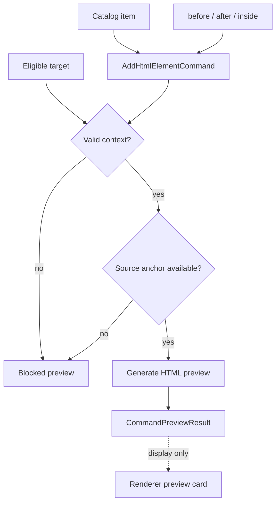

# HTML Insertion Preview Planner

[Docs index](../../README.md)

## At a glance

| Question | Answer |
| --- | --- |
| Is this implemented? | Yes, as dry-run HTML insertion preview planning. |
| Can it insert HTML? | No. |
| Runtime owner | Core pure planner. |
| Safety risk controlled | Blocks unsafe or ambiguous insertion targets. |
| Related next phase | Future execution planning with conflict and history checks. |

## Purpose

The HTML insertion preview planner turns a catalog choice into a concrete preview of source text. It must show what can be reasoned about from the current snapshot and refuse to guess when the source target is not trustworthy.

## Why this exists

Preview planning creates a controlled seam between UI intent and future source mutation. It is the place where unsupported target states become blocked results instead of fragile writes.

## How to read this page

| Need | Focus |
| --- | --- |
| Planner inputs | Data flow. |
| Blocked reasons | Boundaries and common misunderstanding. |
| File roles | Key files table. |

## Current implementation

The planner supports dry-runs for `AddHtmlElementCommand`. It uses the selected Element Library item, insertion mode, target file path, matched DOM Snapshot path, and source anchor information to build a Source Patch Preview.

| Implemented | Blocked | Future |
| --- | --- | --- |
| Before/after/inside preview planning. | File rewrite. | Formatting policy. |
| Source anchor usage. | Guessing missing source location. | Conflict detection. |
| Blocked result output. | Patch application. | Transaction descriptor output. |

## Key files

The command files define intent and validation. The library selector supplies eligibility. The source-patch selector supplies anchors.

## Key files and responsibilities

| File | Responsibility | Reads | Must not do |
| --- | --- | --- | --- |
| `html-insertion-command.types.ts` | Defines command shape. | Catalog and mode types. | Include persistence effects. |
| `html-insertion-command.validators.ts` | Checks command/context shape. | Command + target state. | Accept unsafe context. |
| `html-insertion-command.planner.ts` | Builds preview result. | Valid command + anchor. | Apply patch. |
| `html-insertion-command.preview.ts` | Formats preview payload. | Planner output. | Write source files. |
| `html-source-anchor.selectors.ts` | Resolves insertion anchors. | DOM Snapshot source locations. | Infer absent location. |

## Data flow

| Input | Decision | Output |
| --- | --- | --- |
| Catalog item | Is element supported? | Command input or unsupported. |
| Insertion mode | Is mode allowed for target? | Anchor request or blocked. |
| Snapshot source location | Is it present and usable? | Source anchor or blocked. |
| Planner result | Can snippet be previewed safely? | Source Patch Preview. |

## Main diagram

## Boundaries

The planner must not parse and rewrite whole files as an execution path. It must not apply patches or infer source positions when the snapshot lacks them.

> **Safety boundary:** Missing `sourceLocation` is a reason to block, not a reason to guess.

## What this does not do

| Not provided | Reason |
| --- | --- |
| Source rewrite | Execution runtime is future. |
| Formatting policy | Needs write phase design. |
| Conflict resolution | Needs source freshness checks. |

## Common misunderstanding

> **Common misunderstanding:** The planner creates a preview of insertion text, not an insertion operation.

## Validation

`validate:html-element-library` covers eligibility states. `validate:source-patch-preview` covers planner dry-run states and blocked write behavior.

## Related docs

- [HTML Element Library](./html-element-library.md)
- [Source Patch Preview](./source-patch-preview.md)
- [Element Library preview flow](../flows/element-library-preview-flow.md)

## Future work

Execution planning will need conflict detection, formatting policy, source freshness checks, dirty-state integration, undo transaction descriptors, and refresh planning. Those are outside this dry-run planner.
