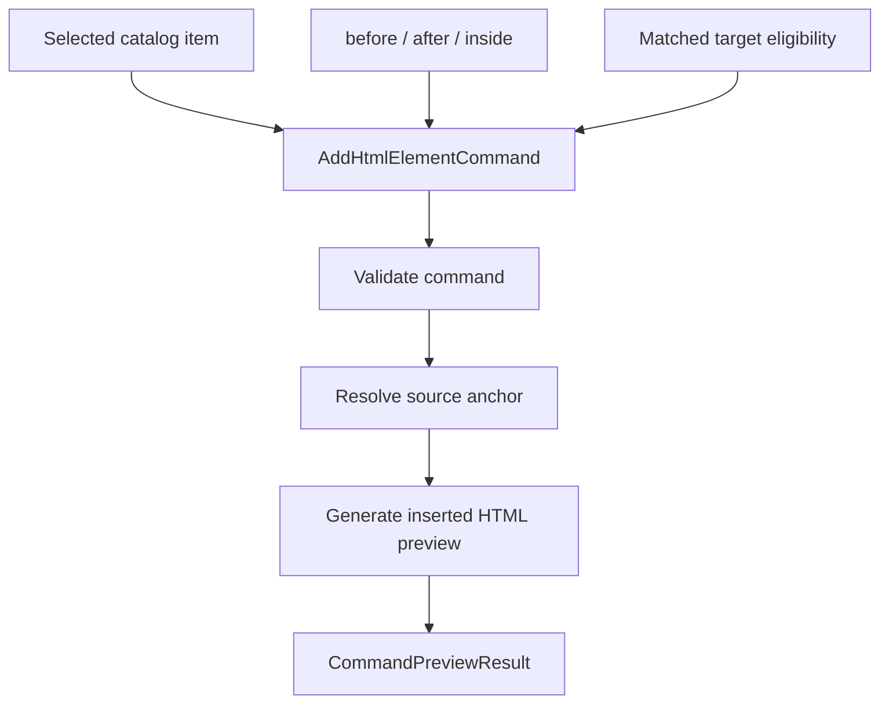

# HTML Insertion Preview Planner

[Docs index](../../README.md)

## Purpose

The HTML insertion preview planner turns a catalog choice into a concrete preview of source text. Its value is precision: it must show what can be reasoned about from the current snapshot and refuse to guess when the source target is not trustworthy.

## Current implementation

The planner supports dry-runs for `AddHtmlElementCommand`. It uses the selected Element Library item, insertion mode, target file path, matched DOM Snapshot path, and source anchor information to build a Source Patch Preview.

The diagram shows the dependency chain. If any required state is missing, the planner should return a blocked result instead of inventing an insertion location.

## Key files

The command files define intent and validation. The library selector supplies eligibility. The source-patch selector supplies anchors.

- `packages/core/commands/html-insertion/html-insertion-command.types.ts`
- `packages/core/commands/html-insertion/html-insertion-command.validators.ts`
- `packages/core/commands/html-insertion/html-insertion-command.planner.ts`
- `packages/core/commands/html-insertion/html-insertion-command.preview.ts`
- `packages/core/project/html-element-library/insertion-target.selectors.ts`
- `packages/core/source-patch/html-source-anchor.selectors.ts`

## Data flow

Target eligibility decides whether the selected Preview node maps to a static DOM Snapshot node and whether before, after, or inside insertion is previewable. The planner resolves an anchor and generates preview text. The output returns through the Command Preview Bus.

## Boundaries

The planner must not parse and rewrite whole files as an execution path. It must not apply patches or infer source positions when the snapshot lacks them. Stale, ambiguous, mismatched, unsupported, or missing targets remain blocked to avoid corrupting the user's source later.

## Validation

`validate:html-element-library` covers eligibility states. `validate:source-patch-preview` covers planner dry-run states and blocked write behavior.

## Related docs

- [HTML Element Library](./html-element-library.md)
- [Source Patch Preview](./source-patch-preview.md)
- [Element Library preview flow](../flows/element-library-preview-flow.md)

## Future work

Execution planning will need conflict detection, formatting policy, source freshness checks, dirty-state integration, undo transaction descriptors, and refresh planning. Those are outside this dry-run planner.
