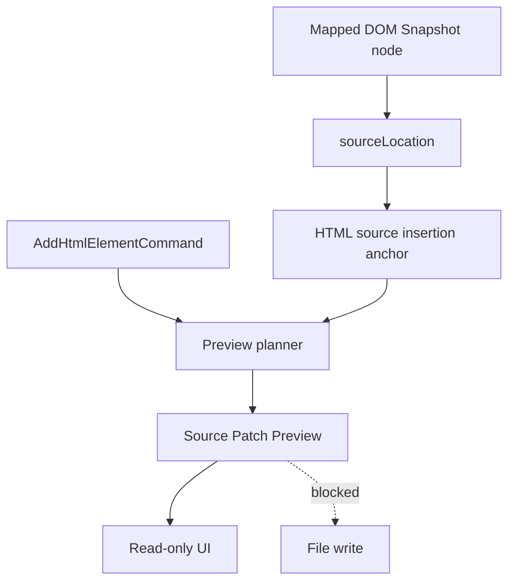

# Source Patch Preview

[Docs index](../../README.md)

## Purpose

This document describes Source Patch Preview: a dry-run source text model for explaining what a future command would change.

## Current implementation

Source Patch Preview models source file path, insertion anchors, inserted text preview, status, errors, and human summaries. It uses DOM Snapshot source locations to plan where insertion could happen. It does not apply patches.

## Key files

- `packages/core/source-patch/html-source-anchor.types.ts`
- `packages/core/source-patch/html-source-anchor.selectors.ts`
- `packages/core/source-patch/source-patch-preview.types.ts`
- `packages/core/commands/html-insertion/html-insertion-command.preview.ts`
- `packages/core/commands/html-insertion/html-insertion-command.planner.ts`
- `apps/desktop/electron/renderer/components/html-element-library-panel/renderers/command-preview.renderer.ts`
- `scripts/validate-source-patch-preview.mjs`

## Data flow

A matched selection provides a DOM Snapshot node. Source anchor selectors derive before/after/inside positions when source location is available. The HTML insertion planner builds an inserted text preview and summary. The renderer shows the result without applying it.

## Boundaries

Source Patch Preview must not write, save, patch, mutate, or call IPC write channels. Missing `sourceLocation` is a valid blocked state. Preview text is explanatory, not an authoritative persisted diff.

## Validation

`validate:source-patch-preview` guards model shape, blocked states, renderer labels, disabled apply behavior, and absence of write-channel implementation.

## Related docs

- [Command Preview Bus](./command-preview-bus.md)
- [HTML insertion preview planner](./html-insertion-preview-planner.md)
- [Source Patch Preview flow](../flows/source-patch-preview-flow.md)

## Future work

Future patch application needs atomic file IO, conflict detection, source freshness checks, undo records, dirty-state UI, and refresh planning before it can be enabled.
