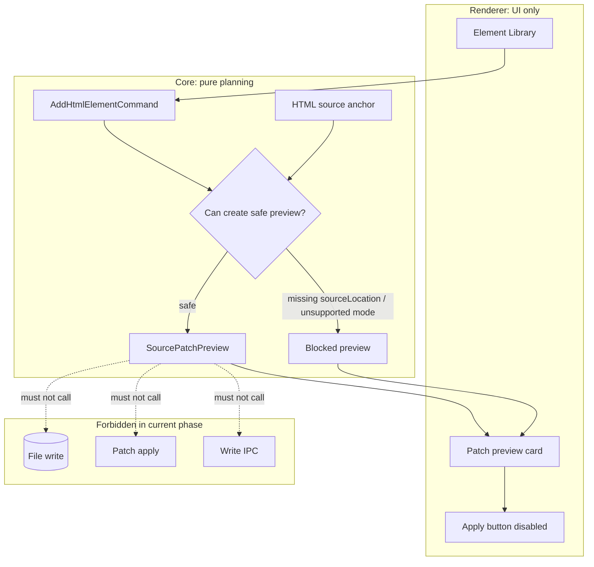

# Source Patch Preview

[Docs index](../../README.md)

## At a glance

| Question | Answer |
| --- | --- |
| Is this implemented? | Yes, as a dry-run description of a possible source change. |
| Can it apply a patch? | No. |
| Runtime owner | Core builds preview; renderer displays it. |
| Safety risk controlled | Prevents preview text from becoming a file mutation shortcut. |
| Related next phase | Transaction skeletons and refresh-boundary planning. |

> **Common misunderstanding:** Source Patch Preview is not the future write runtime. It is only the inspectable description that a future write runtime may consume after additional checks exist.

## Purpose

Source Patch Preview is a verifiable description of a possible source change. Source Patch Preview is not a write operation. It gives the user and validators something concrete to inspect before Crystal has permission to modify files.

## Why this exists

A future editor needs transparency before mutation. Showing a patch-like preview makes intent inspectable while keeping writes blocked.

## How to read this page

| Need | Focus |
| --- | --- |
| Preview status | State diagram. |
| Source anchors | Key files and data flow. |
| Write boundary | What this does not do. |

## Current implementation

The preview model records target file path, source anchor, inserted text preview, status, errors, and a human summary. HTML insertion preview planning uses DOM Snapshot source locations to identify where a future insert might happen. If location data is missing or unsafe, the preview blocks instead of inventing a patch.

| Implemented | Blocked | Future |
| --- | --- | --- |
| Source anchor preview. | Patch apply. | Conflict detection. |
| Inserted text preview. | File save. | Formatting policy. |
| Blocked status for unsafe input. | Write IPC. | Transaction records. |

## Key files

Read the anchor selectors with the planner. The renderer only displays the resulting preview and must not apply it.

## Key files and responsibilities

| File | Responsibility | Reads | Must not do |
| --- | --- | --- | --- |
| `html-source-anchor.types.ts` | Defines preview anchor model. | Snapshot source positions. | Represent applied edits. |
| `html-source-anchor.selectors.ts` | Resolves before/after/inside anchors. | DOM Snapshot node location. | Infer missing source. |
| `source-patch-preview.types.ts` | Defines preview payload. | Anchor and command data. | Encode persistence. |
| `html-insertion-command.planner.ts` | Creates dry-run insertion preview. | Command + anchor. | Write files. |
| `command-preview.renderer.ts` | Displays preview result. | SourcePatchPreview. | Apply patch. |

## Data flow

| Input | Decision | Output |
| --- | --- | --- |
| Mapped DOM Snapshot node | Does source location exist? | Source anchor or blocked status. |
| Insertion mode | Is before/after/inside supported? | Previewable position or blocked state. |
| Catalog item | Can snippet be rendered safely? | Inserted text preview. |
| Preview result | Should renderer enable Apply? | No; display only. |

## Main diagram

## Boundaries

Source Patch Preview must not write, save, patch, mutate, or call IPC write channels. It should remain safe to compute even when the project is open read-only.

> **Safety boundary:** Renderer may display a patch preview, but it cannot apply it, save it, or request file mutation.

## What this does not do

| Not provided | Reason |
| --- | --- |
| Patch application | No apply runtime exists. |
| File persistence | No write IPC exists. |
| Undo/redo transaction | No transaction model exists. |
| Conflict resolution | Future write runtime concern. |

## Common misunderstanding

> **Common misunderstanding:** A preview that looks like code is still a model result, not a source change.

## Validation

`validate:source-patch-preview` guards model shape, blocked states, renderer labels, disabled apply behavior, and absence of write-channel implementation.

## Related docs

- [Command Preview Bus](./command-preview-bus.md)
- [HTML insertion preview planner](./html-insertion-preview-planner.md)
- [Source Patch Preview flow](../flows/source-patch-preview-flow.md)

## Future work

Patch application will need atomic file IO, source freshness checks, conflict detection, formatting policy, undo records, dirty-state UI, and refresh planning. Until those exist, preview text stays descriptive only.
