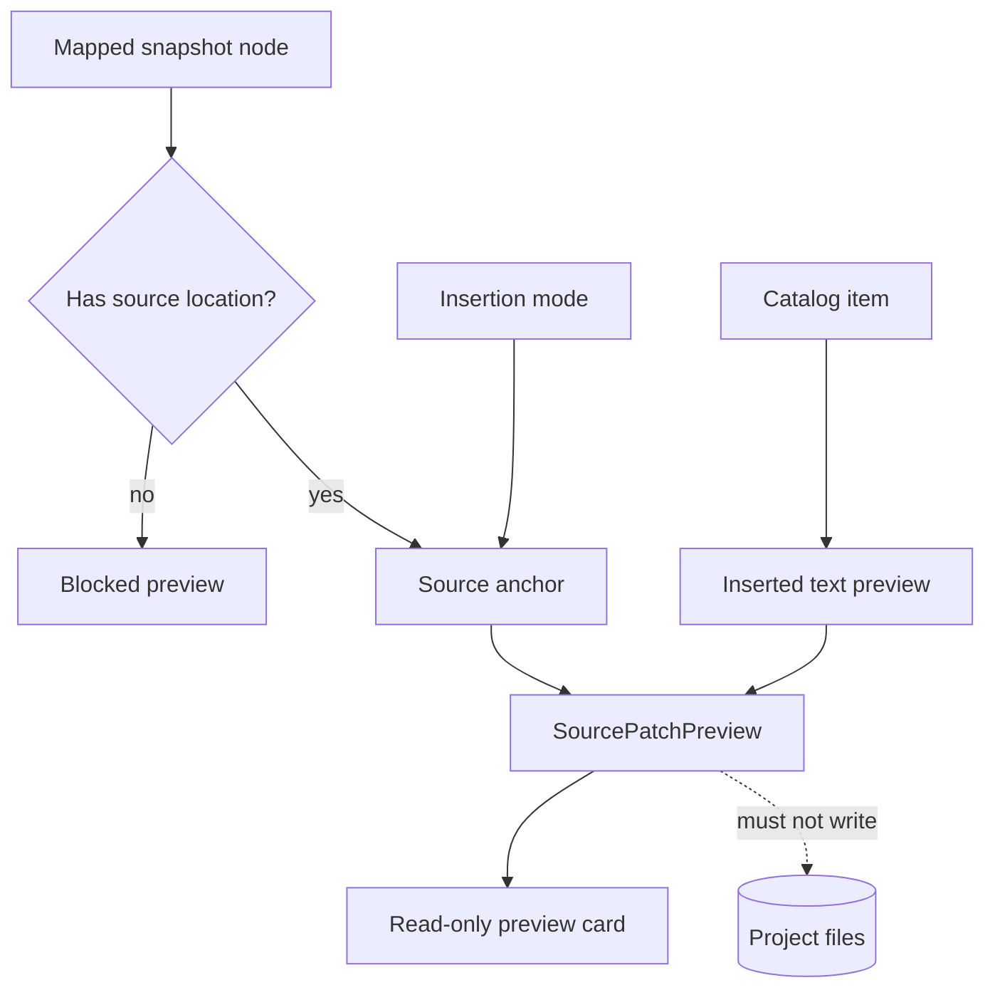

# Source Patch Preview

[Docs index](../../README.md)

## At a glance

| Question | Answer |
| --- | --- |
| Status | Implemented as dry-run display data. |
| Content | Target path, source anchor, inserted text preview, status, issues, and summary. |
| Unsafe input | Produces a blocked result. |
| Apply behavior | Unavailable. |
| Write behavior | None. |

## Purpose

Source Patch Preview makes a possible change inspectable before Crystal has authority to make it. It is deliberately specific enough for review and deliberately powerless.

## Current implementation

HTML insertion preview planning uses a trusted DOM Snapshot source location to derive before, after, or inside anchors. The result records bounded source text and explanatory state. Renderer displays the result and keeps Apply disabled. Later history and refresh planners may read affected-file metadata, but no component consumes it as a patch to apply.

## Key files

The following paths are the shortest reliable entry points. They are not a substitute for following the data flow through the subsystem.

## Key files and responsibilities

| File or path | Responsibility | Reads | Must not do |
| --- | --- | --- | --- |
| `html-source-anchor.types.ts` | Defines source-anchor data. | Snapshot source positions | represent an applied edit |
| `html-source-anchor.selectors.ts` | Resolves supported anchors. | matched Snapshot node | guess missing source |
| `source-patch-preview.types.ts` | Defines the preview payload. | anchor and command data | encode persistence |
| `html-insertion-command.planner.ts` | Creates the dry-run preview. | validated command and anchor | write files |
| `command-preview.renderer.ts` | Presents status and source text. | SourcePatchPreview | enable Apply |

## Data flow

| Input | Decision | Output |
| --- | --- | --- |
| Mapped Snapshot node | Is source location present and current? | Anchor or blocked result |
| Insertion mode | Is a supported position available? | Preview position or blocked result |
| Catalog item | Can bounded source text be represented? | Inserted text preview |
| Preview card | Should renderer expose mutation? | No; display only |
| Planning consumer | Which files and reversibility questions matter? | Descriptor metadata only |

## Boundaries

Source Patch Preview is not a write operation. It must not write, save, patch, call write IPC, mutate Preview, register undo/redo, or create an implicit pending change. Missing evidence blocks rather than triggers fallback mutation.

> **Safety boundary:** State that crosses a boundary is evidence to validate, not authority to perform a privileged effect.

## What this does not do

| Not provided | Why |
| --- | --- |
| Patch application | No apply service exists. |
| File save | No write IPC exists. |
| Undo transaction | Current history data is planning-only. |
| Conflict resolution | A future writer must re-read and validate source freshness. |

## Common misunderstanding

> **Common misunderstanding:** Preview text that looks executable is still a model result. `preview-ready` means ready to show, not ready to write.

## Validation

`npm run validate:source-patch-preview` checks source anchors, statuses, renderer labels, disabled Apply, bus wiring, and absence of write channels and patch application.

## Related docs

- [HTML insertion preview planner](./html-insertion-preview-planner.md)
- [Command Preview Bus](./command-preview-bus.md)
- [Source Patch Preview flow](../flows/source-patch-preview-flow.md)
- [ADR 0003](../../decisions/0003-command-preview-before-write.md)

## Future work

Patch application needs atomic safe IO, source freshness, conflict handling, formatting, executable history, dirty state, refresh execution, and explicit user approval. Until then, preview remains descriptive.
