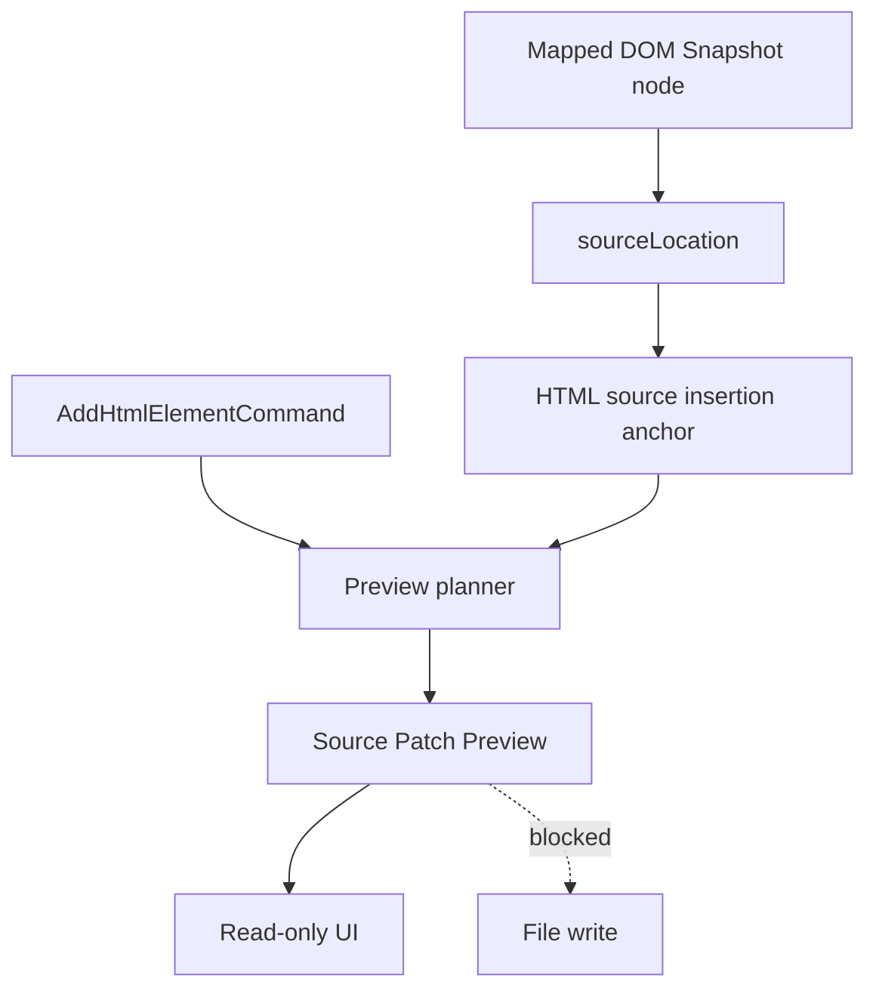

# Source Patch Preview

[Docs index](../../README.md)

## Purpose

Source Patch Preview is a verifiable description of a possible source change. It is useful because it gives the user and validators something concrete to inspect before Crystal has permission to modify files. It is not a write operation.

## Current implementation

The preview model records target file path, source anchor, inserted text preview, status, errors, and a human summary. HTML insertion preview planning uses DOM Snapshot source locations to identify where a future insert might happen. If location data is missing or unsafe, the preview blocks instead of inventing a patch.

The diagram shows the source of trust: a mapped snapshot node with source location can produce an anchor; the anchor can produce preview text; preview text cannot write.

## Key files

Read the anchor selectors with the planner. The renderer only displays the resulting preview and must not apply it.

- `packages/core/source-patch/html-source-anchor.types.ts`
- `packages/core/source-patch/html-source-anchor.selectors.ts`
- `packages/core/source-patch/source-patch-preview.types.ts`
- `packages/core/commands/html-insertion/html-insertion-command.preview.ts`
- `packages/core/commands/html-insertion/html-insertion-command.planner.ts`
- `apps/desktop/electron/renderer/components/html-element-library-panel/renderers/command-preview.renderer.ts`
- `scripts/validate-source-patch-preview.mjs`

## Data flow

A matched selection yields a DOM Snapshot node. Source anchor selectors derive before, after, or inside positions when source location data is present. The planner formats a small inserted-text preview and summary. Renderer displays the result as a dry-run explanation.

## Boundaries

Source Patch Preview must not write, save, patch, mutate, or call IPC write channels. It should remain safe to compute even when the project is open read-only. Missing `sourceLocation`, stale snapshots, ambiguous mappings, or unsupported targets are technical reasons to block rather than guess.

## Validation

`validate:source-patch-preview` guards model shape, blocked states, renderer labels, disabled apply behavior, and absence of write-channel implementation.

## Related docs

- [Command Preview Bus](./command-preview-bus.md)
- [HTML insertion preview planner](./html-insertion-preview-planner.md)
- [Source Patch Preview flow](../flows/source-patch-preview-flow.md)

## Future work

Patch application will need atomic file IO, source freshness checks, conflict detection, formatting policy, undo records, dirty-state UI, and refresh planning. Until those exist, preview text stays descriptive only.
