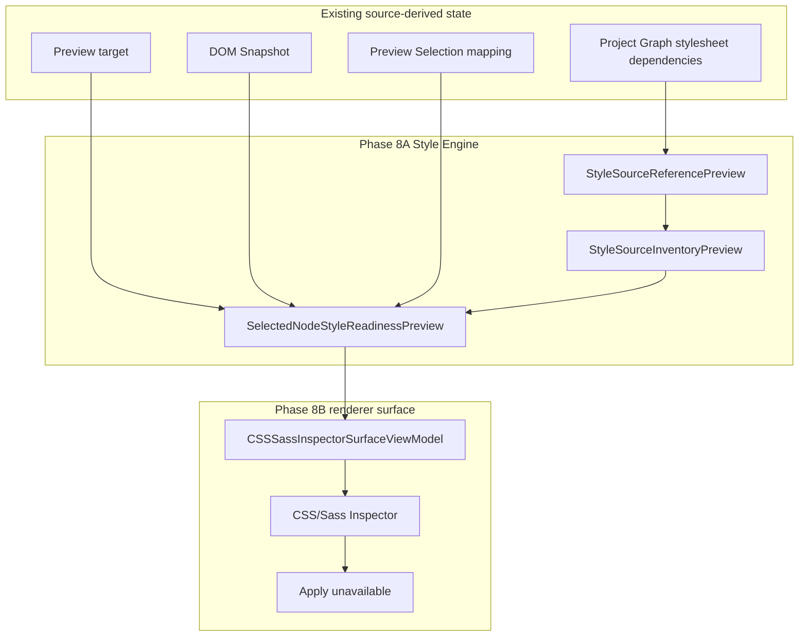

# CSS/Sass Inspector Read-only Visual Surface

[Docs index](../README.md)

> **Navigation:** [Start here](../README.md) → [Guided reading](../guided-reading.md) → [Validation system](./validation-system.md) → CSS/Sass Inspector read-only visual surface → [Future write flow](./flows/future-write-flow.md)

## At a glance

| Question | Answer |
| --- | --- |
| Is this implemented? | Yes, as a read-only renderer surface only. |
| Phase | Phase 8B — CSS/Sass Inspector read-only visual surface. |
| Runtime owner | Renderer UI consumes Phase 8A models. |
| Source of truth | `SelectedNodeStyleReadinessPreview` and `StyleSourceInventoryPreview`. |
| Can it calculate cascade? | No. |
| Can it read computed styles? | No. |
| Can it edit styles? | No. |
| Can Apply run? | No. |
| Can it read the Preview iframe DOM? | No. |
| Can it write files? | No. |

## Purpose

Phase 8B adds the first visual CSS/Sass Inspector surface in the right Inspector area. It gives contributors and later UI work a compact read-only display for style readiness, detected authored style sources, preview-only rule sections, selectors, declarations, and safety boundaries.

It does not change the write model. It follows the Crystal source-modular UI pattern: the renderer surface lives in its own folder with constants, types, view model, render logic, element contracts, validation, and barrel exports.

## Current implementation

The surface consumes Phase 8A models and passive Project Graph dependency metadata. The renderer does not read style files, does not parse Sass, does not call browser stylesheet APIs, and does not inspect the live Preview DOM.

Phase 8B — CSS/Sass Inspector read-only visual surface

Phase 8B boundary: CSS/Sass Inspector read-only visual surface only. No real cascade is calculated. No computed styles are read. No style editing is implemented. No source files are written. No patch apply is available. No write IPC exists. Apply remains unavailable. No contenteditable is used. No undo/redo execution runs. Dirty-state is not persisted. No refresh execution runs. No Preview DOM mutation occurs.

Phase 8A boundary remains preserved in context: Style Engine read-only source inventory foundation only. No CSS/Sass Inspector visual surface is added. No real cascade is calculated. No computed styles are read. No style editing is implemented. No source files are written. No patch apply is available. No write IPC exists. Apply remains unavailable. No contenteditable is used. No undo/redo execution runs. Dirty-state is not persisted. No refresh execution runs. No Preview DOM mutation occurs.

## Key files

The Phase 8B files are renderer and validation files only.

## Key files and responsibilities

| File or path | Responsibility | Reads | Must not do |
| --- | --- | --- | --- |
| `apps/desktop/electron/renderer/views/inspector/css-sass-inspector/css-sass-inspector.constants.ts` | Surface labels and safety notes. | Static constants. | Introduce runtime behavior. |
| `apps/desktop/electron/renderer/views/inspector/css-sass-inspector/css-sass-inspector.types.ts` | Renderer view-model contracts. | Phase 8A type imports. | Create write-capable contracts. |
| `apps/desktop/electron/renderer/views/inspector/css-sass-inspector/css-sass-inspector.view-model.ts` | Converts Phase 8A previews into visual sections. | Explicit preview inputs. | Read files, iframe DOM, computed styles, or CSSOM. |
| `apps/desktop/electron/renderer/views/inspector/css-sass-inspector/css-sass-inspector.render.ts` | Renders passive read-only DOM nodes. | View model. | Create forms, Apply buttons, editable inputs, or handlers. |
| `apps/desktop/electron/renderer/components/project-preview-panel/inspector/project-preview-inspector-renderer.ts` | Wires the surface into the existing Inspector render path. | Preview state, DOM Snapshot state, Preview Selection state, Project Graph dependency metadata. | Mutate Preview DOM or read source files. |
| `apps/desktop/electron/renderer/components/project-preview-panel/project-preview-panel.html` | Static markup for the read-only surface. | No runtime data. | Add form controls inside the CSS/Sass Inspector surface. |
| `apps/desktop/electron/renderer/components/project-preview-panel/project-preview-panel.scss` | Compact visual styling. | Existing shell tokens. | Add global style primitives. |
| `scripts/validate-css-sass-inspector-surface.mjs` | Guards Phase 8B safety. | Scoped files and docs. | Validate by mutating source. |

## Data flow

| Step | Input | Output | Boundary |
| --- | --- | --- | --- |
| 1 | Preview target dependency metadata | Style source references | No renderer file read. |
| 2 | Style source references | `StyleSourceInventoryPreview` | Inventory only. |
| 3 | Selection mapping and DOM Snapshot state | `SelectedNodeStyleReadinessPreview` | Trusted selection required. |
| 4 | Style readiness preview | `CSSSassInspectorSurfaceViewModel` | Presentation model only. |
| 5 | View model | Passive Inspector markup | No editing controls. |
| 6 | Missing input | Empty or blocked state | No fallback to iframe DOM. |
| 7 | SCSS/Sass or unknown source | Unsupported state | No Sass compilation. |
| 8 | Apply affordance | Disabled paragraph | No button and no handler. |



## Boundaries

The CSS/Sass Inspector read-only surface may display inventory, sources, counts, selectors, declarations, rule preview state, unsupported sources, blocked reasons, and safety notes. It must not become a Cascade Map, a computed style inspector, a style editor, a Sass compiler, a source writer, or an Apply workflow.

Still out of scope:

- real cascade calculation
- computed style inspection
- style editing
- CSS/Sass source writes
- Sass compilation
- Sass import resolution
- patch apply
- IPC write
- save/apply workflow
- real undo/redo execution
- dirty-state persistence
- refresh execution
- DOM mutation
- Apply enablement

> **Safety boundary:** The read-only surface is allowed to display authored style inventory readiness. It is not allowed to infer the live cascade, read `getComputedStyle`, inspect `document.styleSheets`, access iframe internals, or mutate the Preview DOM.

## What this does not do

| Not provided | Reason |
| --- | --- |
| Cascade Map | No real cascade is calculated. |
| Computed style inspection | No computed styles are read. |
| Style editing | Declarations remain preview-only and disabled. |
| Source writes | No source files are written. |
| Patch apply | Source Patch Preview remains descriptive. |
| Write IPC | No write IPC exists. |
| Sass compilation | Sass/SCSS remains unsupported in this surface. |
| Preview refresh | No refresh execution runs. |

## Common misunderstanding

> **Common misunderstanding:** Seeing CSS/Sass sources in the Inspector does not mean Crystal has applied-style knowledge. The surface displays authored style inventory readiness; selector matching, cascade resolution, computed values, and style writes remain future work.

## Validation

Run:

```bash
npm run validate:css-sass-inspector-surface
```

The validator checks the surface files, passive Apply markup, forbidden APIs, package script wiring, and Phase 8B documentation boundary.

## Related docs

- [Validation system](./validation-system.md)
- [Future write flow](./flows/future-write-flow.md)
- [Future command execution](./commands/future-command-execution.md)
- [Glossary](../glossary.md)
- [Roadmap implementation status](../roadmap-implementation.md)

## Future work

Later work may introduce authored-style matching against DOM Snapshot, real cascade calculation, computed style inspection through a safe source of truth, style editing, Sass compilation, Sass import resolution, write IPC, patch apply, save/apply workflow, dirty-state persistence, refresh execution, and real undo/redo execution. Those are not part of Phase 8B.

## Read next

You are here: CSS/Sass Inspector read-only visual surface.

Before this:
- [Validation system](./validation-system.md) explains the gates that preserve Phase 8A and Phase 8B boundaries.

Next:
- [Future write flow](./flows/future-write-flow.md) explains what must exist before Apply can become real.

Related:
- [Guided reading](../guided-reading.md)
- Validator: [`validate:css-sass-inspector-surface`](../../scripts/validate-css-sass-inspector-surface.mjs)

Why this matters:
Phase 8B is the first visual CSS/Sass Inspector surface, but it is still a read-only boundary. The documentation keeps visual inspection separate from cascade, computed styles, style editing, source writes, and Apply execution.
