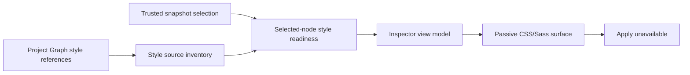

# CSS/Sass Inspector read-only visual surface

[Docs index](../README.md)

## Purpose

The Inspector needs a place to present authored style evidence before Crystal can calculate applied styles or edit source. This surface makes that evidence visible without implying browser truth.

## Current implementation

Phase 8B is implemented as a passive renderer surface. It consumes Phase 8A source-inventory and selected-node readiness models, then displays sources, rule previews, selectors, declarations, unsupported states, and Apply-unavailable messaging. Renderer does not read style files, compile Sass, use CSSOM, inspect the iframe, or create editable controls.

## Key files

- `packages/core/style-engine/style-source-inventory.ts`
- `packages/core/style-engine/selected-node-style-readiness.ts`
- `apps/desktop/electron/renderer/views/inspector/css-sass-inspector/css-sass-inspector.view-model.ts`
- `apps/desktop/electron/renderer/views/inspector/css-sass-inspector/css-sass-inspector.render.ts`
- `scripts/validate-css-sass-inspector-surface.mjs`

## Data flow

Project Graph dependency metadata becomes style-source references and inventory. Trusted Preview Selection and DOM Snapshot state produce selected-node readiness. Renderer converts those plain previews into passive markup. Missing or unsupported input remains visible rather than falling back to live browser APIs.

## Boundaries

The surface may display authored inventory and candidate information. It cannot calculate cascade, read computed styles, access `document.styleSheets`, parse Sass semantics, edit declarations, enable Apply, write files, or mutate Preview DOM.

## Validation

Run `npm run validate:css-sass-inspector-surface`, together with Style Engine and authored-matching validators when shared contracts change.

## Related docs

- [Authored Style Matching](./authored-style-matching-dom-snapshot.md)
- [DOM Snapshot](./preview/dom-snapshot.md)
- [Validation system](./validation-system.md)

## Future work

A future style editor requires source ownership, cascade/computed correlation, persistence, conflict detection, history execution, refresh, and explicit Apply semantics. Adding inputs before those systems would overstate the surface.

## Read next

You are here: CSS/Sass Inspector read-only visual surface.

Before this:
- [Validation System](./validation-system.md) explains the gates that preserve read-only behavior.

Next:
- [Authored Style Matching over DOM Snapshot](./authored-style-matching-dom-snapshot.md) explains the candidate data shown by the surface.

Why this matters:
A visible Inspector can look edit-capable long before the runtime is ready. This page fixes its authority at presentation only.
