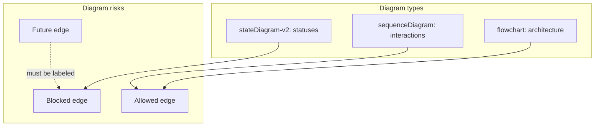

# Architecture Diagrams

[Docs index](../../README.md)

## At a glance

| Question | Answer |
| --- | --- |
| Is this implemented? | Yes, as Mermaid documentation. |
| Can diagrams imply implementation? | No. Future and blocked edges must stay explicit. |
| Runtime owner | Documentation only. |
| Safety risk controlled | Prevents visual diagrams from overstating current write capability. |
| Related next phase | Add diagrams only when new contracts exist. |

## Purpose

The diagrams give quick orientation before reading the longer pages. They are not separate specifications; each one should be read with its linked architecture or flow document.

## Why this exists

Architecture diagrams help contributors see ownership and blocked edges faster than prose alone.

## How to read this page

| Diagram | Use it for |
| --- | --- |
| [System context](./system-context.md) | Whole-app orientation. |
| [Runtime boundaries](./runtime-boundaries.md) | Renderer/preload/main/core split. |
| [Preview selection sequence](./preview-selection-sequence.md) | Iframe click to mapped selection. |
| [Source Patch Preview sequence](./source-patch-preview-sequence.md) | Dry-run source preview. |
| [Command Preview Bus sequence](./command-preview-bus-sequence.md) | Preview result states. |
| [Security boundaries](./security-boundaries.md) | Allowed, forbidden, and future edges. |
| [Validation gates](./validation-gates.md) | Local validation grouping. |

## Current implementation

The diagrams represent the current read-only and dry-run implementation, plus explicitly marked future/blocked flows.

| Implemented | Blocked | Future |
| --- | --- | --- |
| Mermaid diagrams. | Image assets. | New diagrams for new contracts. |
| Subgraphs by runtime/responsibility. | Diagrams implying writes. | Worker/WASM/WebGPU diagrams. |
| Sequence/state diagrams for flows. | Decorative-only diagrams. | Write execution diagrams after design. |

## Key files

Each file is intentionally small and points back to the deeper page for details.

## Key files and responsibilities

| File | Responsibility | Reads | Must not do |
| --- | --- | --- | --- |
| `system-context.md` | Whole-system map. | Architecture docs. | Claim future writes. |
| `runtime-boundaries.md` | Runtime ownership map. | Runtime docs. | Show renderer shortcuts as allowed. |
| `security-boundaries.md` | Allowed/forbidden/future split. | Security docs. | Relax boundaries. |
| `validation-gates.md` | Validation grouping. | Script docs. | Replace runtime validators. |

## Data flow

The diagrams show direction of state and authority. They should make it clear where renderer intent stops, where main owns privileged effects, and where dry-run planning stops before writes.

## Main diagram

## Boundaries

Diagram arrows must not imply unimplemented writes, direct renderer filesystem access, live iframe document access, or trusted Preview iframe privileges.

## What this does not do

| Not provided | Reason |
| --- | --- |
| PNG/JPG/SVG diagrams | Mermaid stays editable in Markdown. |
| Runtime validation | Diagrams are docs, not tests. |
| Future feature proof | Future edges are not implementation. |

## Common misunderstanding

> **Common misunderstanding:** A future node in a diagram is not an implemented module.

## Validation

`validate:architecture-docs` checks for Mermaid coverage and required diagram files.

## Related docs

- [Architecture README](../README.md)
- [Security model](../security-model.md)
- [Validation system](../validation-system.md)

## Future work

Add diagrams for workers, WASM, WebGPU, and write execution only when those systems have concrete contracts.
