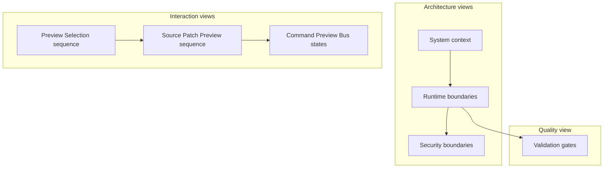

# Architecture diagrams

[Docs index](../../README.md)

## Purpose

The diagrams compress ownership and sequence so a contributor can orient quickly before reading the authoritative prose and implementation. They are navigation aids, not independent specifications.

## Current implementation

The set covers system context, runtime authority, Preview Selection, Source Patch Preview, Command Preview Bus state, security boundaries, and validation gates. Solid edges represent current allowed paths. Dotted edges mark blocked or future-only relationships.

## Key files

- `docs/architecture/diagrams/system-context.md`
- `docs/architecture/diagrams/runtime-boundaries.md`
- `docs/architecture/diagrams/security-boundaries.md`
- `docs/architecture/diagrams/preview-selection-sequence.md`
- `docs/architecture/diagrams/source-patch-preview-sequence.md`
- `docs/architecture/diagrams/command-preview-bus-sequence.md`
- `docs/architecture/diagrams/validation-gates.md`

## Data flow

Each page names the question the diagram answers and links back to deeper documentation. Diagram arrows must preserve the same authority and implementation status as the prose. A future node remains visibly separate from current runtime nodes.

## Boundaries

Do not use a diagram to make an unimplemented write, direct renderer effect, live iframe access, or future accelerator look current. Mermaid remains editable in Markdown; no binary diagram assets are required.

## Validation

`npm run validate:architecture-docs` checks expected files, Mermaid coverage, subgraphs, sequence/state variety, sections, links, and prohibited write claims.

## Related docs

- [Architecture overview](../README.md)
- [Architecture flows](../flows/README.md)
- [Security model](../security-model.md)

## Future work

Add a diagram when a new runtime, contract, or causal path would be materially easier to understand visually. Avoid decorative duplication.
