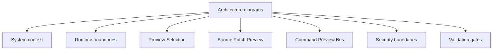

# Architecture Diagrams

[Docs index](../../README.md)

## Purpose

The diagrams give quick orientation before reading the longer pages. They are not separate specifications; each one should be read with its linked architecture or flow document.

## Current implementation

The diagrams represent the current read-only and dry-run implementation after PR #21, plus explicitly marked future/blocked flows. Dotted or dashed arrows usually mean a blocked edge or future-only relationship.

## Key files

Each file is intentionally small and points back to the deeper page for details.

- `docs/architecture/diagrams/system-context.md`
- `docs/architecture/diagrams/runtime-boundaries.md`
- `docs/architecture/diagrams/preview-selection-sequence.md`
- `docs/architecture/diagrams/source-patch-preview-sequence.md`
- `docs/architecture/diagrams/command-preview-bus-sequence.md`
- `docs/architecture/diagrams/security-boundaries.md`
- `docs/architecture/diagrams/validation-gates.md`

## Data flow

The diagrams show direction of state and authority. They should make it clear where renderer intent stops, where main owns privileged effects, and where dry-run planning stops before writes.

## Boundaries

Diagram arrows must not imply unimplemented writes, direct renderer filesystem access, live iframe document access, or trusted Preview iframe privileges.

## Validation

`validate:architecture-docs` checks for Mermaid coverage and required diagram files.

## Related docs

- [Architecture README](../README.md)
- [Security model](../security-model.md)
- [Validation system](../validation-system.md)

## Future work

Add diagrams for workers, WASM, WebGPU, and write execution only when those systems have concrete contracts.
