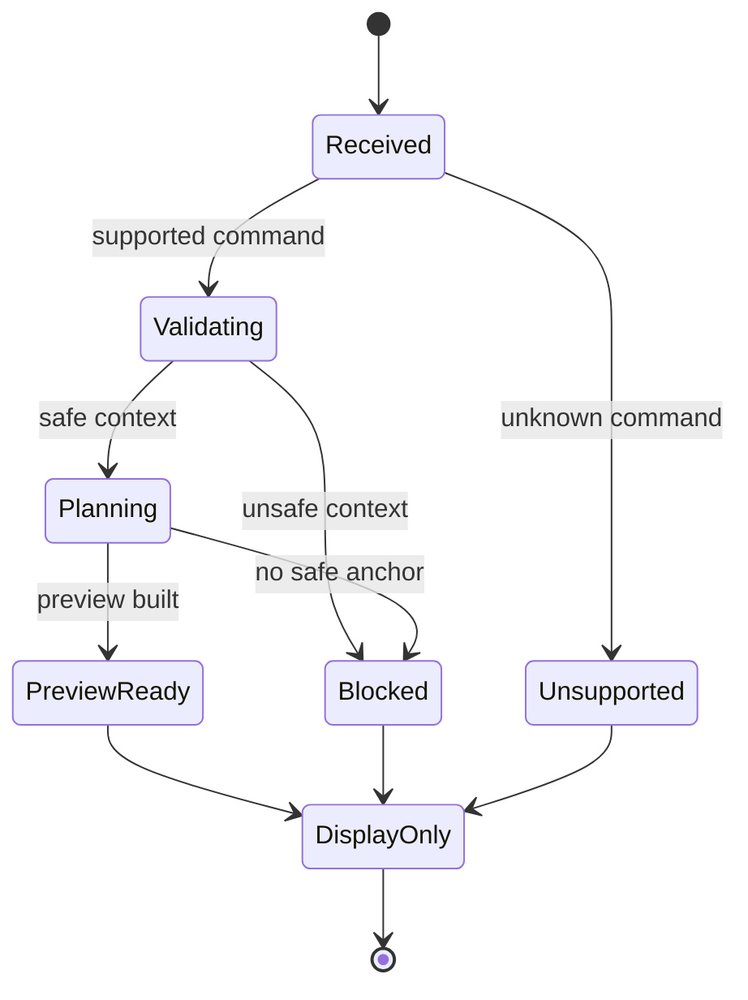

# Command Preview Bus Sequence Diagram

[Docs index](../../README.md)

## At a glance

| Question | Answer |
| --- | --- |
| Is this implemented? | Yes, as dry-run result states. |
| Is it an execution bus? | No. |
| Runtime owner | Core. |
| Safety risk controlled | Keeps unsupported, blocked, and preview-ready outcomes explicit. |
| Related next phase | Separate future execution bus. |

## Purpose

This sequence and state diagram show the dry-run bus as a classification and planning path, not as execution.

## Why this exists

Preview-ready, blocked, and unsupported can look like simple UI labels. Modeling them as states makes the write boundary clearer.

## How to read this page

Read the sequence for actor handoff and the state diagram for allowed statuses.

## Current implementation

The bus receives command intent, validates context, and returns unsupported, blocked, or preview-ready state. It does not replace `packages/core/commands/command-bus.ts` and does not call a writer.

| Implemented | Blocked | Future |
| --- | --- | --- |
| Dry-run statuses. | Execution side effects. | Execution bus. |
| Preview-ready output. | File writes. | Transaction-aware command state. |

## Key files

These files define the dry-run bus and its current HTML insertion preview path.

## Key files and responsibilities

| File | Responsibility | Reads | Must not do |
| --- | --- | --- | --- |
| `command-preview-bus.types.ts` | Status model. | Command preview types. | Encode side effects. |
| `command-preview-bus.preview.ts` | Dry-run routing. | Command + context. | Execute command. |
| `html-insertion-command.validators.ts` | Safety validation. | Context. | Mark unsafe targets ready. |

## Data flow

The bus normalizes command preview outcomes for renderer display.

## Main diagram

## Boundaries

No execution side effects belong in the preview bus.

## What this does not do

| Not provided | Reason |
| --- | --- |
| File write | Not an execution bus. |
| Patch apply | Source Patch Preview only. |
| Undo/redo | No transaction. |

## Common misunderstanding

> **Common misunderstanding:** A bus can centralize preview without centralizing writes.

## Validation

Covered by `validate:source-patch-preview`.

## Related docs

- [Command Preview Bus](../commands/command-preview-bus.md)
- [Future command execution](../commands/future-command-execution.md)

## Future work

A future execution bus should use separate names and stronger guarantees.
