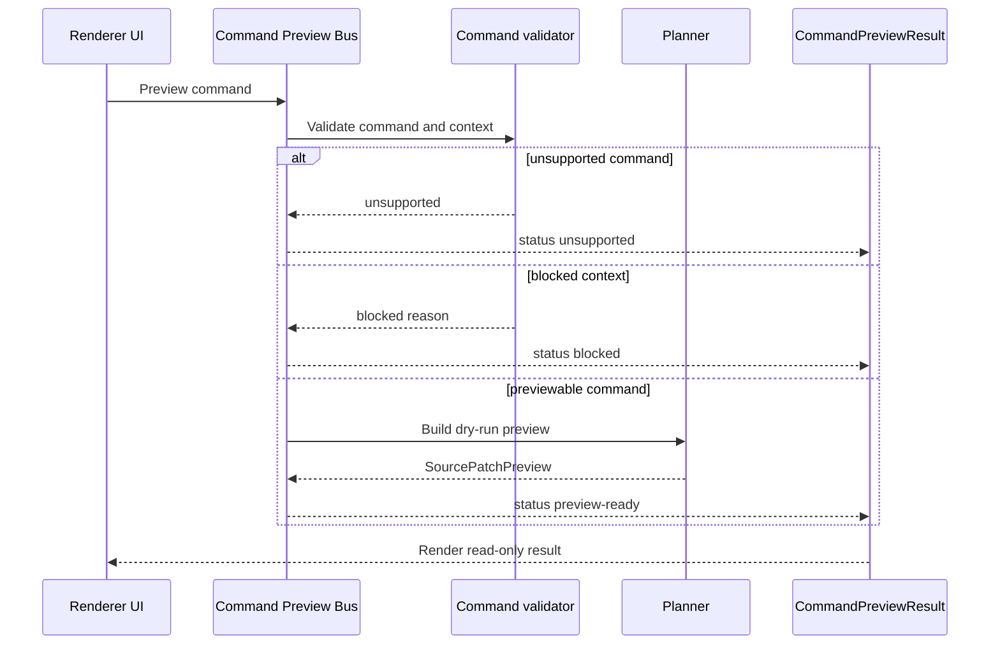

# Command Preview Bus Sequence Diagram

[Docs index](../../README.md)

## Purpose

This diagram shows the dry-run command preview bus as distinct from future command execution.

## Current implementation

## Key files

- `packages/core/commands/command-preview-bus/command-preview-bus.types.ts`
- `packages/core/commands/command-preview-bus/command-preview-bus.preview.ts`
- `packages/core/commands/html-insertion/html-insertion-command.validators.ts`

## Data flow

The bus normalizes command preview outcomes for renderer display.

## Boundaries

No execution side effects belong in the preview bus.

## Validation

Covered by `validate:source-patch-preview`.

## Related docs

- [Command Preview Bus](../commands/command-preview-bus.md)
- [Future command execution](../commands/future-command-execution.md)

## Future work

A future execution bus should use separate names and stronger guarantees.
