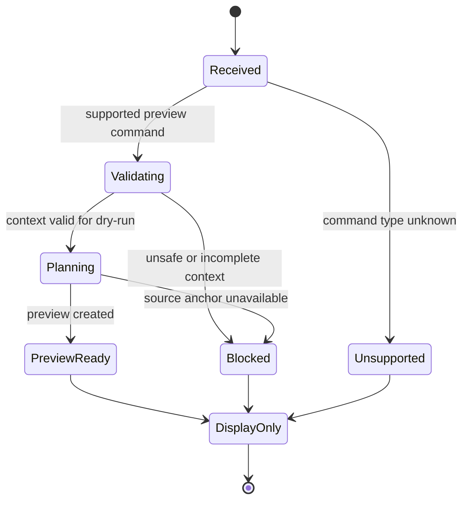

# Command Preview Bus state diagram

[Docs index](../../README.md)

## Purpose

The bus is best understood as a small state machine. It classifies a preview request and always ends in display-only output.

## Current implementation

The supported path handles HTML insertion preview. Unknown command types become unsupported. Unsafe or incomplete context becomes blocked. Safe context may produce preview-ready. None of those states executes a command.

## Key files

- `command-preview-bus.types.ts`
- `command-preview-bus.preview.ts`
- `html-insertion-command.validators.ts`
- `html-insertion-command.planner.ts`
- `validate-source-patch-preview.mjs`

## Data flow

A request enters once, receives a normalized status, and leaves as renderer data. There is no transition from `PreviewReady` to an effectful state.

## Boundaries

The Command Preview Bus is not an execution bus and does not replace the legacy command bus boundary. It cannot write, refresh, or register history.

## Validation

`validate:source-patch-preview` checks status values, routing, blocked reasons, rendering, and no side effects.

## Related docs

- [Command Preview Bus](../commands/command-preview-bus.md)
- [Future command execution](../commands/future-command-execution.md)

## Future work

A transaction-aware execution state machine should be separately named and validated. It should not mutate the semantics of current preview statuses.
