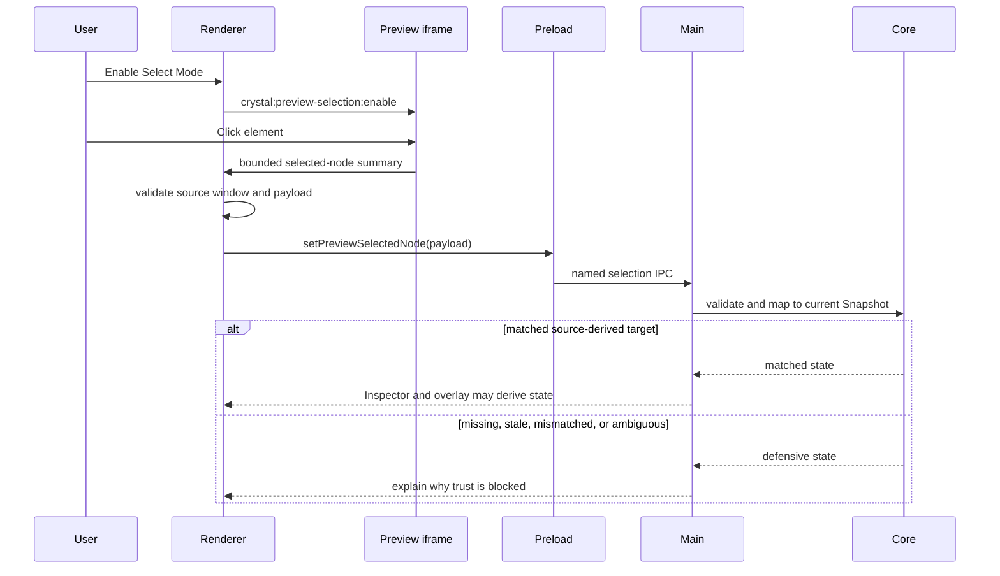

# Preview Selection sequence diagram

[Docs index](../../README.md)

## Purpose

The sequence makes the trust decision after a Preview click visible. Both matched and defensive outcomes are correct results.

## Current implementation

Select Mode is explicitly enabled. The iframe reports a bounded summary. Renderer verifies the message source and shape, preload carries the typed request, main validates again, and core correlates it with current DOM Snapshot state. Only a matched result supplies trusted Inspector and overlay input.

## Key files

- `project-preview-selection-message-bridge.ts`
- `project-preview-selection-service.ts`
- `project-preview-selection-validators.ts`
- `project-preview-selection-mapping.ts`

## Data flow

The iframe contributes visual evidence, not source authority. Current Preview load and Snapshot provide the context that decides whether the evidence is usable.

## Boundaries

No participant reads the live iframe document, mutates project DOM, edits source, or opens write IPC. A defensive branch is not an error to suppress.

## Validation

`validate:preview-selection`, `validate:preview-inspector`, and `validate:visual-selection-overlay` cover transport, mapping, and consumers.

## Related docs

- [Preview Selection](../preview/preview-selection.md)
- [Preview Selection flow](../flows/preview-selection-flow.md)

## Future work

Hover and multi-selection should add explicit messages and states rather than broadening the existing payload into an implicit editor protocol.
