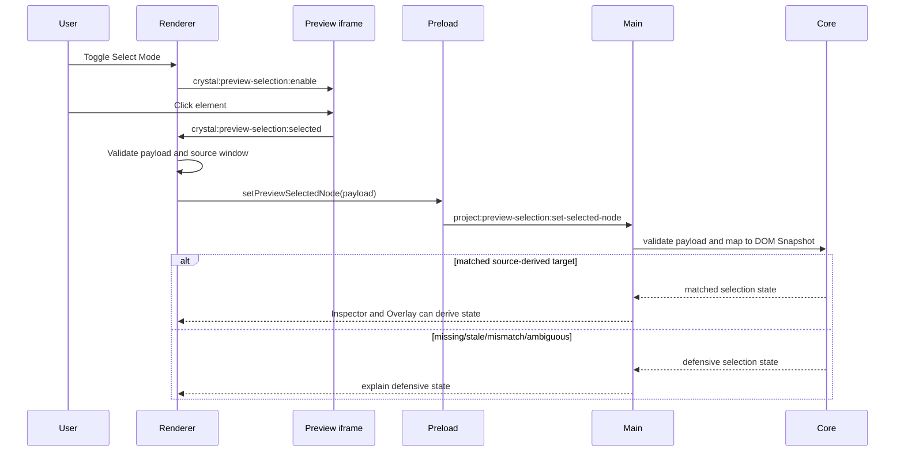

# Preview Selection Sequence Diagram

[Docs index](../../README.md)

## At a glance

| Question | Answer |
| --- | --- |
| Is this implemented? | Yes, as read-only selection flow. |
| Can it edit selected nodes? | No. |
| Runtime owner | Iframe, renderer, main, core. |
| Safety risk controlled | Keeps click payload validation and mapping explicit. |
| Related next phase | Future hover/multi-select states. |

## Purpose

This sequence shows how Crystal turns a click in rendered HTML into a validated read-only selection state without reading iframe internals from renderer.

## Why this exists

The iframe can report a click, but only main/core mapping can decide whether that click relates to the static source model.

## How to read this page

Follow the `alt` branch: matched selection and defensive state are both valid outcomes.

## Current implementation

The click is not trusted by itself. Renderer checks the message source and shape, main validates the payload again, and core maps it to the DOM Snapshot before Inspector or Overlay consumes it.

| Implemented | Blocked | Future |
| --- | --- | --- |
| Bounded selection message. | DOM/source mutation. | Hover selection. |
| Defensive mapping states. | Live iframe DOM access. | Multi-selection. |

## Key files

These files implement the steps in the sequence.

## Key files and responsibilities

| File | Responsibility | Reads | Must not do |
| --- | --- | --- | --- |
| `project-preview-selection-message-bridge.ts` | Message handling. | Iframe message events. | Read iframe DOM. |
| `project-preview-selection-service.ts` | Main selection service. | Validated payload. | Trust invalid data. |
| `packages/core/project/preview-selection/**` | Mapping and state. | Snapshot + selection data. | Edit source. |

## Data flow

The iframe sends limited data. Main and core turn it into sanitized selection state.

## Main diagram

## Boundaries

No live iframe DOM read. No edit. No source write.

## What this does not do

| Not provided | Reason |
| --- | --- |
| Editing | Selection is read-only. |
| DOM mutation | Preview is isolated. |
| Write IPC | No write runtime. |

## Common misunderstanding

> **Common misunderstanding:** Selection state is not edit state.

## Validation

Covered by `validate:preview-selection`, `validate:preview-inspector`, and `validate:visual-selection-overlay`.

## Related docs

- [Preview Selection](../preview/preview-selection.md)
- [Preview Selection flow](../flows/preview-selection-flow.md)

## Future work

Add hover and multi-select only as separate, validated read-only states first.
