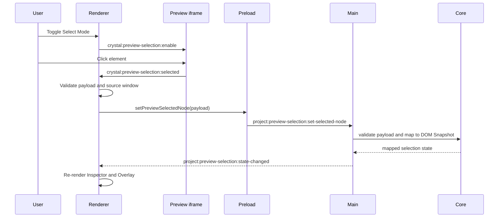

# Preview Selection Sequence Diagram

[Docs index](../../README.md)

## Purpose

This diagram details the read-only Preview Selection path.

## Current implementation

## Key files

- `apps/desktop/electron/renderer/components/project-preview-panel/selection/project-preview-selection-message-bridge.ts`
- `apps/desktop/electron/main/preview-selection/project-preview-selection-service.ts`
- `packages/core/project/preview-selection/**`

## Data flow

The iframe sends limited data. Main and core turn it into sanitized selection state.

## Boundaries

No live iframe DOM read. No edit. No source write.

## Validation

Covered by `validate:preview-selection`, `validate:preview-inspector`, and `validate:visual-selection-overlay`.

## Related docs

- [Preview Selection](../preview/preview-selection.md)
- [Preview Selection flow](../flows/preview-selection-flow.md)

## Future work

Add hover and multi-select only as separate, validated read-only states first.
