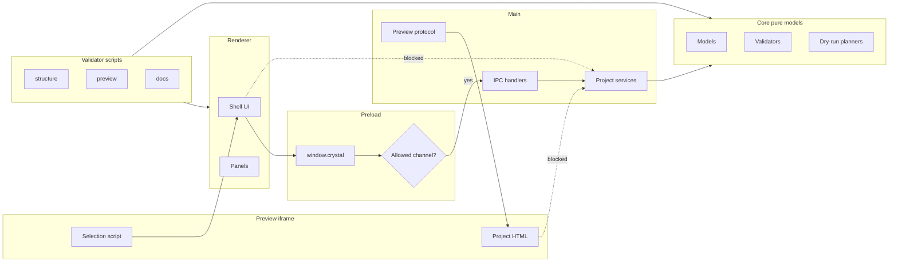

# Runtime Boundaries Diagram

[Docs index](../../README.md)

## At a glance

| Question | Answer |
| --- | --- |
| Is this implemented? | Yes, as a documented runtime split. |
| Can renderer bypass preload? | No. |
| Runtime owner | Renderer, Preview iframe, preload, main, core, validators. |
| Safety risk controlled | Prevents cross-runtime shortcuts. |
| Related next phase | Explicit contracts for future runtimes. |

## Purpose

This diagram shows runtime ownership. It prevents solving a renderer feature by importing main-process authority into the browser runtime.

## Why this exists

Most security-sensitive regressions start as convenience shortcuts across runtime boundaries.

## How to read this page

Each subgraph is an authority zone. Cross-subgraph arrows should be explicit and typed.

## Current implementation

The allowed path is renderer → preload → main → core/adapters. Core is portable; adapters own effects. Renderer UI does not touch filesystem or watcher effects directly.

| Implemented | Blocked | Future |
| --- | --- | --- |
| Renderer/preload/main split. | Renderer to filesystem shortcut. | Workers/WASM/WebGPU ports. |
| Core pure models. | Core importing Electron. | Import-boundary checks. |
| Validator scripts. | Validators mutating source. | Write-runtime gates. |

## Key files

Read these directories by runtime, not by feature.

## Key files and responsibilities

| Path | Responsibility | Reads | Must not do |
| --- | --- | --- | --- |
| `apps/desktop/electron/renderer/**` | Browser UI. | Preload API, shared types. | Import main/adapters. |
| `apps/desktop/electron/preload/**` | Bridge. | IPC constants. | Expose raw IPC. |
| `apps/desktop/electron/main/**` | Privileged services. | Core/adapters. | Render UI. |
| `packages/core/**` | Pure state/planning. | Model inputs. | Use Electron/FS effects. |
| `scripts/**` | Validation. | Source/docs files. | Change runtime behavior. |

## Data flow

Renderer expresses intent; preload exposes a constrained API; main performs privileged work; core calculates model results; adapters perform effects.

## Main diagram

## Boundaries

Renderer cannot bypass preload. Core should not import Electron. Adapters isolate side effects.

## What this does not do

| Not provided | Reason |
| --- | --- |
| Future runtime contracts | Not implemented yet. |
| Write authority | Future-only. |
| Full dependency lint | Future validation. |

## Common misunderstanding

> **Common misunderstanding:** Preview iframe is not part of the trusted renderer shell.

## Validation

Covered by `validate:structure`, `validate:ui-flow`, and feature validators.

## Related docs

- [Runtime boundaries](../runtime-boundaries.md)
- [Module boundaries](../module-boundaries.md)
- [Security model](../security-model.md)

## Future work

Future workers, WASM, and WebGPU need dedicated runtime boxes and explicit bridges.
