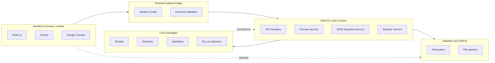

# Runtime Boundaries Diagram

[Docs index](../../README.md)

## Purpose

This diagram shows runtime ownership. It is meant to prevent a common mistake: solving a renderer feature by importing main-process authority directly into the browser runtime.

## Current implementation

The allowed path is renderer → preload → main → core/adapters. Core is portable; adapters own effects. Renderer UI does not touch filesystem or watcher effects directly.

## Key files

Read these directories by runtime, not by feature.

- `apps/desktop/electron/main/**`
- `apps/desktop/electron/preload/**`
- `apps/desktop/electron/renderer/**`
- `packages/core/**`
- `packages/adapters/**`

## Data flow

Renderer expresses intent; preload exposes a constrained API; main performs privileged work; core calculates model results; adapters perform effects.

## Boundaries

Renderer cannot bypass preload. Core should not import Electron. Adapters isolate side effects.

## Validation

Covered by `validate:structure`, `validate:ui-flow`, and feature validators.

## Related docs

- [Runtime boundaries](../runtime-boundaries.md)
- [Module boundaries](../module-boundaries.md)
- [Security model](../security-model.md)

## Future work

Future workers, WASM, and WebGPU need dedicated runtime boxes and explicit bridges.
